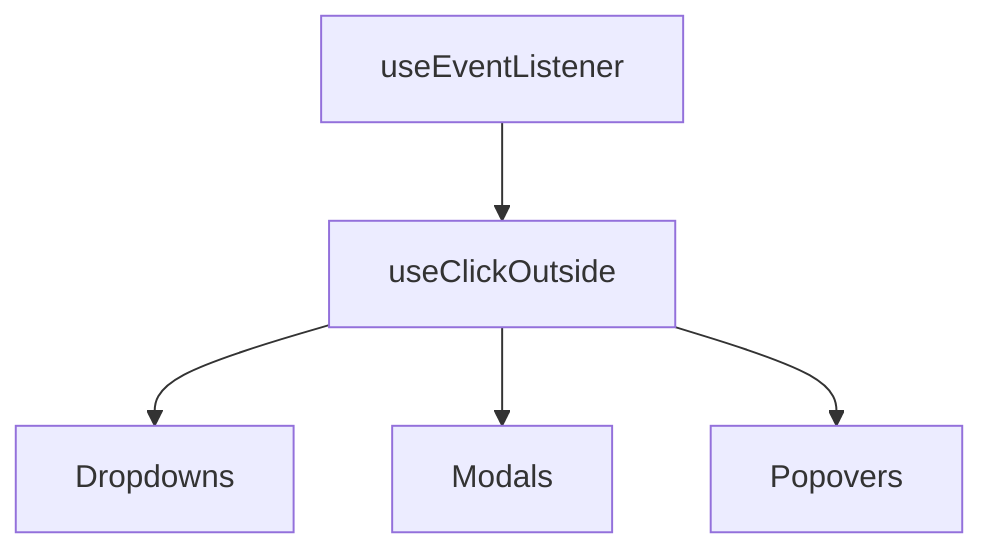

# useClickOutside

A composable for detecting clicks outside of specified element(s) with automatic cleanup.

<DocsPageFeatures :frontmatter />

## Usage

The `useClickOutside` composable detects when users click outside target elements. It uses two-phase detection (pointerdown → pointerup) to prevent false positives when dragging, and includes touch scroll handling for mobile.

```vue collapse no-filename UseClickOutside
<script setup lang="ts">
  import { useClickOutside } from '@vuetify/v0'
  import { useTemplateRef } from 'vue'

  const menu = useTemplateRef('menu')

  useClickOutside(menu, () => {
    console.log('Clicked outside the menu')
  })
</script>

<template>
  <div ref="menu">
    Menu content
  </div>
</template>
```

## Architecture

`useClickOutside` builds on `useEventListener` for pointer and focus event detection:


```mermaid "Click Outside Hierarchy"
flowchart TD
  useEventListener --> useClickOutside
  useClickOutside --> Dropdowns
  useClickOutside --> Modals
  useClickOutside --> Popovers
```

## Options

| Option | Type | Default | Description |
| - | - | - | - |
| `bounds` | `boolean` | `false` | Use bounding-rect detection instead of DOM containment. Required for native `<dialog>` elements — backdrop clicks have the `<dialog>` as the event target, so containment checks always pass |

```ts
import { useClickOutside } from '@vuetify/v0'

const dialog = useTemplateRef('dialog')

// For native <dialog> — backdrop clicks are detected via coordinates
useClickOutside(dialog, () => dialog.value?.close(), { bounds: true })
```

## Reactivity

| Property/Method | Reactive | Notes |
| - | :-: | - |
| `isActive` | <AppSuccessIcon /> | Computed from `!isPaused` |
| `isPaused` | <AppSuccessIcon /> | ShallowRef, readonly |
| `pause()` | - | Stop detection, preserve state |
| `resume()` | - | Resume detection |
| `stop()` | - | Stop and clean up listeners |

## Examples

::: example
/composables/use-click-outside/basic

### Dropdown with Outside Dismiss

A dropdown menu that opens on button click and automatically closes when clicking anywhere outside the menu.

:::

<DocsApi />
