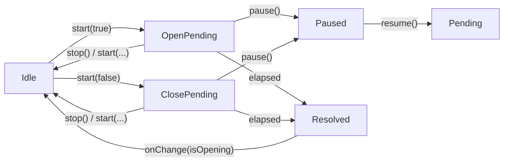

# useDelay

Schedule open and close transitions with start, stop, pause, and resume controls and a reactive view of the pending delay.

<DocsPageFeatures :frontmatter />

## Usage

The `useDelay` composable is the scheduling primitive behind hover-driven UI like tooltips, popovers, and menus. It mirrors the `useTimer` lifecycle — `start`, `stop`, `pause`, `resume`, plus reactive `isActive`, `isPaused`, `remaining` — and adds direction tracking via `isOpening` and a promise that resolves once the delay elapses.

```ts collapse
import { useDelay } from '@vuetify/v0'

const delay = useDelay({
  openDelay: 300,
  closeDelay: 200,
  onChange: isOpening => {
    isVisible.value = isOpening
  },
})

// Schedule an open
await delay.start(true)

// Schedule a close, with a minimum delay of 500ms
await delay.start(false, { minDelay: 500 })

// Pause and resume the in-flight delay
delay.pause()
delay.resume()

// Cancel any pending transition
delay.stop()
```

> [!TIP] Reactive delays
> Both `openDelay` and `closeDelay` accept refs, getters, or plain values. Pass a getter to vary the delay based on input mode — for example, `0` for keyboard focus and `300` for hover.

## Architecture



`start()` cancels any in-flight delay before scheduling the next one — and the previous promise resolves with the *new* direction so awaiting code observes the latest intent. `stop()` cancels without scheduling a replacement; the previous promise stays unresolved. The pending timer is cleared on scope disposal.

## Reactivity

| Property | Type | Description |
|----------|------|-------------|
| `start` | `(isOpening: boolean, options?: { minDelay?: number }) => Promise<boolean>` | Start a delay; resolves with `isOpening` |
| `stop` | `() => void` | Cancel any pending delay and reset state |
| `pause` | `() => void` | Pause the in-flight delay, preserving remaining time |
| `resume` | `() => void` | Resume from where pause left off |
| `isActive` | `Readonly<Ref<boolean>>` | `true` while a delay is pending |
| `isPaused` | `Readonly<Ref<boolean>>` | `true` after `pause()`, `false` after `resume()` or `stop()` |
| `remaining` | `Readonly<Ref<number>>` | Milliseconds left until the pending transition fires |
| `isOpening` | `Readonly<Ref<boolean>>` | Direction of the pending transition (`true` = opening) |

## Examples

::: example
/composables/use-delay/basic

### Hover with Pause/Resume

Hover the target to schedule an 800ms open; leave it to schedule a 600ms close. The progress bar reflects `remaining` against the active direction, the badges surface every reactive flag, and the controls demonstrate `pause`, `resume`, and `stop` against the in-flight delay. Pausing mid-flight freezes the progress bar; resuming continues from the same point.

:::

## Key Features

### Lifecycle Vocabulary

`useDelay` exposes the same lifecycle surface as `useTimer` (`start`, `stop`, `pause`, `resume`, `isActive`, `isPaused`, `remaining`) and adds an `isOpening` direction flag. Consumers that already know `useTimer` get the same shape with one extra dimension — direction.

### Reactive Delays

`openDelay` and `closeDelay` accept any `MaybeRefOrGetter<number | string>`. Resolution happens when `start()` is called, so updates after start do not affect the in-flight delay.

```ts
import { shallowRef } from 'vue'

const fast = shallowRef(false)

const delay = useDelay({
  openDelay: () => fast.value ? 0 : 500,
  closeDelay: 200,
})
```

### Minimum Delay Floor

Pass `minDelay` to `start()` to enforce a floor on the resolved delay. Useful for transient feedback like toasts where the close delay must not be shorter than the time the content has been visible.

```ts
const delay = useDelay({ closeDelay: 200 })

await delay.start(true)
// User dismisses immediately — still hold for 500ms total
await delay.start(false, { minDelay: 500 })
```

### Re-Start Behavior

Calling `start()` while another delay is pending cancels the previous timer and resolves the previous promise with the *new* direction. Awaiting code sees a single source of truth — the latest intent — instead of stale resolutions.

```ts
delay.start(true)
// User leaves before openDelay elapses
delay.start(false) // previous promise resolves false, new close delay begins
```

### Pause and Resume

Pause preserves the remaining delay; resume continues from where pause left off. Useful for hover-driven UI where the user briefly interacts with the panel itself and you don't want the auto-close timer to keep counting.

```ts
const delay = useDelay({ closeDelay: 1000 })

delay.start(false)

// 300ms later — user moves into the panel
delay.pause() // remaining ≈ 700ms

// User moves out
delay.resume() // fires after ~700 more ms
```

### Automatic Cleanup

The pending timer clears on scope disposal — no manual cleanup needed.

```ts
// Timer automatically clears when component unmounts
const delay = useDelay({ openDelay: 300 })
```

<DocsApi />
