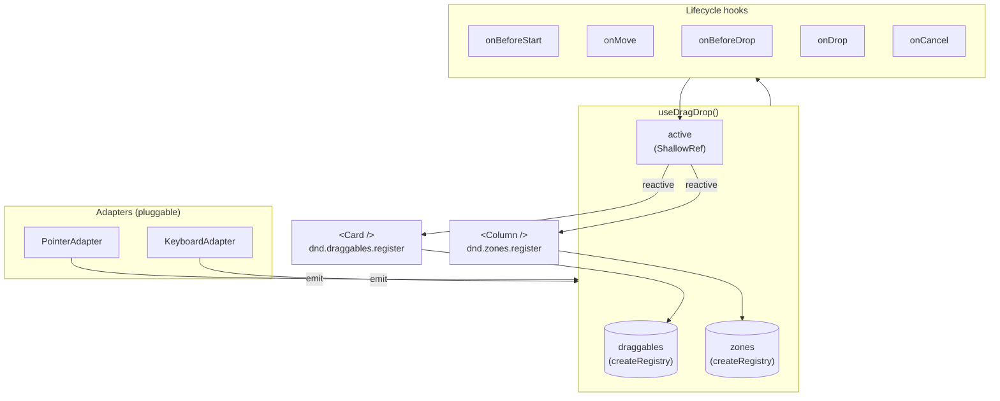

# useDragDrop

Headless drag-and-drop primitive. Owns two registries — draggables and zones — plus the active-drag state.

<DocsPageFeatures :frontmatter />

## Usage

Call `useDragDrop` once per scope (board, tree, splitter). The returned context owns the registries and active-drag state — pass it to children explicitly so they can register draggables and zones against the same instance. The composable returns logical state only; consumers wire DOM attributes themselves (see [DOM attributes](#dom-attributes) below).

```ts collapse
import { useDragDrop } from '@vuetify/v0'

// In the parent scope (e.g. <Kanban.Root>)
const dnd = useDragDrop<{ type: 'card', value: Card }>()
// → dnd.active, dnd.isDragging, dnd.cancel

// In a draggable child (receives `dnd` as a prop)
const ticket = dnd.draggables.register({ el, type: 'card', value: card })
// → ticket.isDragging, ticket.el

// In a drop-zone child (receives `dnd` as a prop)
const zone = dnd.zones.register({
  el,
  accept: ['card'],
  orientation: 'vertical',
  onDrop: (drag, position) => moveCard(drag.value.id, position.index ?? 0),
})
// → zone.isOver, zone.willAccept, zone.indicator, zone.el
```

## Architecture

The factory owns four pieces of state (`draggables`, `zones`, `active`, `isDragging`) plus a public `cancel()` action, and three extension points (adapters, plugins, lifecycle hooks). Pointer and keyboard adapters observe the DOM and emit a four-call lifecycle (`start`, `move`, `drop`, `cancel`); the factory pipes those through per-ticket and global hooks before mutating `active`.



## Adapters

Adapters are pluggable input layers: an adapter observes the DOM (or any other input source) and emits the four lifecycle events the factory consumes. Default adapters are installed automatically.

| Adapter | Import | Default | Description |
|---|---|---|---|
| `PointerAdapter` | `@vuetify/v0` | yes | Pointer Events for mouse, touch, and pen. Optional `threshold` activation distance. |
| `KeyboardAdapter` | `@vuetify/v0` | yes | `Space` / `Enter` to pick up and drop, arrow keys to nudge, `Escape` to cancel. Configurable activation keys + step. |

Both adapters accept a constructor options bag — `PointerAdapter({ threshold })` and `KeyboardAdapter({ activate, step })`.

Replace the defaults entirely by passing the `adapters` option:

```ts
import { useDragDrop, PointerAdapter } from '@vuetify/v0'

// Pointer only — disables keyboard.
const dnd = useDragDrop({ adapters: [new PointerAdapter()] })
```

To extend rather than replace, list the defaults explicitly alongside your custom adapter:

```ts
import { useDragDrop, PointerAdapter, KeyboardAdapter } from '@vuetify/v0'

useDragDrop({
  adapters: [new PointerAdapter(), new KeyboardAdapter(), new MyWebXrAdapter()],
})
```

`adapters: []` disables both defaults entirely (useful for server-driven or test scenarios).

A custom adapter extends the abstract base:

```ts
import { DragDropAdapter } from '@vuetify/v0'
import type { DragDropAdapterContext, DragType } from '@vuetify/v0'

class MyAdapter<K extends DragType = DragType> extends DragDropAdapter<K> {
  setup (context: DragDropAdapterContext<K>): void {
    // observe input, then call:
    //   context.emit.start(source, origin, 'mySource')
    //   context.emit.move(point)
    //   context.emit.drop()
    //   context.emit.cancel()
    this.cleanup = () => { /* tear down listeners */ }
  }
}
```

`context.emit` exposes `start(source, origin, via)`, `move(point)`, `drop()`, and `cancel()` — call these as input arrives. Adapters declare their own `via` value via `Extensible<'pointer' | 'keyboard'>` so consumers reading `active.value.via` can distinguish the input source.

## Reactivity

Every consumer-facing state field is a reactive ref. Reads in templates need `.value`.

| Field | Shape | Updates when |
|---|---|---|
| `dnd.active` | `Readonly<ShallowRef<ActiveDrag<K> \| null>>` | A drag starts, moves, drops, or cancels |
| `dnd.isDragging` | `Readonly<Ref<boolean>>` | `active` becomes non-null / null |
| `ticket.isDragging` | `Readonly<Ref<boolean>>` | This specific ticket is the active drag |
| `ticket.el` | `Readonly<Ref<HTMLElement \| null>>` | Mounts / unmounts (registry element-ref pattern) |
| `zone.isOver` | `Readonly<Ref<boolean>>` | The active drag's `over` field equals this zone's id |
| `zone.willAccept` | `Readonly<Ref<boolean>>` | An active drag matches this zone's `accept` policy |
| `zone.indicator` | `Readonly<Ref<DropIndicator \| null>>` | While over an oriented zone, computes the index/edge/rect of the resolved drop position |
| `zone.el` | `Readonly<Ref<HTMLElement \| null>>` | Mounts / unmounts (registry element-ref pattern) |

Indicator computation is `computed`-cached — `getBoundingClientRect` runs once per `active.value` change, not per template read.

### Methods

| Method | Purpose |
|---|---|
| `dnd.cancel()` | Programmatically cancel the active drag. Fires the cancel chain (`onLeave` on the over-zone → per-draggable `onCancel` → global `onCancel`) with `reason: 'cancel'`. No-op when no drag is active. |

### DOM attributes

The composable does not produce attribute objects — consumers wire data attributes themselves so the design-system layer can choose its own keys. The canonical wiring is:

**Draggable element:**
- `data-draggable` (always)
- `aria-roledescription="draggable"` (always)
- `data-dragging` toggled while `ticket.isDragging.value` is true
- `touch-action: none` (CSS or `style="touch-action: none"`) so the browser doesn't pan/zoom on pointer drag

**Drop zone element:**
- `data-dropzone` (always)
- `data-over` toggled while `zone.isOver.value` is true
- `data-accepts` toggled while both `zone.isOver.value && zone.willAccept.value` are true

## Examples

::: example
/composables/use-drag-drop/DragItem.vue 1
/composables/use-drag-drop/DropList.vue 2
/composables/use-drag-drop/basic.vue 3

### Basic two-list drag

Pick up an item with the pointer or keyboard (`Space` / `Enter`) and drop it in the other list. The example splits the surface across three files to mirror how a real consumer would compose the primitive: a `DragItem` that registers itself as a draggable, a `DropList` that registers itself as a zone and renders draggables, and a `basic` entry that wires the lists together and owns the data.

The zones declare `orientation: 'vertical'` to opt into list-style index resolution — the `onDrop` callback receives `position.index` indicating where in the destination list the drop landed. While a drag is active the wrapper toggles `cursor-grabbing` so the cursor stays consistent across both lists, and each zone shows a primary-tinted ring + background when it would accept the active drag.

Reach for this shape when you want a sortable list with cross-container moves and headless control over visual affordances. For a single-list reorder, drop the second `DropList`. For more drag types in the same scope (e.g. items *and* their containers), widen the discriminated union — the type narrowing on `drag.type` carries the corresponding `drag.value` through.

Need to share the context across deeply nested components without prop-threading? Wrap the parent's `useDragDrop()` call with your own `provide`/`inject` pair (Vue's standard DI pattern) and call `inject` from descendants. A first-class `createDragDropContext()` trinity factory may ship later — see the [createSelectionContext](/composables/selection/create-selection) precedent for the shape it would take.

| File | Role |
|------|------|
| `DragItem.vue` | Receives the shared `dnd` context as a prop and registers itself as a draggable via `dnd.draggables.register({ el, type, value })` |
| `DropList.vue` | Receives the shared `dnd` context as a prop, registers itself as a zone via `dnd.zones.register({ el, accept, orientation, onDrop })`, and emits `move` events upward |
| `basic.vue` | Owns the lists, calls `useDragDrop()` to create the context, threads it to children, and handles cross-list moves |
:::

## Recipes

### Multiple drag types in one scope

Widen the discriminated union — type narrowing on `drag.type` carries the corresponding `drag.value` through, so cards and columns can both be draggable in the same kanban scope without losing payload types.

```ts
type KanbanTypes =
  | { type: 'card', value: Card }
  | { type: 'column', value: Column }

const dnd = useDragDrop<KanbanTypes>()

// Card zone accepts only cards
dnd.zones.register({ el, accept: ['card'], onDrop: (drag, position) => {
  // drag.type narrows to 'card', drag.value to Card
}})

// Column-row zone accepts only columns
dnd.zones.register({ el, accept: ['column'], orientation: 'horizontal' })
```

### Vetoing drops

Either layer can veto. Per-zone vetoes route the drag through the cancel chain (`onLeave` on the active zone → `onCancel` on the source draggable → global `onCancel`) so consumers can roll back optimistic UI without subscribing to a separate "drop failed" event. Both `onCancel` callbacks (per-draggable and global) receive a second argument `reason: 'cancel' | 'reject'` — `'reject'` when the cancel was triggered by a drop veto, `'cancel'` for user-initiated aborts (Escape, programmatic `dnd.cancel()`).

```ts
dnd.zones.register({
  el,
  accept: ['card'],
  onBeforeDrop: (drag) => column.cards.length < column.wipLimit,
})

// Per-draggable cancel can react to the reason:
dnd.draggables.register({
  el,
  type: 'card',
  value: card,
  onCancel: (drag, reason) => {
    if (reason === 'reject') showRejectionToast()
  },
})
```

### Custom adapters?

Drop the defaults entirely and forward your own input source. Useful for cross-window drags, file-drop integrations, or programmatic test fixtures.

```ts
import { useDragDrop } from '@vuetify/v0'
import { MyCustomAdapter } from './my-custom-adapter'

const dnd = useDragDrop({ adapters: [new MyCustomAdapter()] })
```

## Accessibility

WAI-ARIA does not standardize a kanban or "drag list" pattern. The primitive follows the **list-of-lists** convention used by Pragmatic DnD, dnd-kit, and headless-ui:

- Draggable tickets carry `aria-roledescription="draggable"` only — no `aria-grabbed` or `aria-dropeffect`, both deprecated in ARIA 1.1.
- Wrap each drop zone in a container with `role="list"` and the draggable list items with `role="listitem"`.
- Each zone should wire a roving tabindex via [useRovingFocus](/composables/system/use-roving-focus) — one focus stop per zone, arrow keys move between items in the same zone, Tab moves to the next zone.
- Provide a single live region per scope (`<div role="status" aria-live="polite">`) and watch `active` to announce moves ("Card moved to Done, position 2 of 5"). The live region is the consumer's responsibility — the headless contract excludes user-facing strings (PHILOSOPHY §5.5).

The default `KeyboardAdapter` honours the standard contract: `Space` / `Enter` to pick up and drop, arrow keys to nudge the drag point by `step` px (default 16), `Escape` to cancel.

## FAQ

::: faq

??? Why not use HTML5 drag-and-drop?

Native HTML5 DnD has terrible mobile support, an ugly default ghost element you can't customize cross-browser, no programmatic activation distance, and inconsistent event semantics across input devices. `PointerAdapter` uses Pointer Events instead — uniform mouse, touch, and pen handling, no default ghost (you render whatever you want), and full control over activation thresholds. Plug HTML5 in as a custom adapter if you need cross-window drops or OS file-drag integration; the headless contract doesn't lock it out.

??? When does `position.index` get set?

Only when the over-zone declares `orientation`. Without orientation, the zone is opaque — drops fire with `position.pointer` only. With orientation, the composable measures child rects and resolves an index. Empty oriented zones default `index` to `0` (the only sensible drop position when there's nothing to splice between).

??? How do I pick the right `K` parameter?

`K` is a discriminated union of every drag type the scope handles. For a single type, write `useDragDrop<{ type: 'card', value: Card }>()`. For multiple, union them: `{ type: 'card', value: Card } | { type: 'column', value: Column }`. The types are distributive — narrowing on `drag.type` narrows `drag.value` to the matching variant.

??? Can the same DOM element be both a draggable and a zone?

Yes. Two registrations on the same element work because they live in different registries. The kanban use case relies on this: each column registers as a draggable (`type: 'column'`) for column-reordering and as a zone (`accept: ['card']`) for card drops.

??? What if I need autoscroll, FLIP animations, or multi-select drag?

These don't ship in v1 to keep the surface small. The plugin slot is the extension point — `useDragDrop({ plugins: [autoScroll(), flipAnimations()] })` — and lifecycle hooks let you observe everything from outside the composable. Multi-select drag is best composed with [createSelection](/composables/selection/create-selection) so the selected set is its own first-class concept.

:::

## API

<DocsApi />
