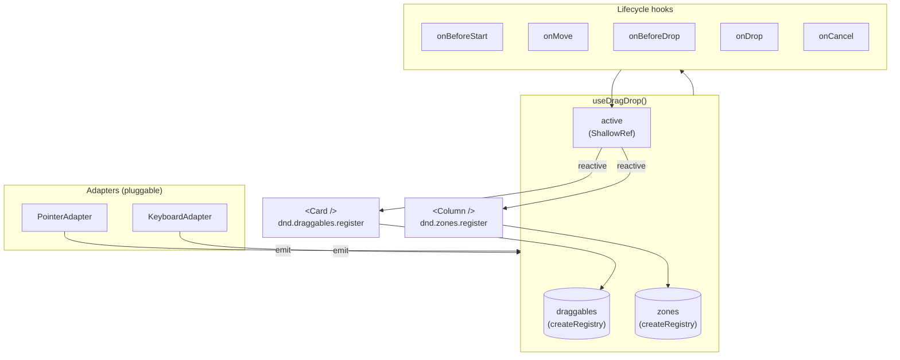

# useDragDrop

<DocsPageFeatures :frontmatter />

Headless drag-and-drop primitive. Owns two registries — draggables and zones — plus the active-drag state.

## Usage

Call `useDragDrop` once per scope and pass the returned context to children that register draggables or zones. Adapters locate by registered `el`, not `data-draggable`. Keyboard pickup needs the ticket focused — `tabindex="0"`, or [useRovingFocus](/composables/system/use-roving-focus).

Drop the card onto the zone. Pointer, touch, or keyboard (`Tab`, then `Space` / `Enter` to pick up, arrows to nudge, `Space` / `Enter` to drop).

```vue playground collapse no-filename useDragDrop
<script setup lang="ts">
  import { useDragDrop } from '@vuetify/v0'
  import { ref, useTemplateRef } from 'vue'

  const dnd = useDragDrop<{ type: 'card', value: string }>()
  const held = ref(['Card'])
  const dropped = ref<string[]>([])

  const draggable = useTemplateRef<HTMLElement>('draggable')
  const dropzone = useTemplateRef<HTMLElement>('dropzone')

  const ticket = dnd.draggables.register({
    el: draggable,
    type: 'card',
    value: 'Card',
  })

  const zone = dnd.zones.register({
    el: dropzone,
    accept: ['card'],
    orientation: 'vertical',
    onDrop: (drag, position) => {
      held.value = held.value.filter(v => v !== drag.value)
      dropped.value.splice(position.index ?? 0, 0, drag.value)
    },
  })
</script>

<template>
  <div class="flex flex-wrap gap-4">
    <div
      v-if="held.length"
      ref="draggable"
      aria-roledescription="draggable"
      class="touch-none cursor-grab select-none px-3 py-2 rounded bg-primary text-on-primary data-[dragging]:cursor-grabbing data-[dragging]:opacity-50"
      data-draggable
      :data-dragging="ticket.isDragging.value || undefined"
      tabindex="0"
    >
      Card
    </div>

    <div
      ref="dropzone"
      class="min-h-12 min-w-32 px-3 py-2 rounded border border-divider data-[accepts]:border-primary data-[accepts]:bg-primary/10"
      :data-accepts="(zone.isOver.value && zone.willAccept.value) || undefined"
      data-dropzone
      :data-over="zone.isOver.value || undefined"
    >
      {{ dropped[0] ?? 'Drop zone' }}
    </div>
  </div>
</template>
```

## Adapters

Adapters are pluggable input layers: an adapter observes the DOM (or any other input source) and emits the four lifecycle events the factory consumes. Default adapters are installed automatically.

| Adapter | Import | Description |
|---|---|---|
| `PointerAdapter` | `@vuetify/v0` | Pointer Events for mouse, touch, and pen (default) |
| `KeyboardAdapter` | `@vuetify/v0` | Keyboard activation (default) |
| `DragDropAdapter` | `@vuetify/v0` | Abstract base class for custom adapters — see [Custom adapters](#custom-adapters) |

`locate()` walks ancestors of the event target until it finds a ticket whose `el` matches. It does not read `data-draggable`.

### PointerAdapter

Pointer Events for mouse, touch, and pen. Installed by default. You do not need a separate touch adapter.

| Option | Type | Default | Description |
|---|---|---|---|
| `threshold` | `number` | `0` | Drag-activation distance in px. Set non-zero to require a minimum movement before the drag starts — useful for distinguishing drags from clicks. |

```ts
import { useDragDrop, PointerAdapter } from '@vuetify/v0'

const dnd = useDragDrop({ adapters: [new PointerAdapter({ threshold: 8 })] })
```

### KeyboardAdapter

Keyboard activation: `Space` / `Enter` to pick up and drop, arrow keys to nudge, `Escape` to cancel. Installed by default.

| Option | Type | Default | Description |
|---|---|---|---|
| `activate` | `string[]` | `[' ', 'Enter']` | Keys that pick up an idle draggable and drop the active one. |
| `step` | `number` | `16` | Pixel step per arrow-key press. |

```ts
import { useDragDrop, KeyboardAdapter } from '@vuetify/v0'

const dnd = useDragDrop({ adapters: [new KeyboardAdapter({ step: 32 })] })
```

### Replacing the defaults

To use only one adapter, pass it explicitly. The default array is replaced entirely:

```ts
import { useDragDrop, PointerAdapter } from '@vuetify/v0'

// Pointer only — keyboard disabled.
const dnd = useDragDrop({ adapters: [new PointerAdapter()] })
```

To extend instead of replace, list the defaults alongside your custom adapter:

```ts
import { useDragDrop, PointerAdapter, KeyboardAdapter } from '@vuetify/v0'
import { GamepadAdapter } from './gamepad-adapter'

useDragDrop({
  adapters: [new PointerAdapter(), new KeyboardAdapter(), new GamepadAdapter()],
})
```

`adapters: []` disables both defaults entirely — useful for server-driven or test scenarios.

### Custom adapters

Extend the abstract `DragDropAdapter` base for shared `cleanup` + `dispose()` lifecycle and the `locate()` DOM-walk helper:

```ts
import { DragDropAdapter } from '@vuetify/v0'
import type { DragDropAdapterContext, DragType } from '@vuetify/v0'

class GamepadAdapter<Z extends DragType = DragType> extends DragDropAdapter<Z> {
  setup (context: DragDropAdapterContext<Z>): void {
    // observe input, then call:
    //   context.emit.start(source, origin, 'gamepad')
    //   context.emit.move(point)
    //   context.emit.drop()
    //   context.emit.cancel()
    this.cleanup = () => { /* tear down listeners */ }
  }
}
```

`context.emit` exposes `start(source, origin, via)`, `move(point)`, `drop()`, and `cancel()` — call these as input arrives. Adapters declare their own `via` value (typed as `DragVia`) so consumers reading `active.value.via` can distinguish the input source. `DragVia` is `Extensible<'pointer' | 'keyboard'>` — additional modalities (e.g. `'gamepad'`) flow through without type-level coordination.

## Architecture

The factory owns four pieces of state (`draggables`, `zones`, `active`, `isDragging`) plus a public `cancel()` action, and three extension points (adapters, plugins, lifecycle hooks). Pointer and keyboard adapters observe the DOM and emit a four-call lifecycle (`start`, `move`, `drop`, `cancel`); the factory pipes those through per-ticket and global hooks before mutating `active`.


```mermaid "useDragDrop architecture"
flowchart TD
  subgraph factory["useDragDrop()"]
    direction TB
    draggables[("draggables<br/>(createRegistry)")]
    zones[("zones<br/>(createRegistry)")]
    active["active<br/>(ShallowRef)"]
  end

  subgraph adapters["Adapters (pluggable)"]
    pointer["PointerAdapter"]
    keyboard["KeyboardAdapter"]
  end

  subgraph hooks["Lifecycle hooks"]
    direction TB
    onBeforeStart
    onMove
    onBeforeDrop
    onDrop
    onCancel
  end

  child1["&lt;Card /&gt;<br/>dnd.draggables.register"] --> draggables
  child2["&lt;Column /&gt;<br/>dnd.zones.register"] --> zones

  pointer -->|emit| factory
  keyboard -->|emit| factory
  factory --> hooks
  hooks --> active

  active -->|reactive| child1
  active -->|reactive| child2
```

## Options

| Option | Type | Default | Description |
|---|---|---|---|
| `adapters` | `DragDropAdapter<Z>[]` | `[PointerAdapter, KeyboardAdapter]` | Replaces the default adapter array when provided. `[]` disables both. |
| `plugins` | `DragDropPlugin<Z>[]` | `[]` | Install-time observers. Each plugin receives the public context and may return a disposer. No plugins ship in v1 — you write them. |
| `onBeforeStart` | `(drag) => boolean \| void` | — | Return `false` to veto the start. Runs while `active` is still `null`; read the `drag` argument. |
| `onMove` | `(drag) => void` | — | Fires on every move **while `active` is set**. |
| `onBeforeDrop` | `(drag, position) => boolean \| void` | — | Return `false` to veto the drop (`reason: 'reject'`). Runs while `active` is still set. |
| `onDrop` | `(drag, position) => void` | — | Fires **after** `active` is cleared to `null`. Read the `drag` argument, not the ref. |
| `onCancel` | `(drag, reason) => void` | — | `reason` is `'cancel'` (Escape, `dnd.cancel()`) or `'reject'` (drop veto). Fires after `active` is cleared. |

Per-ticket hooks (`onBeforeStart`, `onMove`, `onCancel` on a draggable; `onEnter`, `onLeave`, `onBeforeDrop`, `onDrop` on a zone) have the same signatures and the same `active` timing as the matching global option. `disabled?: MaybeRefOrGetter<boolean>` on either registration skips pointer/keyboard start (draggable) or hit-testing (zone).

## Reactivity

### Reactive fields

Every consumer-facing state field is a reactive ref <AppSuccessIcon />. Reads in templates need `.value`.

| Field | Shape | Updates when |
|---|---|---|
| `dnd.active` | `Readonly<ShallowRef<ActiveDrag<Z> \| null>>` | A drag starts, moves, drops, or cancels |
| `dnd.isDragging` | `Readonly<Ref<boolean>>` | `active` becomes non-null / null |
| `ticket.isDragging` | `Readonly<Ref<boolean>>` | This specific ticket is the active drag |
| `ticket.el` | `Readonly<Ref<HTMLElement \| null>>` | Mounts / unmounts (registry element-ref pattern) |
| `zone.isOver` | `Readonly<Ref<boolean>>` | The active drag's `over` field equals this zone's id |
| `zone.willAccept` | `Readonly<Ref<boolean>>` | An active drag matches this zone's `accept` policy |
| `zone.indicator` | `Readonly<Ref<DropIndicator \| null>>` | While over an oriented zone, computes the index/edge/rect of the resolved drop slot. `null` over an unoriented or empty zone — and over the two slots flanking the dragged element's own position in its home zone, which are stays, not moves |
| `zone.el` | `Readonly<Ref<HTMLElement \| null>>` | Mounts / unmounts (registry element-ref pattern) |

### Active drag

`dnd.active.value` is `null` when idle. While set, the object is:

| Field | Shape | Notes |
|---|---|---|
| `id` | `ID` | Registry ticket id. Auto-generated unless you pass `id` to `register`. Not your payload id. |
| `type` / `value` | `Z['type']` / `Z['value']` | Discriminated payload. Narrow on `type` to narrow `value`. |
| `origin` | `{ x, y }` | Pointer (or keyboard start point) at pickup |
| `current` | `{ x, y }` | Latest point |
| `delta` | `{ x, y }` | `current - origin` |
| `over` | `ID \| null` | Zone id under the point, or `null` |
| `willAccept` | `boolean` | Whether that zone's `accept` matches this drag |
| `via` | `DragVia` | `'pointer'`, `'keyboard'`, or an adapter-declared extension. Read this to branch keyboard-only behaviors like focus restoration. |

Indicator rects are cached per zone; `getBoundingClientRect` runs only when the zone resizes or its children mount/unmount, not on each pointer move. The index is measured against **every element child** of the zone `el` (`zoneEl.children`) — headers, spacers, and an in-zone indicator all count as slots. Keep the indicator as a sibling of the zone, not a child.

### Methods

| Method | Purpose |
|---|---|
| `dnd.draggables.register(input)` | Register a draggable. Requires `el`, `type`, and `value`. Returns a ticket with `isDragging` and `unregister()`. |
| `dnd.zones.register(input)` | Register a drop zone. Requires `el`. Returns a ticket with `isOver`, `willAccept`, `indicator`, and `unregister()`. |
| `ticket.unregister()` | Drop a ticket from its registry. Child components that register must unregister on unmount — the factory only disposes remaining tickets when its own scope tears down. Unregistering the active draggable cancels the drag. |
| `dnd.cancel()` | Programmatically cancel the active drag. Fires `onLeave` on the over-zone, then per-draggable `onCancel`, then global `onCancel`, with `reason: 'cancel'`. No-op when no drag is active. |

### DOM attributes

The composable does not produce attribute objects — consumers wire data attributes themselves so the design-system layer can choose its own keys. Adapters never read these; they locate by registered `el`. The canonical wiring is:

**Draggable element:**
- `data-draggable` (always)
- `aria-roledescription="draggable"` (always)
- `data-dragging` toggled while `ticket.isDragging.value` is true
- `tabindex="0"` (or a roving tabindex) so `KeyboardAdapter` can find the focused ticket
- `touch-action: none` (CSS or `style="touch-action: none"`) so the browser doesn't pan/zoom on pointer drag

**Drop zone element:**
- `data-dropzone` (always)
- `data-over` toggled while `zone.isOver.value` is true
- `data-accepts` toggled while both `zone.isOver.value && zone.willAccept.value` are true

## Examples

::: gn-example collapse
/composables/use-drag-drop/DragItem.vue 1
/composables/use-drag-drop/DropList.vue 2
/composables/use-drag-drop/basic.vue 3

### Basic two-list drag

Pick up an item with the pointer or keyboard (`Space` / `Enter`) and drop it in either list. The example splits the surface across three files to mirror how a real consumer would compose the primitive: a `DragItem` that registers itself as a draggable, a `DropList` that registers itself as a zone, paints `zone.indicator` as a sibling bar, and renders draggables, and a `basic` entry that wires the lists together and owns the data.

The zones declare `orientation: 'vertical'` to opt into list-style index resolution — the `onDrop` callback receives `position.index` against the **pre-move** child list. Same-list downward moves subtract 1 after removing the source so the splice lands in the intended slot; cross-list drops use the index as-is. While a drag is active the wrapper toggles `cursor-grabbing`, each zone shows a primary-tinted ring when it would accept the drag, and a 2px bar marks the resolved slot. The bar lives *outside* the zone `el` so it is not counted as a child slot.

Reach for this shape when you want a sortable list with cross-container moves and headless control over visual affordances. For a single-list reorder driven by [createSortable](/composables/data/create-sortable) instead of a plain array, see that page's drag-and-drop example. For a two-level board, compose with [createKanban](/composables/data/create-kanban). For more drag types in the same scope (e.g. items *and* their containers), widen the discriminated union — the type narrowing on `drag.type` carries the corresponding `drag.value` through.

This example uses `tabindex="0"` on every item so keyboard pickup works without extra wiring. Production lists usually add [useRovingFocus](/composables/system/use-roving-focus) so each zone is one tab stop — see [Accessibility](#accessibility). Share the `dnd` context with Vue `provide` / `inject` when prop-threading gets noisy; there is no first-class drag-drop trinity.

| File | Role |
|------|------|
| `DragItem.vue` | Receives the shared `dnd` context as a prop and registers itself as a draggable via `dnd.draggables.register({ el, type, value })` |
| `DropList.vue` | Receives the shared `dnd` context as a prop, registers itself as a zone, renders `zone.indicator` as a sibling, and emits `move` events upward |
| `basic.vue` | Owns the lists, calls `useDragDrop()` to create the context, threads it to children, and applies the pre-move index adjustment on same-list reorder |
:::

## Recipes

### Multiple drag types in one scope

Default to a single type per scope (`useDragDrop<{ type: 'card', value: Card }>()`) — every draggable and zone shares one shape, every callback narrows trivially. Widen `Z` to a discriminated union only when you need cross-type interactions in the same scope (e.g. a kanban where cards drop on columns *and* columns drop on a column-row); a separate `useDragDrop()` per scope is cleaner whenever the types don't meet.

When you do widen, type narrowing on `drag.type` carries the corresponding `drag.value` through, so each variant keeps its payload shape across `onDrop` and `accept`.

```ts
type KanbanTypes =
  | { type: 'card', value: Card }
  | { type: 'column', value: Column }

const dnd = useDragDrop<KanbanTypes>()

// Card zone accepts only cards
dnd.zones.register({ el, accept: ['card'], onDrop: (drag, position) => {
  // drag.type narrows to 'card', drag.value to Card
}})

// Column-row zone accepts only columns
dnd.zones.register({ el, accept: ['column'], orientation: 'horizontal' })
```

### Vetoing drops

Either layer can veto. Per-zone vetoes route the drag through the cancel chain (`onLeave` on the active zone → `onCancel` on the source draggable → global `onCancel`) so consumers can roll back optimistic UI without subscribing to a separate "drop failed" event. Both `onCancel` callbacks (per-draggable and global) receive a second argument `reason: 'cancel' | 'reject'` — `'reject'` when the cancel was triggered by a drop veto, `'cancel'` for user-initiated aborts (Escape, programmatic `dnd.cancel()`).

> [!TIP]
> `onDrop`, `onCancel`, and `onLeave`-during-cancel fire AFTER `dnd.active.value` is cleared to `null` — read the `drag` argument, not the reactive ref. `onMove`, `onEnter`, `onLeave` during a drag, `onBeforeStart`, and `onBeforeDrop` run while `active` still holds the draft (or, for `onBeforeStart`, before it is written). The cleared-before-notify ordering on drop/cancel prevents re-entrance loops when a hook calls `dnd.cancel()` or unregisters a ticket.

`accept` (function form) must return synchronously — predicates that return a Promise / thenable are rejected with a console warning. Wrap async work in `onBeforeDrop` instead, returning `false` to veto.

```ts
dnd.zones.register({
  el,
  accept: ['card'],
  onBeforeDrop: (drag) => column.cards.length < column.wipLimit,
})

// Per-draggable cancel can react to the reason:
dnd.draggables.register({
  el,
  type: 'card',
  value: card,
  onCancel: (drag, reason) => {
    if (reason === 'reject') notify()
  },
})
```

### Installing a plugin

A plugin is `(context) => disposer`. Nothing named `scroll()` or `flip()` is exported — write autoscroll or FLIP yourself against `active` and the registry event bus.

```ts
import { useDragDrop } from '@vuetify/v0'
import type { DragDropPlugin } from '@vuetify/v0'

const logDrops: DragDropPlugin = context => {
  function onRegister (ticket: { id: string }) {
    console.log('zone', ticket.id)
  }
  context.zones.on('register:ticket', onRegister)
  return () => context.zones.off('register:ticket', onRegister)
}

const dnd = useDragDrop({ plugins: [logDrops] })
```

## Accessibility

WAI-ARIA does not standardize a kanban or "drag list" pattern. The primitive follows the **list-of-lists** convention used by Pragmatic DnD, dnd-kit, and headless-ui:

- Draggable tickets carry `aria-roledescription="draggable"` only — no `aria-grabbed` or `aria-dropeffect`, both deprecated in ARIA 1.1.
- Wrap each drop zone in a container with `role="list"` and the draggable list items with `role="listitem"`.
- Each zone should wire a roving tabindex via [useRovingFocus](/composables/system/use-roving-focus) — one focus stop per zone, arrow keys move between items in the same zone **while idle**, Tab moves to the next zone. The two-list example uses `tabindex="0"` on every item instead, so every card is a tab stop.
- Provide a single live region per scope (`<div role="status" aria-live="polite">`) and watch `active` to announce moves ("Card moved to Done, position 2 of 5"). The live region is the consumer's responsibility — the headless contract excludes user-facing strings (PHILOSOPHY §5.5).

Keyboard maps split on whether a drag is active:

| State | `Space` / `Enter` | Arrow keys | `Escape` |
|---|---|---|---|
| Idle | Pick up the focused ticket | Roving focus between items (your `useRovingFocus`, not the adapter) | — |
| Dragging | Drop | Nudge the drag point by `step` px (default 16). `KeyboardAdapter` calls `preventDefault`, so roving does not see these keys. | Cancel |

### Post-drop focus

After a successful keyboard drop, the moved element is typically replaced by the consumer's `onDrop` handler — focus then lands on `<body>`, breaking keyboard flow. Restore it explicitly: in `onDrop`, after mutating the source list, call `nextTick` and refocus the new element by id (or rely on `useRovingFocus` to refocus the active item). Branch on `drag.via === 'keyboard'` (the first argument to `onDrop`) so the restoration only runs for keyboard drags, not pointer drags. `dnd.active.value` is already `null` inside `onDrop` / `onCancel` — read the `drag` argument instead.

## FAQ

::: faq

??? Why not use HTML5 drag-and-drop?

Native HTML5 DnD has terrible mobile support, an ugly default ghost element you can't customize cross-browser, no programmatic activation distance, and inconsistent event semantics across input devices. `PointerAdapter` uses Pointer Events instead — uniform mouse, touch, and pen handling, no default ghost (you render whatever you want), and full control over activation thresholds. Plug HTML5 in as a custom adapter if you need cross-window drops or OS file-drag integration; the headless contract doesn't lock it out.

??? When does `position.index` get set?

Only when the over-zone declares `orientation`. Without orientation, the zone is opaque — drops fire with `position.pointer` only. With orientation, the composable measures **every element child** of the zone `el` (`zoneEl.children`) and resolves an index against that list, not against registered draggables. Empty oriented zones default `index` to `0`. The indicator is `null` over the two slots flanking the dragged element's own position in its home zone — dropping there changes nothing, so no slot is proposed and the drop resolves `index` to the element's current position.

`position.index` is computed against the **pre-move** child list. If your `onDrop` removes the source first and then splices at that index, same-list downward moves overshoot by one — use `to > from ? to - 1 : to`. Cross-list drops do not need the `-1`; the destination's children never included the source. The two-list example and [createSortable](/composables/data/create-sortable)'s DnD demo both apply that adjustment.

??? How do I pick the right `Z` parameter?

`Z` is a discriminated union of every drag type the scope handles. Default to one variant. Widen only when two types actually interact in the same scope — otherwise a second `useDragDrop()` is cleaner. The types are distributive: narrowing `drag.type` narrows `drag.value`. `ActiveDrag.id` is the registry ticket id (pass `id` to `register` if you need it stable); your payload lives on `value`.

```ts
// One type — every callback already knows the shape
const cards = useDragDrop<{ type: 'card', value: Card }>()

// Two types that meet — narrow on drag.type
type Kanban =
  | { type: 'card', value: Card }
  | { type: 'column', value: Column }

const dnd = useDragDrop<Kanban>()

dnd.zones.register({
  el,
  accept: ['card'],
  onDrop: drag => {
    drag.value // Card
  },
})
```

??? Can the same DOM element be both a draggable and a zone?

Yes. Two registrations on the same element work because they live in different registries. The kanban use case relies on this: each column registers as a draggable (`type: 'column'`) for column-reordering and as a zone (`accept: ['card']`) for card drops.

??? What if I need autoscroll, FLIP animations, or multi-select drag?

These don't ship in v1 to keep the surface small. The plugin slot is the extension point — a plugin is `(context) => disposer`. Write autoscroll or FLIP against `active` and the registry event bus; nothing named `scroll()` or `flip()` is exported. See [Installing a plugin](#installing-a-plugin). Multi-select drag is best composed with [createSelection](/composables/selection/create-selection) so the selected set is its own first-class concept.

:::

<DocsApi />
