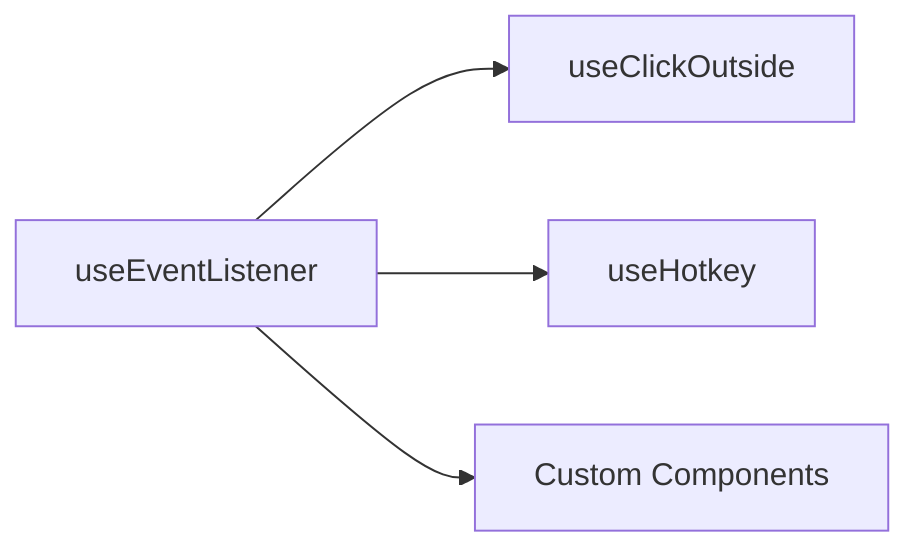

# useEventListener

A composable for handling DOM events with automatic cleanup on component unmount.

<DocsPageFeatures :frontmatter />

## Usage

The `useEventListener` composable attaches event listeners to DOM elements (Window, Document, or HTMLElement) with automatic cleanup when the component is unmounted. It supports reactive targets, multiple events, and multiple handlers.

```vue UseEventListener
<script setup lang="ts">
  import { useEventListener, useWindowEventListener, useDocumentEventListener } from '@vuetify/v0'
  import { ref, useTemplateRef } from 'vue'

  // Track window dimensions
  const windowSize = ref({ width: window.innerWidth, height: window.innerHeight })
  useWindowEventListener('resize', () => {
    windowSize.value = {
      width: window.innerWidth,
      height: window.innerHeight
    }
  })

  // Handle keyboard shortcuts
  useDocumentEventListener('keydown', (e) => {
    if (e.ctrlKey && e.key === 's') {
      e.preventDefault()
      console.log('Save shortcut triggered')
    }
  })

  // Element-specific listener
  const button = useTemplateRef('button')
  useEventListener(button, 'click', () => {
    console.log('Button clicked!')
  })
</script>

<template>
  <div>
    <p>Window: {{ windowSize.width }}x{{ windowSize.height }}</p>
    <button ref="button">Click me</button>
  </div>
</template>
```

## Architecture

`useEventListener` is the foundational event composable that others build upon:



<DocsApi />
