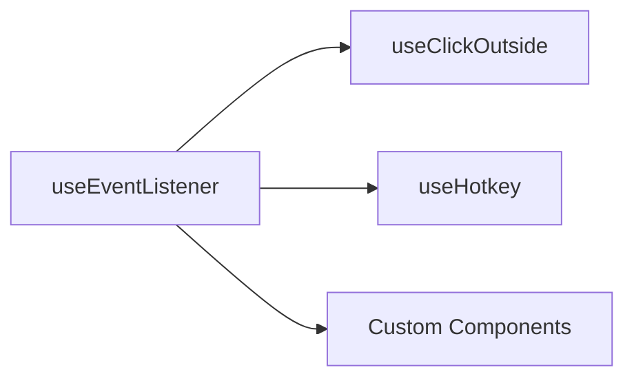

# useEventListener

A composable for handling DOM events with automatic cleanup on component unmount.

<DocsPageFeatures :frontmatter />

## Usage

The `useEventListener` composable attaches event listeners to DOM elements (Window, Document, or HTMLElement) with automatic cleanup when the component is unmounted. It supports reactive targets, multiple events, and multiple handlers.

```vue UseEventListener
<script setup lang="ts">
  import { useEventListener, useWindowEventListener, useDocumentEventListener } from '@vuetify/v0'
  import { ref, useTemplateRef } from 'vue'

  // Track window dimensions
  const windowSize = ref({ width: window.innerWidth, height: window.innerHeight })
  useWindowEventListener('resize', () => {
    windowSize.value = {
      width: window.innerWidth,
      height: window.innerHeight
    }
  })

  // Handle keyboard shortcuts
  useDocumentEventListener('keydown', (e) => {
    if (e.ctrlKey && e.key === 's') {
      e.preventDefault()
      console.log('Save shortcut triggered')
    }
  })

  // Element-specific listener
  const button = useTemplateRef('button')
  useEventListener(button, 'click', () => {
    console.log('Button clicked!')
  })
</script>

<template>
  <div>
    <p>Window: {{ windowSize.width }}x{{ windowSize.height }}</p>
    <button ref="button">Click me</button>
  </div>
</template>
```

## Architecture

`useEventListener` is the foundational event composable that others build upon:



<DocsApi />

## Lifecycle & Cleanup

### Automatic Cleanup

`useEventListener` automatically removes event listeners when:
- The component unmounts
- The Vue effect scope is disposed
- You manually call the returned `stop()` function

**Implementation:**
```ts
// Uses Vue's onScopeDispose internally
onScopeDispose(stop, true)
```

This ensures no memory leaks even if you forget to manually cleanup.

### Manual Cleanup

```ts
const stop = useEventListener(element, 'click', handler)

// Later, manually cleanup if needed
stop()
```

### Reactive Listeners

`useEventListener` supports **reactive** targets, events, and listeners. When any reactive dependency changes, listeners are automatically re-registered:

```ts
const target = ref<HTMLElement | null>(null)
const eventName = ref<string>('click')

// Automatically updates when refs change
useEventListener(target, eventName, () => {
  console.log('Event fired!')
})

// Later - listener automatically re-registers with new event
eventName.value = 'dblclick'
```

**Implementation Details:**

Uses Vue's `watch` with specific options:

```ts
watch(
  () => [toValue(target), toValue(event), unref(listener), toValue(options)],
  handler,
  { immediate: true, flush: 'post' }
)
```

- **`immediate: true`** - Registers listeners immediately on mount
- **`flush: 'post'`** - Waits for DOM updates before registering (important for template refs)
- **`watch` vs `watchEffect`** - Explicit dependencies for better performance

### Template Refs

Works seamlessly with Vue's `useTemplateRef`:

```vue UseEventListener
<script setup lang="ts">
  import { useTemplateRef } from 'vue'
  import { useEventListener } from '@vuetify/v0'

  const button = useTemplateRef('btn')

  // Waits for template ref to be available (flush: 'post')
  useEventListener(button, 'click', () => {
    console.log('Button clicked')
  })
</script>

<template>
  <button ref="btn">Click me</button>
</template>
```

### Usage Outside Components

If you call `useEventListener` outside a component setup function:
- **No automatic cleanup** (no active effect scope)
- **Must manually call** the returned `stop()` function
- Consider wrapping in `effectScope()` for proper cleanup

```ts
import { effectScope } from 'vue'

const scope = effectScope()

scope.run(() => {
  useEventListener(window, 'resize', handler)
})

// Later, dispose the entire scope
scope.stop()
```

### SSR Considerations

Event listeners are only attached when code runs in the browser. The composable checks for browser environment internally, so no special handling is needed for SSR.

### Multiple Events & Handlers

You can listen to multiple events or use multiple handlers:

```ts
// Multiple events
useEventListener(element, ['click', 'dblclick'], handler)

// Multiple handlers
useEventListener(element, 'click', [handler1, handler2])

// Both
useEventListener(element, ['click', 'dblclick'], [handler1, handler2])
```

All combinations are automatically managed and cleaned up together.

