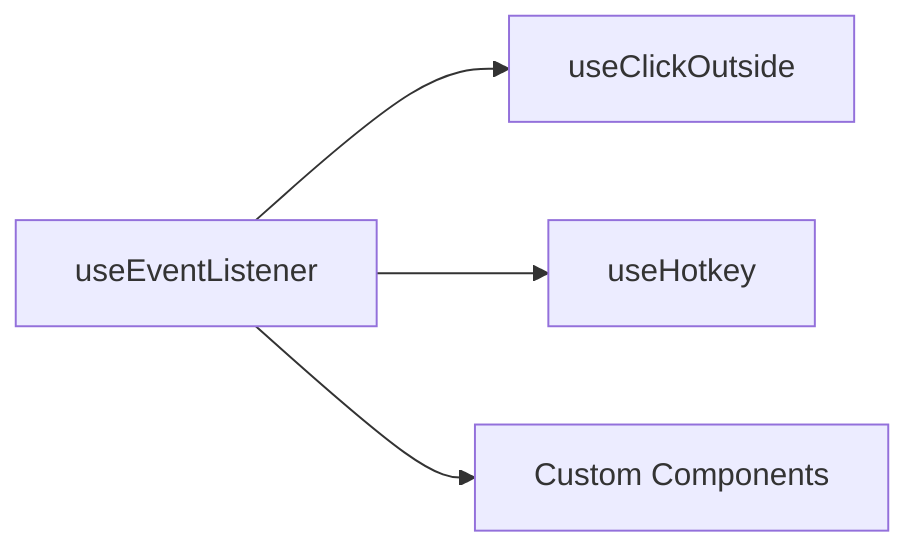

# useEventListener

A composable for handling DOM events with automatic cleanup on component unmount.

<DocsPageFeatures :frontmatter />

## Usage

The `useEventListener` composable attaches event listeners to DOM elements (Window, Document, or HTMLElement) with automatic cleanup when the component is unmounted. It supports reactive targets, multiple events, and multiple handlers.

> [!TIP] Why wrap addEventListener?
> Native `addEventListener` has no awareness of Vue's `effectScope` lifecycle — listeners you add won't be removed when the scope is disposed. `useEventListener` integrates `onScopeDispose` for automatic cleanup, supports reactive targets and events that re-register on change, and provides type-safe overloads for Window, Document, and HTMLElement targets.

```vue collapse no-filename UseEventListener
<script setup lang="ts">
  import { useEventListener, useWindowEventListener, useDocumentEventListener } from '@vuetify/v0'
  import { ref, useTemplateRef } from 'vue'

  // Track window dimensions
  const windowSize = ref({ width: window.innerWidth, height: window.innerHeight })
  useWindowEventListener('resize', () => {
    windowSize.value = {
      width: window.innerWidth,
      height: window.innerHeight
    }
  })

  // Handle keyboard shortcuts
  useDocumentEventListener('keydown', (e) => {
    if (e.ctrlKey && e.key === 's') {
      e.preventDefault()
      console.log('Save shortcut triggered')
    }
  })

  // Element-specific listener
  const button = useTemplateRef('button')
  useEventListener(button, 'click', () => {
    console.log('Button clicked!')
  })
</script>

<template>
  <div>
    <p>Window: {{ windowSize.width }}x{{ windowSize.height }}</p>
    <button ref="button">Click me</button>
  </div>
</template>
```

## Architecture

`useEventListener` is the foundational event composable that others build upon:


```mermaid "Event Listener Hierarchy"
flowchart LR
  useEventListener --> useClickOutside
  useEventListener --> useHotkey
  useEventListener --> Components["Custom Components"]
```

## Reactivity

| Property/Method | Reactive | Notes |
| - | :-: | - |
| `target` | <AppSuccessIcon /> | Accepts MaybeRefOrGetter, watched for changes |
| `event` | <AppSuccessIcon /> | Accepts MaybeRefOrGetter, watched for changes |
| `listener` | <AppSuccessIcon /> | Accepts MaybeRef, watched for changes |
| `options` | <AppSuccessIcon /> | Accepts MaybeRefOrGetter, watched for changes |

> [!TIP] Reactive inputs
> All parameters accept reactive values. When any input changes, listeners are automatically re-registered.

> [!TIP] SSR safety
> `useWindowEventListener` and `useDocumentEventListener` are SSR-safe — they check `IN_BROWSER` and return a no-op cleanup on the server. Raw access to `window` or `document` in the listener body (e.g. `window.innerWidth`) is not guarded for you.

## Examples

::: gn-example
/composables/use-event-listener/mouse-tracker

### Mouse Tracker

A bounded tracking area that reports real-time cursor coordinates and click count using three separate `useEventListener` calls on the same element. Moving the mouse fires `mousemove` to update `x` and `y` relative to the element's top-left corner; clicking fires `click` to increment the counter; entering and leaving the area fires a combined `['mouseenter', 'mouseleave']` listener — demonstrating that the second argument accepts both a single event name and an array of names.

The crosshair overlay is drawn with two absolutely-positioned lines that follow the `x`/`y` refs, giving immediate visual feedback for the coordinate values. The element border transitions from `border-divider` to `border-primary` on entry, driven purely by the reactive `inside` flag.

Reach for this pattern over a template-level `@mousemove` when the listener target needs to be dynamic (passed as a ref or computed from props), when you want a single call site for setup and automatic teardown, or when attaching to `window` / `document` targets rather than a specific element. For global keyboard shortcuts, prefer [useHotkey](/composables/system/use-hotkey); for outside-click detection, prefer [useClickOutside](/composables/system/use-click-outside) — both are built on `useEventListener` and cover the most common specializations.

:::

<DocsApi />
