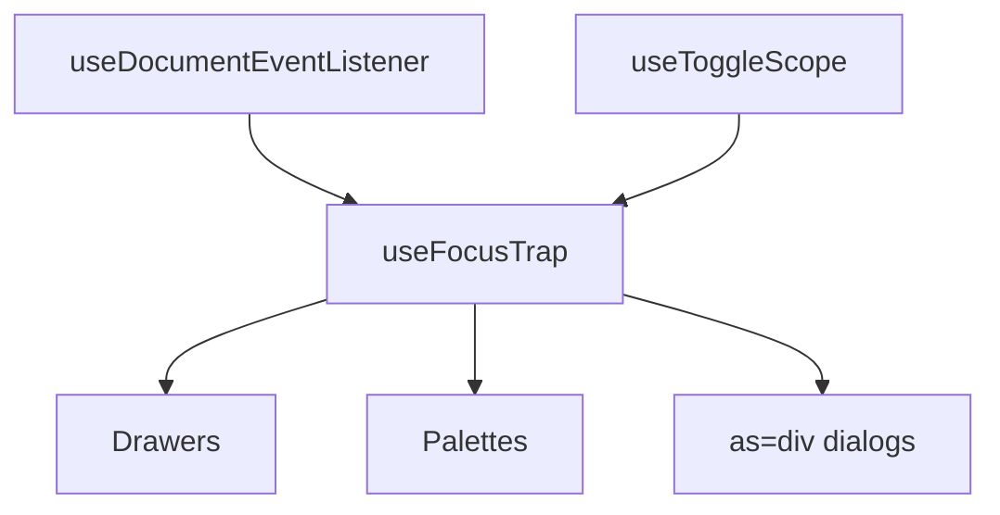

# useFocusTrap

A composable that confines keyboard focus to a root element for as long as the trap is active.

<DocsPageFeatures :frontmatter />

## Usage

A native `<dialog>` opened with `showModal()` is trapped by the browser, so it needs nothing here. Modal overlays that are not a native dialog do: a `Dialog.Content` rendered `as="div"`, a drawer, a command palette. Tooltips and menus typically do not. `useFocusTrap` wraps Tab and Shift+Tab at the first and last tabbable descendant, focuses into the root on activate, and returns focus to the previously focused element on deactivate, unless focus already left the root.

```vue collapse no-filename useFocusTrap
<script setup lang="ts">
  import { useFocusTrap } from '@vuetify/v0'
  import { shallowRef, useTemplateRef } from 'vue'

  const isOpen = shallowRef(false)
  const panel = useTemplateRef<HTMLElement>('panel')

  useFocusTrap(panel, { active: isOpen })
</script>

<template>
  <button @click="isOpen = true">Open</button>

  <div v-if="isOpen" ref="panel" tabindex="-1" aria-label="Trapped panel">
    <input>
    <button @click="isOpen = false">Close</button>
  </div>
</template>
```

## Architecture

`useFocusTrap` composes `useDocumentEventListener` and `useToggleScope`. Each engaged `listen: true` trap binds its own document-level listener; a module-level stack chooses which of those listeners owns Tab and Escape:



The keydown listener is bound to `document` in the capture phase, not to the root. A root-bound listener stops firing the moment focus leaves the subtree — a backdrop click that blurs to `<body>`, or a stray programmatic `focus()` — and the trap is then dead with no way back. Binding at the document means an escaped focus is recovered on the next Tab, and containment survives an inner `stopPropagation()`.

Only the boundaries are intercepted. A Tab press in the middle of the list passes through untouched, so a nested widget keeps full control of its own Tab handling everywhere except the first and last stop.

## Options

| Option | Type | Default | Description |
| - | - | - | - |
| `active` | `MaybeRefOrGetter<boolean>` | `undefined` | Reactive activation source. Omit it to drive the trap imperatively |
| `initial` | `false \| MaybeElementRef` | `undefined` | Where focus lands on activate. `false` skips autofocus; an element focuses that node instead of the first tabbable one. If the node cannot take focus, the first tabbable descendant (or the root) is used instead |
| `restore` | `boolean` | `true` | Return focus to the previously focused element on deactivate. Skipped when focus already sits on an outside control; a blur to `<body>` still restores |
| `listen` | `boolean` | `true` | Bind the capture-phase document listener. Set `false` to drive `onKeydown` yourself — a `listen: false` trap is not pushed onto the nest stack |
| `onEscape` | `(event: KeyboardEvent) => void` | `undefined` | Called on Escape while this trap is the last connected trap that has `onEscape` and owns focus. Opt-in — the trap never closes anything itself |

```ts
import { useFocusTrap } from '@vuetify/v0'
import { shallowRef, useTemplateRef } from 'vue'

const isOpen = shallowRef(false)
const panel = useTemplateRef<HTMLElement>('panel')
const cancel = useTemplateRef<HTMLElement>('cancel')

// Destructive dialogs should land on the safe action
useFocusTrap(panel, { active: isOpen, initial: cancel })
```

## Reactivity

| Property/Method | Reactive | Notes |
| - | :-: | - |
| `isActive` | <AppSuccessIcon /> | ShallowRef, readonly. The trap's state — `active` is only its source |
| `activate()` | - | Captures the return-focus target and engages containment |
| `deactivate()` | - | Releases containment and returns focus |
| `onKeydown()` | - | The handler. Bound on `document` unless `listen` is `false` |

## Examples

::: gn-example
/composables/use-focus-trap/basic

### Panel with Trapped Focus

A panel holding two text inputs and two buttons. Opening it moves focus to the first input; Tab from the Confirm button wraps back to that input rather than continuing into the page, and Shift+Tab from the first input wraps to Confirm. Escape and Cancel both close the panel, and focus returns to the trigger that opened it.

Reach for this whenever a modal overlay is not a native `<dialog>`. Pair it with `useStack` for z-index and dismissal ordering, and with `useClickOutside` for pointer dismissal — the trap deliberately owns focus order and nothing else.

:::

## Recipes

### Escape Only for the Top Overlay

Nested *traps* already resolve to the last *connected* trap that has `onEscape`. Nested *overlays* still need a stacking guard when dismissal policy is overlay-stack, not trap-stack — `useStack` tracks which overlay is topmost:

```ts
import { useFocusTrap, useStack } from '@vuetify/v0'
import { shallowRef, useTemplateRef } from 'vue'

const isOpen = shallowRef(false)
const panel = useTemplateRef<HTMLElement>('panel')
const stack = useStack()
const ticket = stack.register({ onDismiss: () => (isOpen.value = false) })

useFocusTrap(panel, {
  active: isOpen,
  onEscape: event => {
    if (!ticket.globalTop.value) return
    event.preventDefault()
    isOpen.value = false
  },
})
```

### Releasing Tab to an Inner Widget

A code editor or grid inside the trap needs Tab for itself. Because only the boundaries are intercepted, this works without configuration — Tab presses between the first and last stop are never touched.

A widget that sits *at* a boundary cannot opt out, though. The trap listens on `document` in the capture phase, so it has already wrapped focus by the time a handler inside the root runs; that handler's `preventDefault()` comes too late. Two ways out:

- **Keep the widget off the boundary.** A tabbable element after it — a footer button, or a `tabindex="0"` sentinel — makes the widget interior, and its Tab handling is then untouched.
- **Own the listener.** Pass `listen: false` and call `onKeydown` yourself — otherwise the document capture listener has already wrapped.

```ts
import { useFocusTrap } from '@vuetify/v0'
import { shallowRef, useTemplateRef } from 'vue'

const isOpen = shallowRef(false)
const panel = useTemplateRef<HTMLElement>('panel')
const editorHasFocus = shallowRef(false)
const trap = useFocusTrap(panel, { active: isOpen, listen: false })

function onPanelKeydown (event: KeyboardEvent) {
  if (editorHasFocus.value && event.key === 'Tab') return

  trap.onKeydown(event)
}
```

## Accessibility

A focus trap is one half of a modal contract. The trap manages focus order; you still supply the rest:

| Responsibility | Where it lives |
| - | - |
| `role="dialog"` and `aria-modal="true"` | Your markup, or `Dialog.Content` |
| An accessible name | `aria-label`, or `Dialog.Title` with `aria-labelledby` |
| Escape to dismiss | `onEscape`, or the stack ticket's `onDismiss` |
| Pointer dismissal | `useClickOutside` |
| Inerting the rest of the page | Native `<dialog>`, or the `inert` attribute |
| `tabindex="-1"` on the root | Your markup |

`aria-disabled="true"` controls are treated as tabbable, per [APG](https://www.w3.org/WAI/ARIA/apg/practices/keyboard-interface/): an aria-disabled control stays in the tab order, and skipping it would let the browser walk past the computed boundary and out of the trap. This is a deliberate divergence from roving-focus composables like [useRovingFocus](/composables/system/use-roving-focus), which must skip disabled items.

The boundary is computed the way the browser computes tab order, so a radio group counts as **one** stop — the checked radio if it is otherwise tabbable, otherwise the first otherwise-tabbable member. Disabled, hidden, or inert members are not stops and do not hide the rest of the group. Grouping follows the HTML rule of same `name` plus same form owner, so two forms on a page keep independent groups.

Positive `tabindex` values are the one case the trap declines to model: candidates are collected in document order and never re-sorted into their real tab position, so a root containing them can leak at the boundary. Use `0` and `-1` only.

## FAQ

::: faq

??? Do I need this for a `Dialog` component?

Not with the default `as="dialog"`. `Dialog.Content` calls `showModal()`, and the browser supplies the top layer, focus trapping, page inerting, and Escape. You need `useFocusTrap` when you render `as="div"` — that call is optional-chained away, so a `div` host gets none of it.

??? Why does focus not land anywhere when the panel opens?

The root has no tabbable descendants and no `tabindex`. The trap falls back to focusing the root, but an element without a `tabindex` cannot take focus, so the call is a silent no-op. Add `tabindex="-1"` to the root. Containment is unaffected either way — Tab is swallowed before the fallback runs.

??? I called `deactivate()` but the trap will not reopen.

`active` is a *source*, `isActive` is the state. The source's transitions drive the trap; an imperative call writes the state directly and never writes back. So `deactivate()` while `active` still reads `true` stays deactivated until `active` next goes false then true. Drive it from one side or the other, not both.

??? Focus escapes past a control inside a custom element.

Containment pierces open shadow roots, but discovery cannot — `querySelectorAll` does not cross the boundary, so a tab stop inside a descendant's shadow root is invisible to the trap. If it is the *last* stop, Tab leaves. The same applies to `<iframe>` content, which no JavaScript trap can contain.

??? Can two traps be active at once?

Nested ones, yes — the last *connected* activated trap owns Tab, and the last connected trap that has `onEscape` owns Escape. Typical overlay nesting is inward-first (inner activated last), matching APG. An inner Tab-only trap does not eat the outer dialog's Escape.

Two *disjoint* active traps are not supported — each reads the other's focus as outside and they fight over every Tab. Deactivate one first.

:::

<DocsApi />
