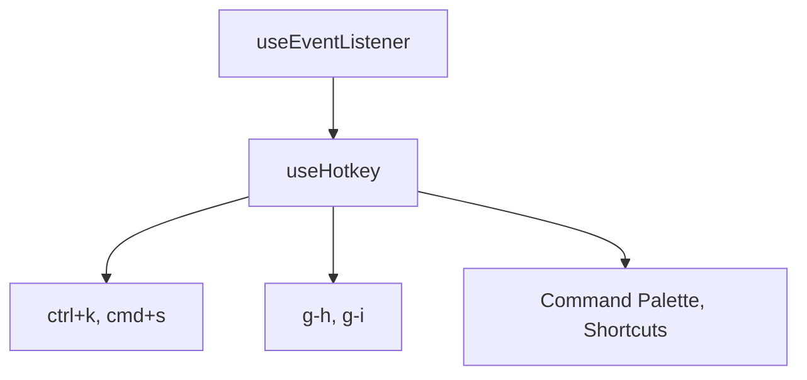

# useHotkey

A composable for handling hotkey combinations and sequences with platform-aware modifiers and automatic cleanup.

<DocsPageFeatures :frontmatter />

## Usage

The `useHotkey` composable registers hotkey handlers on the window with automatic cleanup when the component is unmounted. It supports key combinations (`ctrl+k`), key sequences (`g-h`), and platform-aware modifier mapping.

```vue UseHotkey
<script setup lang="ts">
  import { useHotkey } from '@vuetify/v0'
  import { ref } from 'vue'

  const commandPaletteOpen = ref(false)
  const message = ref('')

  // Simple key combination - Ctrl+K (Cmd+K on Mac)
  useHotkey('ctrl+k', () => {
    commandPaletteOpen.value = true
  })

  // Key sequence (GitHub-style) - press 'g' then 'h'
  useHotkey('g-h', () => {
    message.value = 'Go home!'
  })

  // With multiple modifiers
  useHotkey('ctrl+shift+s', () => {
    message.value = 'Save all!'
  })

  // Allow in inputs with the inputs option
  useHotkey('escape', () => {
    commandPaletteOpen.value = false
  }, { inputs: true })
</script>

<template>
  <div>
    <p>Press Ctrl+K to open command palette</p>
    <p>Press g then h for GitHub-style navigation</p>
    <p v-if="message">{{ message }}</p>
  </div>
</template>
```

## Architecture

`useHotkey` builds on `useEventListener` for keyboard event handling:



<DocsApi />
