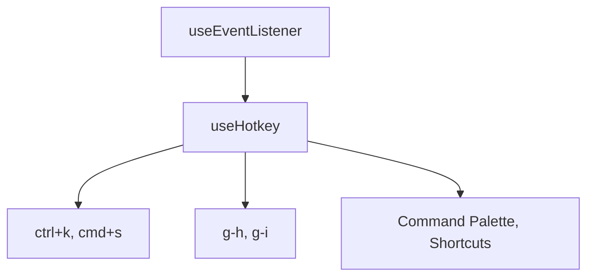

# useHotkey

A composable for handling hotkey combinations and sequences with platform-aware modifiers and automatic cleanup.

<DocsPageFeatures :frontmatter />

## Usage

The `useHotkey` composable registers hotkey handlers on the window with automatic cleanup when the component is unmounted. It supports key combinations (`ctrl+k`), key sequences (`g-h`), and platform-aware modifier mapping.

```vue collapse no-filename UseHotkey
<script setup lang="ts">
  import { useHotkey } from '@vuetify/v0'
  import { ref } from 'vue'

  const commandPaletteOpen = ref(false)
  const message = ref('')

  // Simple key combination - Ctrl+K (Cmd+K on Mac)
  useHotkey('ctrl+k', () => {
    commandPaletteOpen.value = true
  })

  // Key sequence (GitHub-style) - press 'g' then 'h'
  useHotkey('g-h', () => {
    message.value = 'Go home!'
  })

  // With multiple modifiers
  useHotkey('ctrl+shift+s', () => {
    message.value = 'Save all!'
  })

  // Allow in inputs with the inputs option
  useHotkey('escape', () => {
    commandPaletteOpen.value = false
  }, { inputs: true })
</script>

<template>
  <div>
    <p>Press Ctrl+K to open command palette</p>
    <p>Press g then h for GitHub-style navigation</p>
    <p v-if="message">{{ message }}</p>
  </div>
</template>
```

## Architecture

`useHotkey` builds on `useEventListener` for keyboard event handling:


```mermaid "Hotkey Hierarchy"
flowchart TD
  useEventListener --> useHotkey
  useHotkey --> Combinations["ctrl+k, cmd+s"]
  useHotkey --> Sequences["g-h, g-i"]
  useHotkey --> Components["Command Palette, Shortcuts"]
```

## Options

### Key Aliases

Key strings are normalized before matching, so you can use human-friendly names instead of exact `KeyboardEvent.key` values:

| Alias | Canonical |
| - | - |
| `esc` | `escape` |
| `return` | `enter` |
| `del` | `delete` |
| `space`, `spacebar` | ` ` (space character) |
| `up` / `down` / `left` / `right` | `arrowup` / `arrowdown` / `arrowleft` / `arrowright` |
| `control` | `ctrl` |
| `command` | `cmd` |
| `option` | `alt` |
| `plus` | `+` |
| `minus`, `hyphen` | `-` |
| `slash` | `/` |
| `underscore` | `_` |

```ts no-filename
// These are equivalent:
useHotkey('escape', close)
useHotkey('esc', close)

useHotkey('ctrl+plus', zoomIn)   // matches Ctrl ++
useHotkey('cmd+minus', zoomOut)  // matches Cmd +-
```

## Reactivity

| Property/Method | Reactive | Notes |
| - | :-: | - |
| `isActive` | <AppSuccessIcon /> | Computed from cleanup ref |
| `isPaused` | <AppSuccessIcon /> | ShallowRef, readonly |
| `keys` | <AppSuccessIcon /> | Accepts MaybeRefOrGetter, watched for changes |

## Examples

::: gn-example
/composables/use-hotkey/useCommandPalette.ts 1
/composables/use-hotkey/CommandPalette.vue 2
/composables/use-hotkey/command-palette.vue 3

### Command Palette

A searchable command palette driven entirely by `useHotkey`, with the keyboard wiring extracted into a composable. Three kinds of binding work together: a global `cmd+j` combination opens the palette from anywhere; GitHub-style sequences — press `g` then `h`, or `g` then `s` — fire actions without opening it at all; and once the palette is open, per-command combinations (`cmd+l`, `cmd+s`, …) run alongside arrow-key navigation through the filtered list. The composable owns every binding and all the state; the component only renders the `Dialog` surface.

The key composition pattern is [useToggleScope](/composables/system/use-toggle-scope). The scoped bindings — navigation and the per-command shortcuts — are registered only while `isOpen` is `true` and are torn down automatically when the palette closes, so global keys never collide with palette keys and there is no manual cleanup. Those scoped shortcuts pass `{ inputs: true }` so they keep firing while focus is in the search field; by default `useHotkey` skips text inputs. The sequences reset after `sequenceTimeout` if you pause between keystrokes.

Reach for `useHotkey` plus `useToggleScope` whenever a surface needs context-sensitive shortcuts that exist only while it is open — command palettes, modals, sidebars, and feature-specific overlays all share this shape. For one-shot global bindings without scope gating, call `useHotkey` directly. For element-level arrow navigation inside a listbox, reach for [useRovingFocus](/composables/system/use-roving-focus) instead; for the lower-level keyboard plumbing `useHotkey` builds on, see [useEventListener](/composables/system/use-event-listener).

| File | Role |
|------|------|
| `useCommandPalette.ts` | Composable — owns palette state, the command list, and every `useHotkey` binding (global combination, sequences, scoped per-command shortcuts) |
| `CommandPalette.vue` | Reusable component — renders the `Dialog`, the search field, and the filtered command list |
| `command-palette.vue` | Entry — instantiates the composable, shows the last action, and lists the available shortcuts |
:::

<DocsApi />
