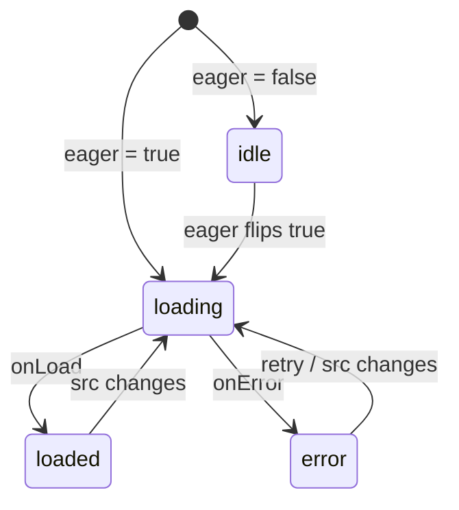
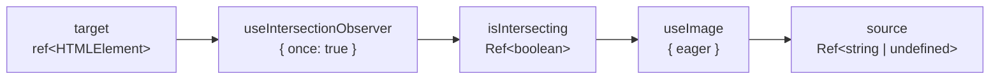

# useImage

Tracks image loading state as a reactive state machine with idle, loading, loaded, and error states.

<DocsPageFeatures :frontmatter />

## Usage

The `useImage` composable owns the loading lifecycle for a single image source.
Bind the returned `source`, `onLoad`, and `onError` to a plain image element.

```vue collapse
<script setup lang="ts">
  import { toRef } from 'vue'
  import { useImage } from '@vuetify/v0'

  const props = defineProps<{ src: string, alt: string }>()

  const { source, isLoaded, isError, onLoad, onError, retry } = useImage({
    src: toRef(() => props.src),
  })
</script>

<template>
  
</template>
```

## Architecture



## Reactivity

| Property/Method | Reactive | Notes |
| - | :-: | - |
| `status` | <AppSuccessIcon /> | Readonly ShallowRef of `'idle' \| 'loading' \| 'loaded' \| 'error'` |
| `isIdle` / `isLoading` / `isLoaded` / `isError` | <AppSuccessIcon /> | Readonly boolean refs derived from `status` |
| `source` | <AppSuccessIcon /> | Gated `src` — `undefined` while idle, otherwise the current source |
| `onLoad` / `onError` | <AppErrorIcon /> | Bind to image `load` / `error` events |
| `retry` | <AppErrorIcon /> | Reset back to `loading` and re-attempt |

## Examples

::: example
/composables/use-image/basic

### Basic usage

Wire `useImage` directly to a plain `` element. The composable returns `source`, `onLoad`, `onError`, and four state refs — bind them to the element and you have the full load lifecycle for ~10 lines of setup.

Reach for raw `useImage` when the image lives in markup the `Image` compound can't produce — hand-rolled `<picture>`, a canvas-adjacent element, third-party wrappers, or anywhere you want the state machine without v0's DOM. For typical content images, prefer `Image.Root` + `Image.Img` which packages the same composable with built-in placeholder and fallback slots.

The example surfaces the `status` ref as a live label and includes buttons that swap between a working URL and a known-broken URL, so the transitions `idle → loading → loaded | error` play out on click.

:::

::: example
/composables/use-image/useLazyImage.ts 1
/composables/use-image/LazyImage.vue 2
/composables/use-image/lazy.vue 3

### Compose with useIntersectionObserver

Wrap `useImage` and `useIntersectionObserver` in a small custom composable to build a reusable viewport-driven lazy loader. The observer returns a reactive `isIntersecting` flag; pipe that into `useImage`'s `eager` option and the source is withheld — status stays `idle`, no network request is made — until the target element scrolls into view.



Reach for this pattern when the built-in `<Image.Root lazy>` isn't a fit: when you're not using the `Image` compound at all, when you need the observer target to be a different element than the image container, or when you want to share one observer across several images. The composable becomes the single owner of both "has it entered the viewport" and "what's the load status" — callers just destructure `{ target, source, onLoad, onError, isLoaded }` and wire them up.

Three things make this composition work:

- **`once: true` on the observer** — once the element intersects, the observer disconnects. `isIntersecting` stays `true` thereafter, so the image loads once and doesn't regress if the user scrolls it back off-screen.
- **`rootMargin`** — start loading slightly before intersection (e.g. `"200px"`) so the image is typically loaded by the time it's actually visible. The default `"0px"` fires exactly at viewport entry, which can produce a visible blank frame on fast scrolling.
- **`eager: isIntersecting`** — the observer's reactive flag drives `useImage`'s gate directly. No manual `watch`, no imperative calls — Vue's reactivity handles the state transition.

Under the hood `<Image.Root lazy>` does exactly this; the custom composable exists so you can apply the same pattern without the compound component.

| File | Role |
|------|------|
| `useLazyImage.ts` | Custom composable combining `useImage` and `useIntersectionObserver` — returns `{ target, ...image }` for consumers |
| `LazyImage.vue` | Presentational component binding the returned `target` to its root, `source` to the ``, and handlers to `load`/`error` |
| `lazy.vue` | Entry point rendering several lazy images in a scrolling container to demonstrate the viewport trigger |

:::

::: example
/composables/use-image/RetryableImage.vue 1
/composables/use-image/retry.vue 2

### Retry on error

Build a reusable image component that surfaces a retry button when loading fails. Calling `retry()` resets the status back to `loading` (or `idle` if `eager` is currently `false`) without changing the `src` — the browser re-attempts the same request, which handles the common case of transient network failures, flaky CDNs, or images that aren't in cache yet on the second attempt.

Reach for this pattern anywhere a failed image shouldn't be a dead end: user-uploaded content that might take a moment to propagate through a CDN, photos behind a request-signed URL that can expire, or any UX where a "try again" button is friendlier than leaving a broken-image icon on screen. Track an `attempts` counter alongside `retry` when you want to cap retries or show progress ("Attempt 3 of 3") — `useImage` doesn't manage retry bookkeeping itself, which keeps it headless.

A few details worth knowing:

- **`retry()` is idempotent relative to `src`** — it doesn't change the source, just rewinds the state machine. If the image fails deterministically (404, CORS error), retry loops without progress; a fallback source or a cap is the caller's responsibility.
- **Works with reactive `src` changes** — swapping `src` also resets the state machine automatically, so you typically call `retry()` only when you want to re-attempt the *same* URL. Set a new URL via the reactive ref if you want to try a different source.
- **Pairs with the `status` ref** — the example conditionally renders the button via `isError`, but you can style around `data-state="error"` for CSS-only treatments (e.g., a red border that appears on error).

Not limited to user-facing retries — the same pattern works for programmatic retries with backoff: watch `isError`, schedule a timer, call `retry()`.

| File | Role |
|------|------|
| `RetryableImage.vue` | Wraps `useImage`, tracks an `attempts` counter, and renders a retry button inside an `isError` branch |
| `retry.vue` | Demonstrates both a working source and a broken one side-by-side so the retry UX is visible without waiting for real failure |

:::

## FAQ

::: faq

??? Why is the option called `eager` instead of `lazy`?

`eager` is a reactive gate that mirrors the semantics of HTML's `loading="eager"` attribute — when `eager` is `true`, the image starts loading. When `false`, the source is withheld and status stays `idle`. Using `eager` lets you write expressive bindings like `eager: isIntersecting`.

??? Does `useImage` use IntersectionObserver internally?

No. `useImage` is the state machine; viewport detection is a separate concern. Compose it with `useIntersectionObserver` (or any other reactive gate) by passing the result to the `eager` option.

??? What about native `loading="lazy"`?

Native browser-level lazy loading is a separate mechanism. The browser still fires `load` and `error` events, so `useImage` works correctly with or without it. Reach for the `eager` gate only when you need to control exactly when the source is set.

??? What happens when `src` changes?

Status resets to `loading` (or `idle` if `eager` is `false`) and the source updates. Already-loaded or errored states do not persist across source changes.

??? Why does `source` return `undefined` while idle?

So you can bind it directly to an `` element without the browser starting a request. The browser ignores `` elements without a `src`, which is exactly what you want during the deferred phase.

:::

<DocsApi />
