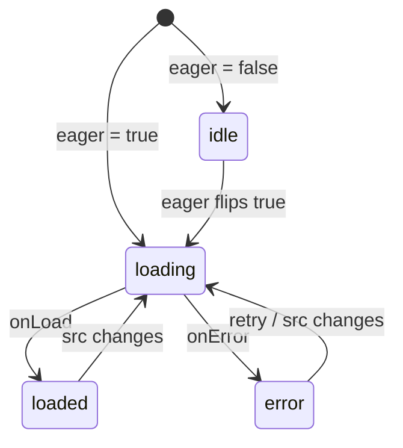

# useImage

Tracks image loading state as a reactive state machine with idle, loading, loaded, and error states.

<DocsPageFeatures :frontmatter />

## Usage

The `useImage` composable owns the loading lifecycle for a single image source.
Bind the returned `source`, `onLoad`, and `onError` to a plain image element.

```ts collapse no-filename
import { toRef } from 'vue'
import { useImage } from '@vuetify/v0'

const props = defineProps<{ src: string }>()

const { source, isLoaded, isError, onLoad, onError, retry } = useImage({
  src: toRef(() => props.src),
})

// In template:
// 
```

::: example
/composables/use-image/basic
:::

## Architecture



## Reactivity

| Property/Method | Reactive | Notes |
| - | :-: | - |
| `status` | <AppSuccessIcon /> | Readonly ShallowRef of `'idle' \| 'loading' \| 'loaded' \| 'error'` |
| `isIdle` / `isLoading` / `isLoaded` / `isError` | <AppSuccessIcon /> | Readonly boolean refs derived from `status` |
| `source` | <AppSuccessIcon /> | Gated `src` — `undefined` while idle, otherwise the current source |
| `onLoad` / `onError` | <AppErrorIcon /> | Bind to image `load` / `error` events |
| `retry` | <AppErrorIcon /> | Reset back to `loading` and re-attempt |

## Examples

::: example
/composables/use-image/useLazyImage.ts 1
/composables/use-image/LazyImage.vue 2
/composables/use-image/lazy.vue 3

### Compose with useIntersectionObserver

Wrap `useImage` and `useIntersectionObserver` in a small custom composable to build a reusable viewport-driven lazy loader. The `eager` gate receives the observer's `isIntersecting` signal so the source is withheld until the target element scrolls into view.

| File | Role |
|------|------|
| `useLazyImage.ts` | Custom composable combining `useImage` with `useIntersectionObserver` |
| `LazyImage.vue` | Presentational component that binds the returned `target`, `source`, and handlers |
| `lazy.vue` | Entry point rendering several lazy images in a scrolling container |

:::

::: example
/composables/use-image/RetryableImage.vue 1
/composables/use-image/retry.vue 2

### Retry on error

Build a reusable image component that exposes a retry button when loading fails. The `retry()` function resets the status back to `loading` so the browser re-attempts the request.

| File | Role |
|------|------|
| `RetryableImage.vue` | Wraps `useImage` and renders a retry button on error |
| `retry.vue` | Demonstrates both a successful source and a broken one side by side |

:::

## FAQ

::: faq

??? Why is the option called `eager` instead of `lazy`?

`eager` is a reactive gate that mirrors the semantics of HTML's `loading="eager"` attribute — when `eager` is `true`, the image starts loading. When `false`, the source is withheld and status stays `idle`. Using `eager` lets you write expressive bindings like `eager: isIntersecting`.

??? Does `useImage` use IntersectionObserver internally?

No. `useImage` is the state machine; viewport detection is a separate concern. Compose it with `useIntersectionObserver` (or any other reactive gate) by passing the result to the `eager` option.

??? What about native `loading="lazy"`?

Native browser-level lazy loading is a separate mechanism. The browser still fires `load` and `error` events, so `useImage` works correctly with or without it. Reach for the `eager` gate only when you need to control exactly when the source is set.

??? What happens when `src` changes?

Status resets to `loading` (or `idle` if `eager` is `false`) and the source updates. Already-loaded or errored states do not persist across source changes.

??? Why does `source` return `undefined` while idle?

So you can bind it directly to an `` element without the browser starting a request. The browser ignores `` elements without a `src`, which is exactly what you want during the deferred phase.

:::

<DocsApi />
