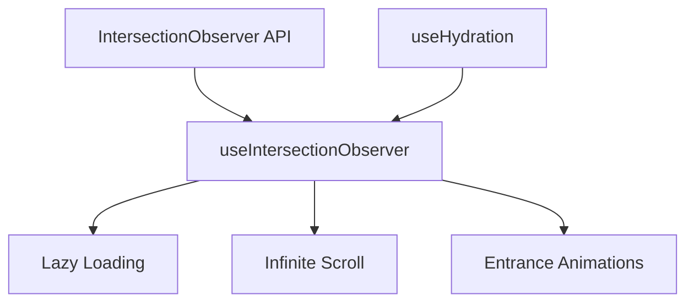

# useIntersectionObserver

A composable for detecting when elements enter or leave the viewport using the Intersection Observer API with automatic cleanup.

<DocsPageFeatures :frontmatter />

## Usage

The `useIntersectionObserver` composable wraps the Intersection Observer API to detect when elements become visible in the viewport. It's useful for lazy loading images, infinite scroll, entrance animations, and performance optimizations.

```vue UseIntersectionObserver
<script setup lang="ts">
  import { useIntersectionObserver } from '@vuetify/v0'
  import { ref, useTemplateRef } from 'vue'

  const target = useTemplateRef('target')
  const isVisible = ref(false)

  useIntersectionObserver(target, (entries) => {
    isVisible.value = entries[0].isIntersecting
  }, {
    threshold: 0.5, // Trigger when 50% visible
    rootMargin: '0px'
  })
</script>

<template>
  <div>
    <div style="height: 100vh">Scroll down to see the element</div>
    <div ref="target" :class="{ visible: isVisible }">
      I'm {{ isVisible ? 'visible' : 'hidden' }}
    </div>
  </div>
</template>
```

## Examples

::: example
/composables/use-intersection-observer/scroll-reveal
:::

## Architecture

`useIntersectionObserver` wraps the native IntersectionObserver API with Vue reactivity:



<DocsApi />
