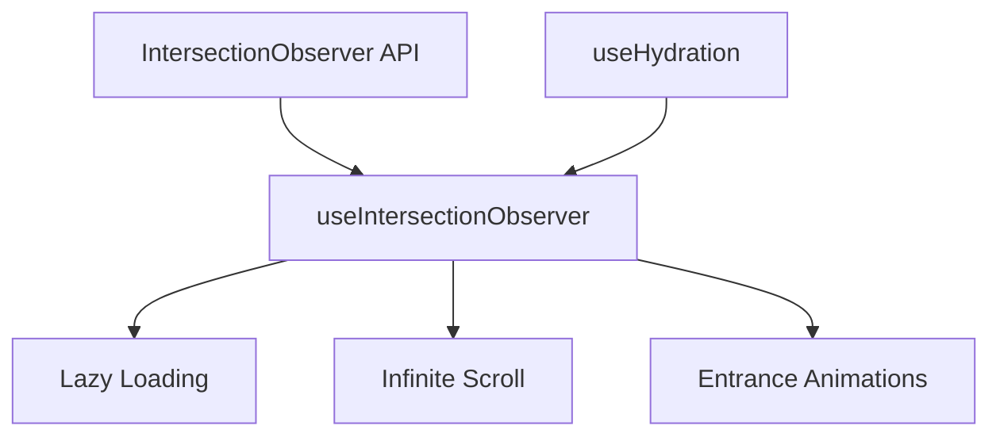

# useIntersectionObserver

A composable for detecting when elements enter or leave the viewport using the Intersection Observer API with automatic cleanup.

<DocsPageFeatures :frontmatter />

## Usage

The `useIntersectionObserver` composable wraps the Intersection Observer API to detect when elements become visible in the viewport. It's useful for lazy loading images, infinite scroll, entrance animations, and performance optimizations.

```vue UseIntersectionObserver
<script setup lang="ts">
  import { useIntersectionObserver } from '@vuetify/v0'
  import { ref, useTemplateRef } from 'vue'

  const target = useTemplateRef('target')
  const isVisible = ref(false)

  useIntersectionObserver(target, (entries) => {
    isVisible.value = entries[0].isIntersecting
  }, {
    threshold: 0.5, // Trigger when 50% visible
    rootMargin: '0px'
  })
</script>

<template>
  <div>
    <div style="height: 100vh">Scroll down to see the element</div>
    <div ref="target" :class="{ visible: isVisible }">
      I'm {{ isVisible ? 'visible' : 'hidden' }}
    </div>
  </div>
</template>
```

## Architecture

`useIntersectionObserver` wraps the native IntersectionObserver API with Vue reactivity:



<DocsApi />

## Lifecycle & Cleanup

### Automatic Cleanup

`useIntersectionObserver` automatically disconnects the observer when:
- The component unmounts
- The Vue effect scope is disposed
- You call the returned `stop()` function

**Implementation:**
```ts
// Uses Vue's onScopeDispose internally
onScopeDispose(() => observer.disconnect())
```

This prevents memory leaks by ensuring observers don't continue running after the component is destroyed.

### Manual Control

The composable returns control functions for fine-grained lifecycle management:

```ts
const { isActive, isIntersecting, pause, resume, stop } = useIntersectionObserver(
  element,
  callback
)

// Check if observer is active
console.log(isActive.value) // true

// Temporarily pause observation (keeps observer alive)
pause()
console.log(isActive.value) // false
console.log(isIntersecting.value) // false (reset on pause)

// Resume observation
resume()
console.log(isActive.value) // true

// Permanently stop and disconnect observer
stop()
console.log(isActive.value) // false
```

**State properties:**
- **`isActive`**: True when the observer exists and is observing (false when paused or stopped)
- **`isPaused`**: True when observation is temporarily paused
- **`isIntersecting`**: True when the element is currently intersecting the viewport

**Difference between pause and stop:**
- **`pause()`**: Temporarily stops observing, can be resumed with `resume()`
- **`stop()`**: Permanently disconnects the observer, cannot be restarted

### Reactive Target

The target element can be reactive. When the target ref changes, the observer automatically re-attaches:

```ts
const element = ref<HTMLElement | null>(null)

useIntersectionObserver(element, callback)

// Later - observer automatically reconnects to new element
element.value = document.querySelector('.new-target')
```

### Template Refs

Works seamlessly with Vue's template refs:

```vue UseIntersectionObserver
<script setup lang="ts">
  import { useTemplateRef } from 'vue'
  import { useIntersectionObserver } from '@vuetify/v0'

  const section = useTemplateRef('section')

  const { isIntersecting } = useIntersectionObserver(
    section,
    ([entry]) => {
      console.log('Section visibility:', entry.isIntersecting)
    }
  )
</script>

<template>
  <section ref="section">
    <p v-if="isIntersecting">Now visible!</p>
  </section>
</template>
```

### Usage Outside Components

If called outside a component setup function:
- **No automatic cleanup** (no active effect scope)
- **Must manually call** `stop()` to prevent memory leaks
- Consider wrapping in `effectScope()`:

```ts
import { effectScope } from 'vue'

const scope = effectScope()

scope.run(() => {
  useIntersectionObserver(element, callback)
})

// Later, cleanup all observers in the scope
scope.stop()
```

### SSR Considerations

`IntersectionObserver` is a browser-only API. The composable checks for browser environment internally:

```ts
// Safe to call during SSR - will not throw
const { isIntersecting } = useIntersectionObserver(element, callback)
// isIntersecting.value will be false in SSR
```

### Performance Tips

**Use appropriate thresholds:**
```ts
// Trigger once when element appears
useIntersectionObserver(element, callback, { threshold: 0 })

// Trigger at multiple visibility levels
useIntersectionObserver(element, callback, { threshold: [0, 0.25, 0.5, 0.75, 1] })
```

**Use rootMargin for early loading:**
```ts
// Start loading 200px before element enters viewport
useIntersectionObserver(element, callback, {
  rootMargin: '200px'
})
```

**Pause when not needed:**
```ts
const { pause, resume } = useIntersectionObserver(element, callback)

// Pause during heavy operations
pause()
performHeavyWork()
resume()
```

