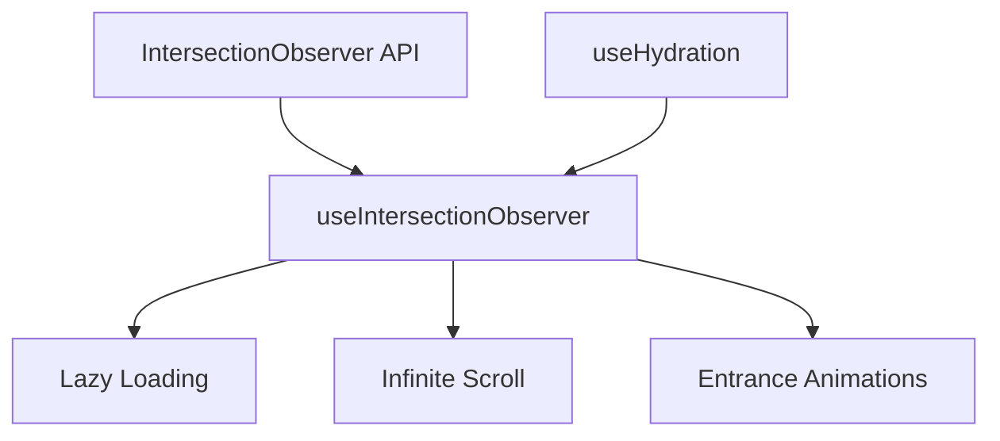

# useIntersectionObserver

A composable for detecting when elements enter or leave the viewport using the Intersection Observer API with automatic cleanup.

<DocsPageFeatures :frontmatter />

## Usage

The `useIntersectionObserver` composable wraps the Intersection Observer API to detect when elements become visible in the viewport. It's useful for lazy loading images, infinite scroll, entrance animations, and performance optimizations.

> [!TIP] Why wrap IntersectionObserver?
> The native `IntersectionObserver` has no awareness of Vue's `effectScope` lifecycle. If you create one inside a composable, it won't automatically disconnect when the scope is disposed. `useIntersectionObserver` integrates `onScopeDispose` for automatic cleanup, defers creation until after hydration for SSR safety, and adds reactive target tracking — things the native API can't do on its own.

```vue collapse no-filename UseIntersectionObserver
<script setup lang="ts">
  import { useIntersectionObserver } from '@vuetify/v0'
  import { ref, useTemplateRef } from 'vue'

  const target = useTemplateRef('target')
  const isVisible = ref(false)

  useIntersectionObserver(target, (entries) => {
    isVisible.value = entries[0].isIntersecting
  }, {
    threshold: 0.5, // Trigger when 50% visible
    rootMargin: '0px'
  })
</script>

<template>
  <div>
    <div style="height: 100vh">Scroll down to see the element</div>
    <div ref="target" :class="{ visible: isVisible }">
      I'm {{ isVisible ? 'visible' : 'hidden' }}
    </div>
  </div>
</template>
```

## Architecture

`useIntersectionObserver` wraps the native IntersectionObserver API with Vue reactivity:


```mermaid "Intersection Observer Hierarchy"
flowchart TD
  IntersectionObserver["IntersectionObserver API"] --> useIntersectionObserver
  useHydration --> useIntersectionObserver
  useIntersectionObserver --> LazyLoading["Lazy Loading"]
  useIntersectionObserver --> InfiniteScroll["Infinite Scroll"]
  useIntersectionObserver --> Animations["Entrance Animations"]
```

## Options

| Option | Type | Default | Notes |
| - | - | - | - |
| `immediate` | `boolean` | `false` | Fire the callback immediately on mount before any intersection |
| `once` | `boolean` | `false` | Stop observing after the first intersection fires |
| `threshold` | `number \| number[]` | `0` | Intersection ratio(s) at which the callback fires |
| `root` | `Element \| null` | `null` | Ancestor to use as viewport (null = browser viewport) |
| `rootMargin` | `string` | `'0px'` | CSS margin around the root for intersection calculations |

## Reactivity

| Property/Method | Reactive | Notes |
| - | :-: | - |
| `isActive` | <AppSuccessIcon /> | Computed from observer ref |
| `isIntersecting` | <AppSuccessIcon /> | ShallowRef, readonly |
| `isPaused` | <AppSuccessIcon /> | ShallowRef, readonly |
| `target` | <AppSuccessIcon /> | Accepts MaybeRef, watched for changes |
| `pause()` | — | Temporarily stop observing without disconnecting |
| `resume()` | — | Resume after `pause()` |
| `stop()` | — | Disconnect the observer permanently |

### useElementIntersection

| Property/Method | Reactive | Notes |
| - | :-: | - |
| `isIntersecting` | <AppSuccessIcon /> | ShallowRef, readonly |
| `intersectionRatio` | <AppSuccessIcon /> | ShallowRef, readonly (0.0 to 1.0) |

## Examples

::: example
/composables/use-intersection-observer/scroll-reveal

### Scroll Reveal with Visibility Percentage

Cards that fade in and slide up with a staggered delay as they scroll into view, with a progress bar showing each card's visibility percentage.

:::

<DocsApi />
