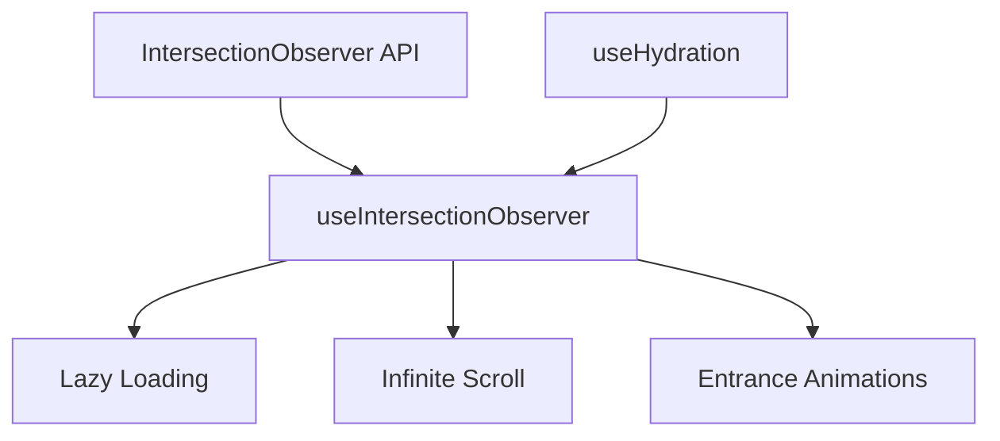

# useIntersectionObserver

A composable for detecting when elements enter or leave the viewport using the Intersection Observer API with automatic cleanup.

<DocsPageFeatures :frontmatter />

## Usage

The `useIntersectionObserver` composable wraps the Intersection Observer API to detect when elements become visible in the viewport. It's useful for lazy loading images, infinite scroll, entrance animations, and performance optimizations.

> [!TIP] Why wrap IntersectionObserver?
> The native `IntersectionObserver` has no awareness of Vue's `effectScope` lifecycle. If you create one inside a composable, it won't automatically disconnect when the scope is disposed. `useIntersectionObserver` integrates `onScopeDispose` for automatic cleanup, defers creation until after hydration for SSR safety, and adds reactive target tracking — things the native API can't do on its own.

```vue collapse no-filename UseIntersectionObserver
<script setup lang="ts">
  import { useIntersectionObserver } from '@vuetify/v0'
  import { ref, useTemplateRef } from 'vue'

  const target = useTemplateRef('target')
  const isVisible = ref(false)

  useIntersectionObserver(target, (entries) => {
    isVisible.value = entries[0].isIntersecting
  }, {
    threshold: 0.5, // Trigger when 50% visible
    rootMargin: '0px'
  })
</script>

<template>
  <div>
    <div style="height: 100vh">Scroll down to see the element</div>
    <div ref="target" :class="{ visible: isVisible }">
      I'm {{ isVisible ? 'visible' : 'hidden' }}
    </div>
  </div>
</template>
```

## Architecture

`useIntersectionObserver` wraps the native IntersectionObserver API with Vue reactivity:


```mermaid "Intersection Observer Hierarchy"
flowchart TD
  IntersectionObserver["IntersectionObserver API"] --> useIntersectionObserver
  useHydration --> useIntersectionObserver
  useIntersectionObserver --> LazyLoading["Lazy Loading"]
  useIntersectionObserver --> InfiniteScroll["Infinite Scroll"]
  useIntersectionObserver --> Animations["Entrance Animations"]
```

## Options

| Option | Type | Default | Notes |
| - | - | - | - |
| `immediate` | `boolean` | `false` | Fire the callback immediately on mount before any intersection |
| `once` | `boolean` | `false` | Stop observing after the first intersection fires |
| `threshold` | `number \| number[]` | `0` | Intersection ratio(s) at which the callback fires |
| `root` | `Element \| null` | `null` | Ancestor to use as viewport (null = browser viewport) |
| `rootMargin` | `string` | `'0px'` | CSS margin around the root for intersection calculations |

## Reactivity

| Property/Method | Reactive | Notes |
| - | :-: | - |
| `isActive` | <AppSuccessIcon /> | Computed from observer ref |
| `isIntersecting` | <AppSuccessIcon /> | ShallowRef, readonly |
| `isPaused` | <AppSuccessIcon /> | ShallowRef, readonly |
| `target` | <AppSuccessIcon /> | Accepts MaybeRef, watched for changes |
| `pause()` | — | Temporarily stop observing without disconnecting |
| `resume()` | — | Resume after `pause()` |
| `stop()` | — | Disconnect the observer permanently |

### useElementIntersection

| Property/Method | Reactive | Notes |
| - | :-: | - |
| `isIntersecting` | <AppSuccessIcon /> | ShallowRef, readonly |
| `intersectionRatio` | <AppSuccessIcon /> | ShallowRef, readonly (0.0 to 1.0) |

## Examples

::: gn-example
/composables/use-intersection-observer/scroll-reveal

### Scroll Reveal with Visibility Percentage

Six cards that fade in and slide up with a staggered CSS delay as they scroll into view inside a fixed-height scroll container, each card showing a live visibility percentage progress bar.

The example creates one `useIntersectionObserver` instance per card inside `onMounted`, passing the scoped `root` element as the IntersectionObserver root so intersection is measured relative to the container rather than the browser viewport. A 21-stop threshold array (`Array.from({ length: 21 }, (_, i) => i / 20)`) fires the callback at every 5% increment, which is how `ratios` stays continuously updated for the smooth progress bar animation. Cards are permanently revealed — added to a `Set` — once they cross 30% visibility; the `Set` is stored in a `shallowRef` and replaced with a new `Set` on each update to trigger Vue's shallow-change detection.

Staggered entrance is achieved entirely in CSS with `transitionDelay: ${index * 75}ms` — no JavaScript timers. The composable does the detection work; CSS handles the choreography. Reach for this pattern for entrance animations, ad viewability tracking, or any scroll-triggered effect that needs per-element granularity. For a simpler "has it ever been visible" gate, combine with `{ once: true }` to disconnect the observer after first intersection and avoid ongoing callback overhead — see [useImage](/composables/system/use-image) for an example of that pattern.

:::

## FAQ

::: faq

??? How do I stop observing after an element first becomes visible?

Pass `{ once: true }` and the observer disconnects after the first intersection. This avoids ongoing callback overhead for one-shot cases like lazy-loading an image or a single entrance animation.

??? What's the difference between useIntersectionObserver and useElementIntersection?

useIntersectionObserver gives you the raw entries callback plus `pause()`, `resume()`, and `stop()` control. useElementIntersection is a thinner wrapper around a single element that just exposes reactive `isIntersecting` and `intersectionRatio`.

??? How do I measure visibility against a scroll container instead of the viewport?

Pass the container element as the `root` option — it defaults to `null`, the browser viewport. `rootMargin` and `threshold` are then calculated relative to that container.

??? How do I track a continuous visibility percentage instead of just visible/hidden?

Pass an array of thresholds so the callback fires at each ratio step — e.g. `Array.from({ length: 21 }, (_, i) => i / 20)` fires every 5%. The scroll-reveal example uses exactly this to drive its progress bar.

:::

<DocsApi />
