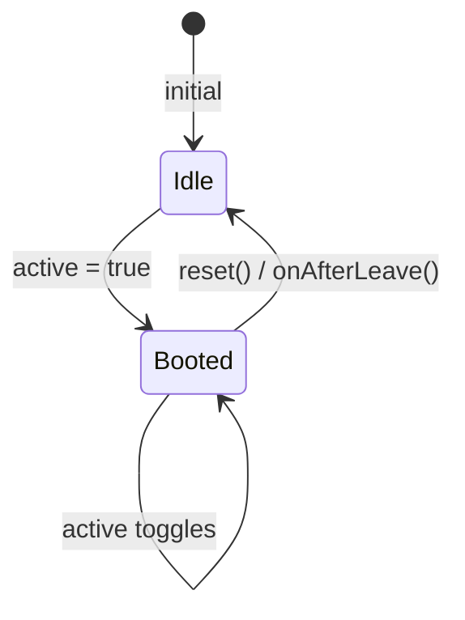

<script setup>
import BasicExample from '@/examples/composables/use-lazy/basic.vue'
import BasicExampleRaw from '@/examples/composables/use-lazy/basic.vue?raw'
</script>

# useLazy

A composable for deferring content rendering until first activation, with optional reset on deactivation.

<DocsPageFeatures :frontmatter />

## Usage

The `useLazy` composable tracks whether content has been activated at least once. Content renders only after first activation (unless eager mode is enabled), reducing initial render cost for components like dialogs, menus, and tooltips.

<DocsExample file="basic.vue" :code="BasicExampleRaw">
  <BasicExample />
</DocsExample>

## Architecture



<DocsApi />

## Eager Mode

Use the `eager` option to render content immediately without waiting for activation:

```ts
const { hasContent } = useLazy(isOpen, { eager: true })
// hasContent.value is always true
```

The `eager` option accepts a reactive value for dynamic control:

```ts
const props = defineProps<{ eager: boolean }>()
const { hasContent } = useLazy(isOpen, {
  eager: toRef(() => props.eager),
})
```

## Transition Integration

The `onAfterLeave` callback resets the lazy state after the leave transition completes (unless eager mode is enabled):

```vue
<template>
  <Transition @after-leave="onAfterLeave">
    <div v-if="isOpen">
      <template v-if="hasContent">
        <!-- Heavy content -->
      </template>
    </div>
  </Transition>
</template>
```

This allows memory to be reclaimed when the content is hidden, while preserving the content during the leave animation.
