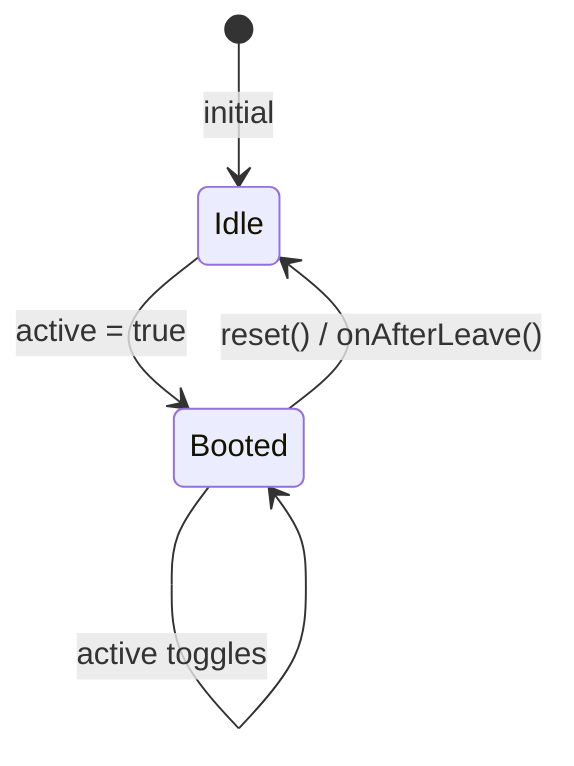

# useLazy

A composable for deferring content rendering until first activation, with optional reset on deactivation.

<DocsPageFeatures :frontmatter />

## Usage

The `useLazy` composable tracks whether content has been activated at least once. Content renders only after first activation (unless eager mode is enabled), reducing initial render cost for components like dialogs, menus, and tooltips.

```ts collapse no-filename
import { shallowRef } from 'vue'
import { useLazy } from '@vuetify/v0'

const isOpen = shallowRef(false)

const { isBooted, hasContent, onAfterLeave } = useLazy(isOpen)

// hasContent becomes true after isOpen is first set to true
// onAfterLeave resets lazy state for transition integration
```

## Architecture


```mermaid "useLazy Lifecycle"
stateDiagram-v2
  [*] --> Idle: initial
  Idle --> Booted: active = true
  Booted --> Booted: active toggles
  Booted --> Idle: reset() / onAfterLeave()
```

## Reactivity

| Property/Method | Reactive | Notes |
| - | :-: | - |
| `isBooted` | <AppSuccessIcon /> | ShallowRef, readonly |
| `hasContent` | <AppSuccessIcon /> | Computed from `isBooted \|\| eager \|\| active` |
| `active` | <AppSuccessIcon /> | Accepts MaybeRefOrGetter, watched for changes |
| `eager` | <AppSuccessIcon /> | Accepts MaybeRefOrGetter in options |

## Examples

::: gn-example
/composables/use-lazy/basic

### Lazy Content Panel

A collapsible panel that defers DOM rendering until the first time it opens, then simulates an 800 ms async content load before rendering a 50-item list.

The core of the pattern is `hasContent`, which starts `false` and flips to `true` after `isOpen` is first set to `true`. The template gates the entire content subtree on `hasContent` inside a `<template v-if>`, so Vue never mounts the heavy list until it's actually needed. A `watch` on `hasContent` kicks off the simulated fetch — the actual content is a `shallowRef<string[]>` that starts empty and is populated after the timeout.

`onAfterLeave` is wired to the `<Transition>`'s `@after-leave` event. When the panel closes and its leave animation completes, `isBooted` resets to `false` — causing `hasContent` to go back to `false`. The `watch` on `isBooted` clears `items` at the same time, so re-opening the panel triggers a fresh load. Omit this hook if you want the content to survive close/reopen cycles (for example, a settings panel whose form state should persist).

Reach for `useLazy` whenever deferred mounting matters: dialogs, drawers, accordion sections, or any content that is conditionally shown and expensive to mount. The `delay` and `eager` options (not used in this example) add a debounce floor and an always-mounted escape hatch — see the "Delay" and "Eager Mode" sections below.

:::

## Delay

Use the `delay` option to defer the first mount by a fixed number of milliseconds. This prevents a flash of content for operations that complete very quickly:

```ts
const { hasContent } = useLazy(isOpen, { delay: 200 })
// Content only mounts if isOpen stays true for 200ms
```

## Eager Mode

Use the `eager` option to render content immediately without waiting for activation:

```ts
const { hasContent } = useLazy(isOpen, { eager: true })
// hasContent.value is always true
```

The `eager` option accepts a reactive value for dynamic control:

```ts
const props = defineProps<{ eager: boolean }>()
const { hasContent } = useLazy(isOpen, {
  eager: toRef(() => props.eager),
})
```

## Transition Integration

The `onAfterLeave` callback resets the lazy state after the leave transition completes (unless eager mode is enabled):

```vue
<template>
  <Transition @after-leave="onAfterLeave">
    <div v-if="isOpen">
      <template v-if="hasContent">
        <!-- Heavy content -->
      </template>
    </div>
  </Transition>
</template>
```

This allows memory to be reclaimed when the content is hidden, while preserving the content during the leave animation.

<DocsApi />
