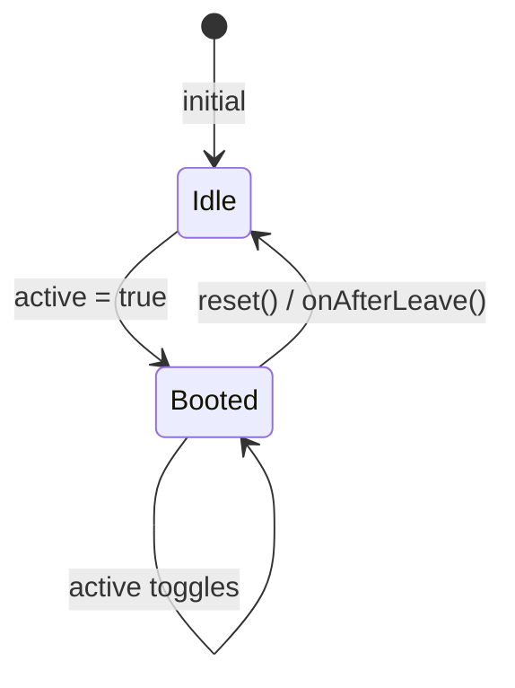

# useLazy

A composable for deferring content rendering until first activation, with optional reset on deactivation.

<DocsPageFeatures :frontmatter />

## Usage

The `useLazy` composable tracks whether content has been activated at least once. Content renders only after first activation (unless eager mode is enabled), reducing initial render cost for components like dialogs, menus, and tooltips.

```ts collapse no-filename
import { shallowRef } from 'vue'
import { useLazy } from '@vuetify/v0'

const isOpen = shallowRef(false)

const { isBooted, hasContent, onAfterLeave } = useLazy(isOpen)

// hasContent becomes true after isOpen is first set to true
// onAfterLeave resets lazy state for transition integration
```

## Architecture


```mermaid "useLazy Lifecycle"
stateDiagram-v2
  [*] --> Idle: initial
  Idle --> Booted: active = true
  Booted --> Booted: active toggles
  Booted --> Idle: reset() / onAfterLeave()
```

## Reactivity

| Property/Method | Reactive | Notes |
| - | :-: | - |
| `isBooted` | <AppSuccessIcon /> | ShallowRef, readonly |
| `hasContent` | <AppSuccessIcon /> | Computed from `isBooted \|\| eager \|\| active` |
| `active` | <AppSuccessIcon /> | Accepts MaybeRefOrGetter, watched for changes |
| `eager` | <AppSuccessIcon /> | Accepts MaybeRefOrGetter in options |

## Examples

::: gn-example
/composables/use-lazy/tabs.ts
/composables/use-lazy/HeavyPanel.vue
/composables/use-lazy/LazyTab.vue
/composables/use-lazy/demo.vue

### Lazy Tab Panels

A three-tab interface where each panel's heavy content mounts only the first time its tab is opened, and a live mount counter proves each panel mounts exactly once no matter how often you switch back and forth.

Each panel is a `LazyTab` that calls `useLazy(() => active)` and gates its body on `hasContent`. The gate starts `false`, so the expensive `HeavyPanel` subtree is never created for a tab the reader has not visited yet. The moment a tab is first selected, `isBooted` flips to `true` and `hasContent` stays `true` permanently — this example deliberately omits `onAfterLeave`, so once a panel boots it survives every subsequent tab switch. The panel wrapper toggles visibility with `v-show`, keeping the already-mounted DOM around for instant re-display instead of paying the mount cost again. `HeavyPanel` increments a shared counter in its `onMounted` hook, and the readout under the tabs confirms the count never climbs past one per panel.

This is the canonical pattern for tabbed dashboards, wizard steps, and any layout where most panels are never viewed in a given session. Contrast it with [usePresence](/composables/system/use-presence), which orchestrates enter and leave animations rather than deferring the first mount, and with [useToggleScope](/composables/system/use-toggle-scope) for tearing an effect scope down when content hides. To reclaim memory when a panel closes, wire `onAfterLeave` into a `Transition` so `isBooted` resets and the subtree unmounts — at the cost of re-mounting on the next open.

| File | Role |
|------|------|
| `tabs.ts` | Tab definitions plus a shared composable that tracks per-panel mount counts |
| `HeavyPanel.vue` | The expensive content; reports its mount to the shared counter |
| `LazyTab.vue` | Wraps a panel with `useLazy`, gating its body on `hasContent` |
| `demo.vue` | Renders the tab bar, the lazy panels, and the live mount readout |

:::

## Recipes

### Delay

Use the `delay` option to defer the first mount by a fixed number of milliseconds. This prevents a flash of content for operations that complete very quickly:

```ts
const { hasContent } = useLazy(isOpen, { delay: 200 })
// Content only mounts if isOpen stays true for 200ms
```

### Eager Mode

Use the `eager` option to render content immediately without waiting for activation:

```ts
const { hasContent } = useLazy(isOpen, { eager: true })
// hasContent.value is always true
```

The `eager` option accepts a reactive value for dynamic control:

```ts
const props = defineProps<{ eager: boolean }>()
const { hasContent } = useLazy(isOpen, {
  eager: toRef(() => props.eager),
})
```

### Transition Integration

The `onAfterLeave` callback resets the lazy state after the leave transition completes (unless eager mode is enabled):

```vue
<template>
  <Transition @after-leave="onAfterLeave">
    <div v-if="isOpen">
      <template v-if="hasContent">
        <!-- Heavy content -->
      </template>
    </div>
  </Transition>
</template>
```

This allows memory to be reclaimed when the content is hidden, while preserving the content during the leave animation.

## FAQ

::: faq

??? What's the difference between useLazy and usePresence?

useLazy defers a subtree's first mount until it's activated, and can tear it back down later. [usePresence](/composables/system/use-presence) orchestrates enter and leave animations for content that is already mounting. Reach for useLazy to skip render cost, usePresence to animate transitions.

??? How do I reclaim memory when lazy content closes?

Wire `onAfterLeave` into a `Transition`'s `@after-leave`. It resets `isBooted` once the leave animation finishes, so the subtree unmounts — at the cost of re-mounting on the next open. Omit it to keep content alive after first boot.

??? Can I render the content immediately and bypass the lazy gate?

Yes — pass `{ eager: true }` and `hasContent` is always `true`. `eager` also accepts a ref or getter, so you can drive lazy behavior from a prop.

:::

<DocsApi />
