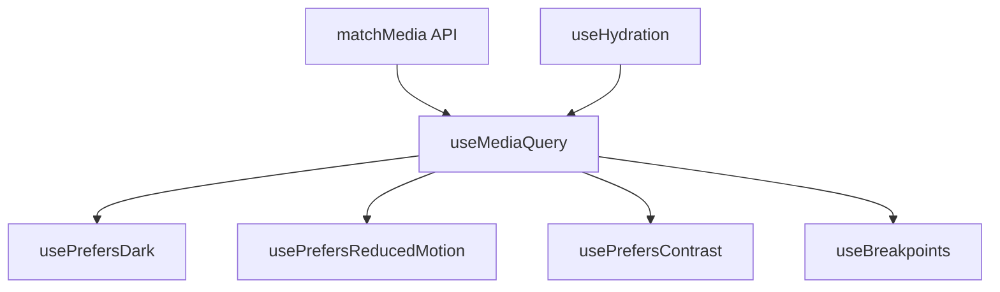

<script setup>
import BasicExample from '@/examples/composables/use-media-query/basic.vue'
import BasicExampleRaw from '@/examples/composables/use-media-query/basic.vue?raw'
</script>

# useMediaQuery

A composable for reactive CSS media query matching with automatic cleanup.

<DocsPageFeatures :frontmatter />

## Usage

The `useMediaQuery` composable wraps the browser's `matchMedia` API, providing reactive updates when the media query state changes. It supports static strings, refs, and getter functions for dynamic queries.

<DocsExample file="basic.vue" title="Media Query Detection" :code="BasicExampleRaw">
  <BasicExample />
</DocsExample>

## Architecture

`useMediaQuery` wraps the browser's matchMedia API with Vue reactivity and SSR safety:



<DocsApi />

## Convenience Composables

Several pre-configured composables are provided for common use cases:

### usePrefersDark

Detects if the user prefers dark color scheme:

```ts
import { usePrefersDark } from '@vuetify/v0'

const { matches: prefersDark } = usePrefersDark()
// Equivalent to: useMediaQuery('(prefers-color-scheme: dark)')
```

### usePrefersReducedMotion

Detects if the user prefers reduced motion:

```ts
import { usePrefersReducedMotion } from '@vuetify/v0'

const { matches: prefersReducedMotion } = usePrefersReducedMotion()
// Equivalent to: useMediaQuery('(prefers-reduced-motion: reduce)')
```

### usePrefersContrast

Detects if the user prefers more contrast:

```ts
import { usePrefersContrast } from '@vuetify/v0'

const { matches: prefersContrast } = usePrefersContrast()
// Equivalent to: useMediaQuery('(prefers-contrast: more)')
```

## Common Media Queries

Here are some commonly used media queries:

```ts
// Screen size
useMediaQuery('(min-width: 768px)')
useMediaQuery('(max-width: 1024px)')
useMediaQuery('(min-width: 768px) and (max-width: 1024px)')

// Orientation
useMediaQuery('(orientation: portrait)')
useMediaQuery('(orientation: landscape)')

// Display capabilities
useMediaQuery('(hover: hover)')          // Has hover capability
useMediaQuery('(pointer: fine)')         // Has fine pointer (mouse)
useMediaQuery('(pointer: coarse)')       // Has coarse pointer (touch)

// User preferences
useMediaQuery('(prefers-color-scheme: dark)')
useMediaQuery('(prefers-reduced-motion: reduce)')
useMediaQuery('(prefers-contrast: more)')
useMediaQuery('(prefers-reduced-transparency: reduce)')

// Display
useMediaQuery('(display-mode: standalone)')  // PWA standalone
useMediaQuery('(prefers-reduced-data: reduce)')
```

## Dynamic Queries

The query parameter accepts `MaybeRefOrGetter<string>`, allowing dynamic queries:

```ts
import { ref, computed } from 'vue'
import { useMediaQuery } from '@vuetify/v0'

// Using a ref
const breakpoint = ref(768)
const { matches } = useMediaQuery(() => `(min-width: ${breakpoint.value}px)`)

// Later, change the breakpoint
breakpoint.value = 1024  // Query automatically updates

// Using a computed
const queryString = computed(() =>
  isDarkMode.value
    ? '(prefers-color-scheme: dark)'
    : '(prefers-color-scheme: light)'
)
const { matches } = useMediaQuery(queryString)
```

When the query changes, the composable automatically:
1. Removes the listener from the previous `MediaQueryList`
2. Creates a new `MediaQueryList` for the updated query
3. Attaches a new change listener

## Accessing MediaQueryList

The composable exposes the underlying `MediaQueryList` for advanced use cases:

```ts
const { matches, query, mediaQueryList } = useMediaQuery('(min-width: 768px)')

// Access the native MediaQueryList
console.log(mediaQueryList.value?.media)  // '(min-width: 768px)'
```

## SSR & Hydration Safety

The composable is SSR-safe and hydration-aware:
- Returns `false` for `matches` on the server
- Returns `null` for `mediaQueryList` on the server
- No errors thrown when `window` is unavailable
- Defers client updates until after hydration to prevent mismatches

```ts
// Safe to use in SSR contexts
const { matches } = useMediaQuery('(min-width: 768px)')
// matches.value === false during SSR and hydration
// Updates to actual value after hydration completes
```

The composable integrates with `useHydration` internally, ensuring the media query value only updates after Vue has finished hydrating the DOM. This prevents hydration mismatch warnings.

## Lifecycle & Cleanup

### Automatic Cleanup

Event listeners are automatically removed when:
- The component unmounts
- The Vue effect scope is disposed
- The query string changes (previous listener removed)

### Manual Cleanup

The composable returns a `stop()` function for manual lifecycle control:

```ts
const { matches, stop } = useMediaQuery('(min-width: 768px)')

// Later, manually stop listening
stop()

// After stop(), matches won't update on media query changes
```

This is useful for:
- Long-lived components that need to toggle media query listening
- Conditional feature detection
- Performance optimization when queries are no longer needed

## vs useBreakpoints

| Feature | useMediaQuery | useBreakpoints |
|---------|---------------|----------------|
| Custom queries | Yes | No (predefined) |
| User preferences | Yes | No |
| Orientation | Yes | No |
| Width/height | Manual query | Built-in |
| Named breakpoints | No | Yes (xs, sm, md, lg, xl, xxl) |
| Mobile detection | Manual | Built-in `isMobile` |
| Manual stop | Yes | No (plugin lifecycle) |
| Hydration-aware | Yes | Yes |

Use `useMediaQuery` for:
- User preference detection (dark mode, reduced motion)
- Custom responsive logic
- Non-width-based queries (orientation, hover, pointer)

Use `useBreakpoints` for:
- Standard responsive layouts
- Named breakpoint logic
- Mobile detection
