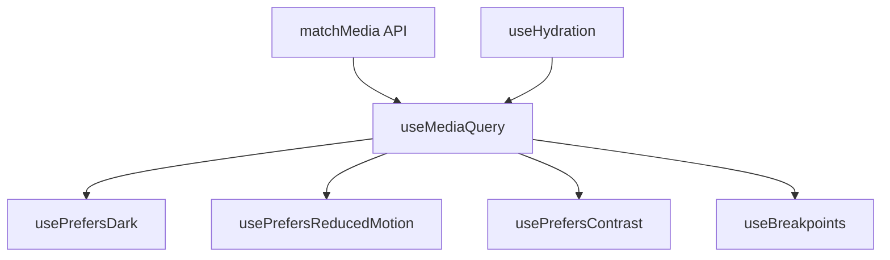

# useMediaQuery

A composable for reactive CSS media query matching with automatic cleanup.

<DocsPageFeatures :frontmatter />

## Usage

The `useMediaQuery` composable wraps the browser's `matchMedia` API, providing reactive updates when the media query state changes. It supports static strings, refs, and getter functions for dynamic queries.

<DocsExample file="basic.vue" title="Media Query Detection" :code="BasicExampleRaw">
  <BasicExample />
</DocsExample>

## Architecture

`useMediaQuery` wraps the browser's matchMedia API with Vue reactivity and SSR safety:

<DocsApi />
