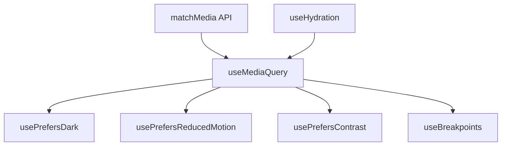

# useMediaQuery

A composable for reactive CSS media query matching with automatic cleanup.

<DocsPageFeatures :frontmatter />

## Usage

The `useMediaQuery` composable wraps the browser's `matchMedia` API, providing reactive updates when the media query state changes. It supports static strings, refs, and getter functions for dynamic queries.

> [!TIP] Why wrap matchMedia?
> The native `matchMedia` API has no awareness of Vue's `effectScope` lifecycle — change listeners you add won't be removed when the scope is disposed. `useMediaQuery` integrates `onScopeDispose` for automatic cleanup, defers evaluation until after hydration for SSR safety, and supports reactive query strings that re-evaluate on change.

```vue collapse no-filename UseMediaQuery
<script setup lang="ts">
  import { useMediaQuery } from '@vuetify/v0'
  import { shallowRef } from 'vue'

  const { matches: prefersDark } = useMediaQuery('(prefers-color-scheme: dark)')
  const { matches: isMobile } = useMediaQuery('(max-width: 768px)')

  // Dynamic query with a reactive value
  const breakpoint = shallowRef(768)
  const { matches: isWide } = useMediaQuery(
    () => `(min-width: ${breakpoint.value}px)`
  )
</script>

<template>
  <div>
    <p>Dark mode: {{ prefersDark }}</p>
    <p>Mobile: {{ isMobile }}</p>
    <p>Wide (>= {{ breakpoint }}px): {{ isWide }}</p>
  </div>
</template>
```

## Architecture

`useMediaQuery` wraps the browser's matchMedia API with Vue reactivity and SSR safety:


```mermaid "Media Query Hierarchy"
flowchart TD
  matchMedia["matchMedia API"] --> useMediaQuery
  useHydration --> useMediaQuery
  useMediaQuery --> usePrefersDark
  useMediaQuery --> usePrefersReducedMotion
  useMediaQuery --> usePrefersContrast
  useMediaQuery --> useBreakpoints
```

## Reactivity

| Property/Method | Reactive | Notes |
| - | :-: | - |
| `matches` | <AppSuccessIcon /> | ShallowRef, readonly |
| `query` | <AppSuccessIcon /> | Computed, accepts MaybeRefOrGetter |
| `mediaQueryList` | <AppSuccessIcon /> | ShallowRef, readonly (MediaQueryList or null) |

> [!TIP] Dynamic queries
> Pass a ref or getter to `useMediaQuery` for dynamic query updates. The composable re-evaluates when the query changes.

## Examples

::: gn-example
/composables/use-media-query/basic

### Dynamic Min-Width Detection

Two media queries running in parallel: a static `(orientation: landscape)` check and a dynamic `(min-width: Npx)` query whose threshold is controlled by a `Slider`. Dragging the slider updates `minWidth`, which flows into a getter passed to `useMediaQuery` — the composable re-evaluates the query string reactively and updates `isWide` without any manual teardown or re-registration.

The key detail is the getter form: `` () => `(min-width: ${minWidth.value}px)` `` — a function rather than a plain string. `useMediaQuery` watches for getter changes, disconnects the previous `MediaQueryList` listener, and attaches a new one for the updated query. Pass a plain string when the query is constant; pass a getter (or a `Ref<string>`) when it depends on reactive state.

Both `matches` refs are `shallowRef`, so reads in templates are direct boolean values — no `.value` unwrapping needed in the interpolation. Reach for `useMediaQuery` when you need a single custom query; reach for [useBreakpoints](/composables/plugins/use-breakpoints) when you need a named set of named viewport tiers across the whole application.

:::

<DocsApi />
