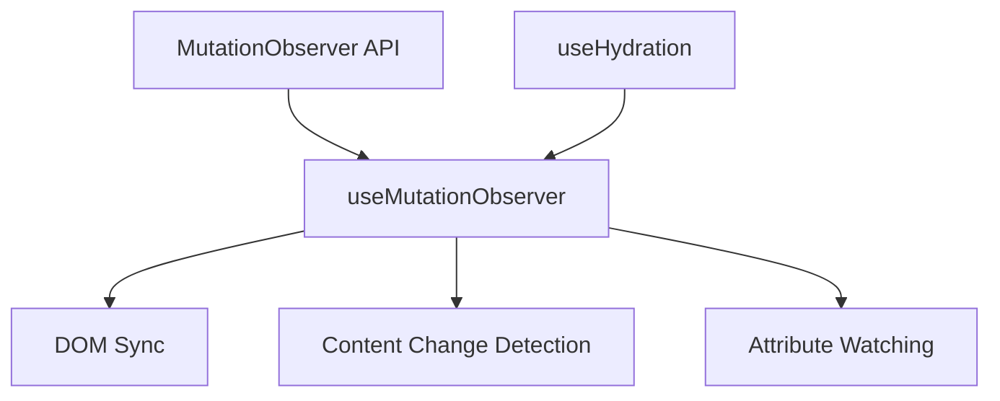

# useMutationObserver

A composable for detecting DOM changes using the Mutation Observer API with automatic cleanup.

<DocsPageFeatures :frontmatter />

## Usage

The `useMutationObserver` composable wraps the Mutation Observer API to detect changes to the DOM tree. It's useful for monitoring attribute changes, child element modifications, and character data updates.

```vue UseMutationObserver
<script setup lang="ts">
  import { useMutationObserver } from '@vuetify/v0'
  import { ref, useTemplateRef } from 'vue'

  const target = useTemplateRef('target')
  const mutationCount = ref(0)

  useMutationObserver(target, (mutations) => {
    mutationCount.value += mutations.length
    mutations.forEach(mutation => {
      console.log('Type:', mutation.type)
      console.log('Added nodes:', mutation.addedNodes)
      console.log('Removed nodes:', mutation.removedNodes)
    })
  }, {
    childList: true,
    attributes: true,
    attributeOldValue: true
  })
</script>

<template>
  <div>
    <div ref="target">
      <p>Mutations detected: {{ mutationCount }}</p>
    </div>
  </div>
</template>
```

## Architecture

`useMutationObserver` wraps the native MutationObserver API with Vue reactivity:



<DocsApi />
