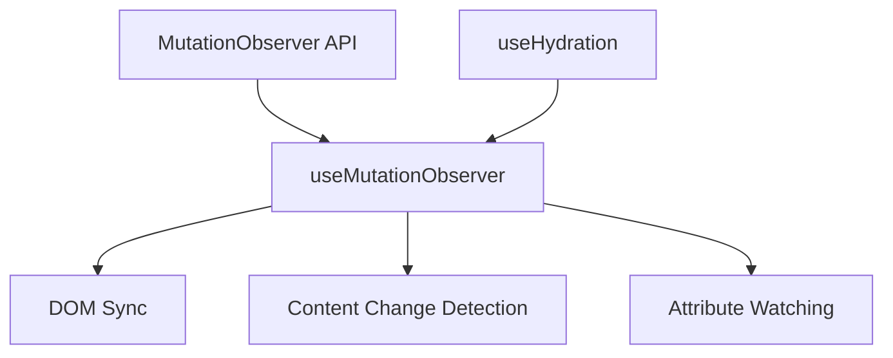

# useMutationObserver

A composable for detecting DOM changes using the Mutation Observer API with automatic cleanup.

<DocsPageFeatures :frontmatter />

## Usage

The `useMutationObserver` composable wraps the Mutation Observer API to detect changes to the DOM tree. It's useful for monitoring attribute changes, child element modifications, and character data updates.

> [!TIP] Why wrap MutationObserver?
> The native `MutationObserver` has no awareness of Vue's `effectScope` lifecycle. If you create one inside a composable, it won't automatically disconnect when the scope is disposed. `useMutationObserver` integrates `onScopeDispose` for automatic cleanup, defers creation until after hydration for SSR safety, and adds reactive target tracking — things the native API can't do on its own.

```vue collapse no-filename UseMutationObserver
<script setup lang="ts">
  import { useMutationObserver } from '@vuetify/v0'
  import { ref, useTemplateRef } from 'vue'

  const target = useTemplateRef('target')
  const mutationCount = ref(0)

  useMutationObserver(target, (mutations) => {
    mutationCount.value += mutations.length
    mutations.forEach(mutation => {
      console.log('Type:', mutation.type)
      console.log('Added nodes:', mutation.addedNodes)
      console.log('Removed nodes:', mutation.removedNodes)
    })
  }, {
    childList: true,
    attributes: true,
    attributeOldValue: true
  })
</script>

<template>
  <div>
    <div ref="target">
      <p>Mutations detected: {{ mutationCount }}</p>
    </div>
  </div>
</template>
```

## Architecture

`useMutationObserver` wraps the native MutationObserver API with Vue reactivity:


```mermaid "Mutation Observer Hierarchy"
flowchart TD
  MutationObserver["MutationObserver API"] --> useMutationObserver
  useHydration --> useMutationObserver
  useMutationObserver --> DOMSync["DOM Sync"]
  useMutationObserver --> ContentChanges["Content Change Detection"]
  useMutationObserver --> AttributeWatch["Attribute Watching"]
```

## Options

| Option | Type | Default | Notes |
| - | - | - | - |
| `immediate` | `boolean` | `false` | Fire the callback immediately on mount before any mutation |
| `once` | `boolean` | `false` | Stop observing after the first callback fires |
| `childList` | `boolean` | `true` | Observe child node additions and removals |
| `attributes` | `boolean` | `false` | Observe attribute changes |
| `characterData` | `boolean` | `false` | Observe text content changes |
| `subtree` | `boolean` | `false` | Extend observation to all descendant nodes |
| `attributeFilter` | `string[]` | — | Limit attribute observation to specific attribute names |
| `characterDataOldValue` | `boolean` | `false` | Record previous text value in mutation records |

## Reactivity

| Property/Method | Reactive | Notes |
| - | :-: | - |
| `isActive` | <AppSuccessIcon /> | Computed from observer ref |
| `isPaused` | <AppSuccessIcon /> | ShallowRef, readonly |
| `target` | <AppSuccessIcon /> | Accepts MaybeRef, watched for changes |
| `pause()` | — | Temporarily stop observing without disconnecting |
| `resume()` | — | Resume after `pause()` |
| `stop()` | — | Disconnect the observer permanently |

## Examples

::: gn-example
/composables/use-mutation-observer/basic

### DOM Mutation Logger

An interactive sandbox that fires three distinct mutation types at the Mutation Observer: `childList` changes when children are added or removed via the Add/Remove buttons; `attributes` changes when the Toggle Attribute button flips `data-highlighted` on the root; and `characterData` changes propagate up from any descendant text node thanks to `subtree: true`. Every batch of `MutationRecord` objects that the callback receives is appended to a color-coded log entry below the target, labeled by type and detail.

The example exercises `pause()` and `resume()` so you can see that mutations fired while the observer is paused are silently dropped — the log does not catch up when observing resumes. The `isPaused` ref drives the button label reactively without any extra watcher. Use this pattern in performance-sensitive trees where you need to defer observation during bulk DOM writes, then resume once the work is complete. For size-change tracking, prefer [useResizeObserver](/composables/system/use-resize-observer); for DOM-presence detection, prefer [useIntersectionObserver](/composables/system/use-intersection-observer).

:::

## FAQ

::: faq

??? Why are mutations that happen while paused never reported?

`pause()` stops observation outright; changes during the pause are dropped and are not replayed when you call `resume()`. Use it to skip noise during bulk DOM writes, then resume once the work is done.

??? How do I watch text or attribute changes on descendants, not just direct children?

Set `subtree: true` to extend observation to every descendant, then enable the record types you need — `characterData` for text, `attributes` for attribute changes. `childList` is on by default.

??? When should I use useMutationObserver vs the other observers?

Use useMutationObserver for DOM-tree, attribute, and text changes. Reach for [useResizeObserver](/composables/system/use-resize-observer) for element size changes and [useIntersectionObserver](/composables/system/use-intersection-observer) for viewport visibility.

??? Can I observe only specific attributes instead of every attribute change?

Yes. Set `attributes: true` and pass `attributeFilter: ['class', 'data-state']` to limit observation to those names, which avoids callback noise from unrelated attribute writes.

:::

<DocsApi />
