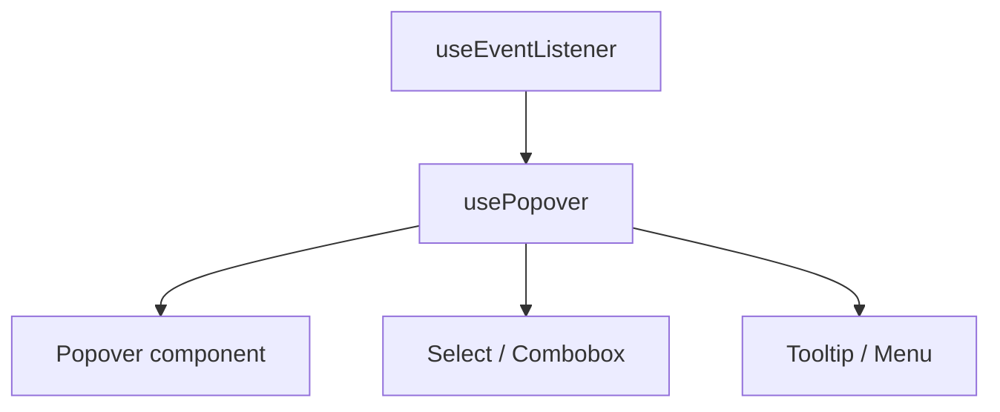

# usePopover

A composable for native popover API behavior with CSS anchor positioning.

<DocsPageFeatures :frontmatter />

## Usage

`usePopover` manages a popover's open/close state, generates CSS anchor positioning styles, and synchronizes reactive state with native popover toggle events. Spread `anchorStyles` on the activator, `contentAttrs` and `contentStyles` on the content element, and call `attach()` to wire up the native popover lifecycle.

```vue collapse no-filename usePopover
<script setup lang="ts">
  import { usePopover } from '@vuetify/v0'
  import { useTemplateRef } from 'vue'

  const content = useTemplateRef('content')

  const {
    isOpen,
    toggle,
    attach,
    anchorStyles,
    contentAttrs,
    contentStyles,
  } = usePopover({ positionArea: 'bottom' })

  attach(content)
</script>

<template>
  <button :style="anchorStyles" @click="toggle">
    {{ isOpen ? 'Close' : 'Open' }}
  </button>

  <div
    ref="content"
    v-bind="contentAttrs"
    :style="contentStyles"
  >
    Popover content
  </div>
</template>
```

## Architecture

`usePopover` builds on `useEventListener` for native toggle event synchronization. It is a standalone composable — not part of the compound Popover component — making it ideal for building select, combobox, tooltip, and menu components directly.



## Options

| Option | Type | Default | Notes |
| - | - | - | - |
| `id` | `string` | auto | Base ID for anchor name and popover `id`. Auto-generated if not provided |
| `positionArea` | `string` | `'bottom'` | CSS `position-area` value — controls where the content appears relative to the anchor |
| `positionTry` | `string` | `'most-width bottom'` | CSS `position-try-fallbacks` value — fallback positions when the primary area overflows |
| `isOpen` | `Ref<boolean>` | — | External ref for bidirectional open state (e.g., from `defineModel`) |
| `openDelay` | `MaybeRefOrGetter<number>` | `0` | Milliseconds to wait before opening the popover |
| `closeDelay` | `MaybeRefOrGetter<number>` | `0` | Milliseconds to wait before closing the popover |

## Reactivity

| Property/Method | Reactive | Notes |
| - | :-: | - |
| `isOpen` | <AppSuccessIcon /> | ShallowRef, tracks whether the popover is open |
| `open()` | - | Open the popover |
| `close()` | - | Close the popover |
| `toggle()` | - | Toggle open/close |
| `cancel()` | - | Cancel any pending open or close transition |
| `attach(el)` | - | Wire native show/hide watch + toggle event sync to a content element |
| `anchorStyles` | <AppSuccessIcon /> | Readonly Ref, CSS `anchor-name` for the activator element |
| `contentAttrs` | <AppSuccessIcon /> | Readonly Ref, `id` and `popover` attribute for the content element |
| `contentStyles` | <AppSuccessIcon /> | Readonly Ref, CSS anchor positioning styles for the content element |

## Examples

::: gn-example
/composables/use-popover/anchor-positioning

### CSS Anchor Positioning

A button-triggered panel that positions itself below the activator using the native Popover API and CSS anchor positioning. The example shows the three-part spread: `anchorStyles` goes on the trigger (sets the `anchor-name` CSS property), `contentAttrs` goes on the popover element (sets `id` and the `popover` attribute), and `contentStyles` goes on the popover element (sets `position-anchor` and `position-area`). `attach(content)` wires the native `toggle` event back to `isOpen` so the state stays in sync even if the browser closes the popover on focus-loss or back-navigation.

The `positionTry: 'flip-block'` option tells the browser to try flipping to the opposite side when the popover would overflow the viewport — no JavaScript position math required. Call `toggle()` from the button's click handler to open and close programmatically. The status indicator at the bottom reads `isOpen` directly to show the live state. For the full compound-component surface that composes `usePopover` with slots and transitions, see [Popover](/components/disclosure/popover); for a click-outside close handler that pairs naturally with any popover, see [useClickOutside](/composables/system/use-click-outside).

:::

<DocsApi />
