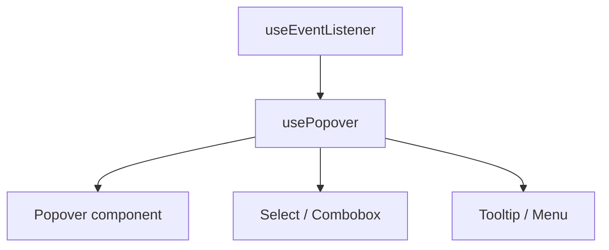

# usePopover

A composable for native popover API behavior with CSS anchor positioning.

<DocsPageFeatures :frontmatter />

## Usage

`usePopover` manages a popover's open/close state, generates CSS anchor positioning styles, and synchronizes reactive state with native popover toggle events. Spread `anchorStyles` on the activator, `contentAttrs` and `contentStyles` on the content element, and call `attach()` to wire up the native popover lifecycle.

```vue collapse no-filename usePopover
<script setup lang="ts">
  import { usePopover } from '@vuetify/v0'
  import { useTemplateRef } from 'vue'

  const content = useTemplateRef('content')

  const {
    isOpen,
    toggle,
    attach,
    anchorStyles,
    contentAttrs,
    contentStyles,
  } = usePopover({ positionArea: 'bottom' })

  attach(content)
</script>

<template>
  <button :style="anchorStyles" @click="toggle">
    {{ isOpen ? 'Close' : 'Open' }}
  </button>

  <div
    ref="content"
    v-bind="contentAttrs"
    :style="contentStyles"
  >
    Popover content
  </div>
</template>
```

## Architecture

`usePopover` builds on `useEventListener` for native toggle event synchronization. It is a standalone composable — not part of the compound Popover component — making it ideal for building select, combobox, tooltip, and menu components directly.


```mermaid "Popover Architecture"
flowchart TD
  useEventListener --> usePopover
  usePopover --> Popover["Popover component"]
  usePopover --> Select["Select / Combobox"]
  usePopover --> Tooltip["Tooltip / Menu"]
```

## Adapters

Adapters let you swap the underlying positioning engine without changing your application code.

| Adapter | Import | Description |
|---------|--------|-------------|
| `V0PopoverAdapter` | `@vuetify/v0` | CSS anchor positioning (default, zero runtime dependency) |
| `FloatingUIPopoverAdapter` | `@vuetify/v0/popover/adapters/floating-ui` | [Floating UI](https://floating-ui.com) JS measurement — `flip()` covers overflow |

`FloatingUIPopoverAdapter` is subpath-only so `@floating-ui/dom` stays out of the main barrel. Install the peer, then pass an instance via the `adapter` option. `positionTry` is ignored; `flip()` covers the overflow intent. Pass `middleware` to the constructor to override the default `[offset(8), flip(), shift({ padding: 8 })]`.

::: code-group no-filename

```bash pnpm
pnpm add @floating-ui/dom
```

```bash npm
npm install @floating-ui/dom
```

```bash yarn
yarn add @floating-ui/dom
```

```bash bun
bun add @floating-ui/dom
```

:::

```ts src/popover.ts
import { usePopover } from '@vuetify/v0'
import { FloatingUIPopoverAdapter } from '@vuetify/v0/popover/adapters/floating-ui'

const popover = usePopover({ adapter: new FloatingUIPopoverAdapter() })
```

## Options

| Option | Type | Default | Notes |
| - | - | - | - |
| `id` | `string` | auto | Base ID for anchor name and popover `id`. Auto-generated if not provided |
| `positionArea` | `string` | `'bottom'` | CSS `position-area` value — controls where the content appears relative to the anchor |
| `positionTry` | `string` | `'most-width bottom'` | CSS `position-try-fallbacks` value — fallback positions when the primary area overflows |
| `isOpen` | `Ref<boolean>` | — | External ref for bidirectional open state (e.g., from `defineModel`) |
| `openDelay` | `MaybeRefOrGetter<number>` | `0` | Milliseconds to wait before opening the popover |
| `closeDelay` | `MaybeRefOrGetter<number>` | `0` | Milliseconds to wait before closing the popover |
| `adapter` | `PopoverAdapter` | `new V0PopoverAdapter()` | Positioning engine. The default emits CSS anchor positioning with zero runtime dependency — see [Adapters](#adapters) |

## Reactivity

| Property/Method | Reactive | Notes |
| - | :-: | - |
| `isOpen` | <AppSuccessIcon /> | ShallowRef, tracks whether the popover is open |
| `open()` | - | Open the popover |
| `close()` | - | Close the popover |
| `toggle()` | - | Toggle open/close |
| `cancel()` | - | Cancel any pending open or close transition |
| `attach(el)` | - | Wire native show/hide watch + toggle event sync to a content element |
| `attachAnchor(el)` | - | Register the activator/reference element with the positioning adapter |
| `anchorStyles` | <AppSuccessIcon /> | Readonly Ref, CSS `anchor-name` for the activator element |
| `contentAttrs` | <AppSuccessIcon /> | Readonly Ref, `id` and `popover` attribute for the content element |
| `contentStyles` | <AppSuccessIcon /> | Readonly Ref, CSS anchor positioning styles for the content element |

## Examples

::: gn-example
/composables/use-popover/useMenu.ts 1
/composables/use-popover/MenuButton.vue 2
/composables/use-popover/menu-button.vue 3

### Dropdown Menu

A custom account menu built directly on `usePopover`, without the compound Popover component. The composable owns the popover instance and the menu data, the presentational component renders the trigger and the panel, and the entry wires them together and reports the chosen action. This is the shape to reach for when you want full control over a menu, select, or combobox surface rather than the slots and transitions of [Popover](/components/disclosure/popover).

The example exercises the full three-part spread that `usePopover` returns. `anchorStyles` goes on the trigger, where it sets the CSS `anchor-name` the panel positions against; `contentAttrs` goes on the panel and applies its `id` plus the native `popover` attribute; and `contentStyles` carries the CSS anchor-positioning rules — `position-anchor`, `position-area`, and the `position-try-fallbacks` produced by `positionTry: 'flip-block'`, which lets the browser flip the panel above the trigger when there is no room below, with no JavaScript position math. Because `contentAttrs` registers an auto popover, the browser handles light dismiss for free: clicking outside or pressing Escape closes the panel.

`MenuButton.vue` calls `attach(content)` with a template ref to the panel element. That single call wires the native `toggle` event back into `isOpen`, so when the browser closes the popover on light dismiss the reactive state stays in sync. Selecting an item calls `close()` and records the choice; the trigger reads `isOpen` to rotate its caret. For the close-on-outside-click behavior wired manually rather than through the native popover, see [useClickOutside](/composables/system/use-click-outside); the open and close delays come from [useDelay](/composables/system/use-delay).

| File | Role |
|------|------|
| `useMenu.ts` | Creates the popover, owns the menu items, and closes on select |
| `MenuButton.vue` | Renders the trigger and panel; calls `attach` to sync native state |
| `menu-button.vue` | Wires the composable to the component and shows the chosen action |
:::

## Bring your own positioning engine

`usePopover` positions content with CSS anchor positioning by default (`V0PopoverAdapter`) — no JavaScript measurement, no runtime dependency. For Firefox ESR and Safari before version 26, reach for the shipped [FloatingUIPopoverAdapter](#adapters) first. The sketch below is the same adapter shape if you want to wrap a different engine (Popper, or your own) rather than import one.

```ts collapse no-filename floating-ui-popover-adapter.ts
import { PopoverAdapter } from '@vuetify/v0'
import { autoUpdate, computePosition, flip, offset, shift } from '@floating-ui/dom'
import { shallowRef, watch } from 'vue'

import type { PopoverAdapterContext } from '@vuetify/v0'

export class FloatingUIPopoverAdapter extends PopoverAdapter {
  setup (context: PopoverAdapterContext) {
    const styles = shallowRef<Record<string, string>>({ position: 'fixed', top: '0px', left: '0px' })
    let stopAutoUpdate: (() => void) | undefined

    async function reposition () {
      const anchor = context.anchorEl.value
      const content = context.contentEl.value
      if (!anchor || !content) return

      const { side, align } = context.placement.value
      const { x, y } = await computePosition(anchor, content, {
        placement: align === 'center' ? side : `${side}-${align}`,
        middleware: [offset(8), flip(), shift({ padding: 8 })],
      })

      styles.value = { position: 'fixed', top: `${y}px`, left: `${x}px` }
    }

    watch(
      () => [context.anchorEl.value, context.contentEl.value, context.isOpen.value] as const,
      ([anchor, content, isOpen]) => {
        stopAutoUpdate?.()
        stopAutoUpdate = undefined
        if (!anchor || !content || !isOpen) return
        stopAutoUpdate = autoUpdate(anchor, content, reposition)
      },
      { immediate: true },
    )

    this.dispose = () => stopAutoUpdate?.()

    return styles
  }
}
```

```ts no-filename usage
import { usePopover } from '@vuetify/v0'
import { FloatingUIPopoverAdapter } from './floating-ui-popover-adapter'

const popover = usePopover({ adapter: new FloatingUIPopoverAdapter() })
```

Everything else is unchanged — `attach()`, `attachAnchor()`, `contentAttrs`, and `anchorStyles` all work the same way regardless of which adapter is active. `contentStyles` becomes whatever the adapter's `setup()` returns instead of the CSS anchor-positioning declarations, so a floating-ui adapter can hand back computed `top`/`left`/`position` the way the sketch above does.

The [Popover](/components/disclosure/popover) component and the [Select](/components/forms/select), [Tooltip](/components/disclosure/tooltip), and `createCombobox` built on top of `usePopover` all accept the same `adapter` option (`positionAdapter` on `createCombobox`, since it already has its own filtering `adapter`) and forward it through, so swapping the positioning engine for one of those doesn't require dropping down to `usePopover` directly.

## FAQ

::: faq

??? When should I use `usePopover` vs the Popover component?

Reach for `usePopover` when you want full control over a select, combobox, tooltip, or menu surface built from your own markup. Use the [Popover](/components/disclosure/popover) component when its slots and transitions are enough.

??? Why do I have to call `attach()`?

`attach(el)` wires the native popover's `toggle` event back into `isOpen`. Without it, the browser's light dismiss (outside click, Escape) would close the popover but your reactive state would drift out of sync.

??? Do I need useClickOutside to close the popover when clicking away?

No. `contentAttrs` registers a native auto popover, so the browser handles light dismiss — outside click and Escape — for free. Reach for [useClickOutside](/composables/system/use-click-outside) only when you wire dismissal manually instead of using the native popover.

??? How do I delay opening or closing the popover?

Pass `openDelay` and `closeDelay` (ms) in the options. Call `cancel()` to abort a pending open or close transition before it fires.

??? How do I control where the popover appears relative to its trigger?

Set `positionArea` (e.g. `'bottom'`) for the primary placement and `positionTry` for the fallback positions the browser flips to when that area overflows — CSS anchor positioning handles it with no JavaScript layout math.

??? Does v0 ship a floating-ui adapter?

Yes. Import `FloatingUIPopoverAdapter` from `@vuetify/v0/popover/adapters/floating-ui` and pass it as the `adapter` option — see [Adapters](#adapters). It requires the `@floating-ui/dom` peer; the CSS default (`V0PopoverAdapter`) stays zero-dependency. For a different engine, see [Bring your own positioning engine](#bring-your-own-positioning-engine).

:::

<DocsApi />
