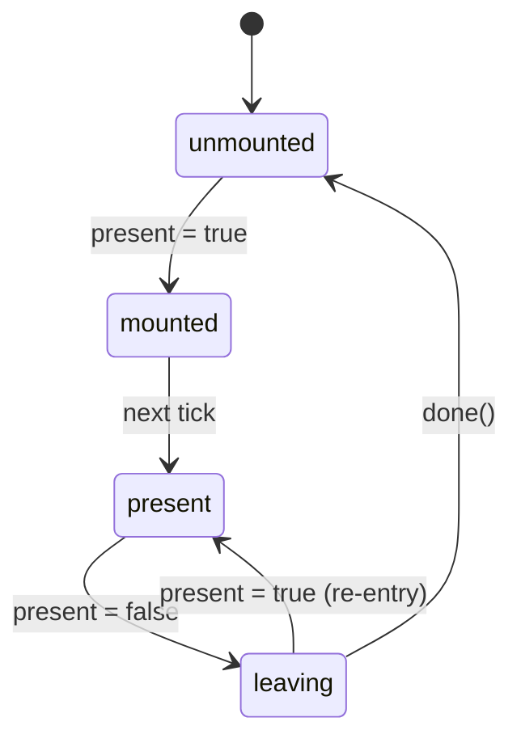

# usePresence

Animation-agnostic mount lifecycle management.

<DocsPageFeatures :frontmatter />

## Usage

The `usePresence` composable implements a state machine that controls when content should be in the DOM. It handles lazy mounting, enter/exit timing, and cleanup — without opinion on how animation happens.

```ts collapse no-filename usePresence
import { usePresence } from '@vuetify/v0'
import { shallowRef } from 'vue'

const isOpen = shallowRef(false)

const { isMounted, isPresent, isLeaving, state, done } = usePresence({
  present: isOpen,
  lazy: true,
  immediate: false,
})

// isMounted — controls v-if (true during mounted, present, and leaving)
// state — 'unmounted' | 'mounted' | 'present' | 'leaving'
// done() — call when exit animation finishes
```

## Options

| Option | Type | Default | Notes |
| - | - | - | - |
| `present` | `MaybeRefOrGetter<boolean>` | — | Required. Drives visibility — when truthy, content enters; when falsy, begins leaving |
| `lazy` | `boolean` | `false` | Delay first mount until `present` is `true` for the first time |
| `immediate` | `boolean` | `true` | Auto-resolve the `leaving` state on the next tick if `done()` is not called. Set to `false` for JS-driven animations that need full timing control |

## Architecture



## Reactivity

| Property | Type | Description |
|----------|------|-------------|
| `state` | `Ref<PresenceState>` | Current lifecycle state |
| `isMounted` | `Ref<boolean>` | Whether content should be in the DOM |
| `isPresent` | `Ref<boolean>` | Whether content is logically active |
| `isLeaving` | `Ref<boolean>` | Whether an exit is in progress |
| `done` | `() => void` | Signal that exit animation is complete |

## Examples

::: gn-example
/composables/use-presence/basic

### CSS Transition

A toggle button that reveals a card with a CSS fade-and-slide enter/exit animation, demonstrating how `usePresence` separates mount lifetime from visual state. `isMounted` drives the `v-if` so the element is absent from the DOM when fully invisible; `state` drives the UnoCSS utility classes — the card is `opacity-100 translate-y-0` in the `present` state and `opacity-0 -translate-y-2` in any other state, letting the CSS `transition-all` handle the animation.

The critical detail is `immediate: false` paired with `done()` on `transitionend`. When `immediate` is `true` (the default), `usePresence` auto-resolves the leaving state on the next microtask — fast enough for content with no exit animation, but it races CSS transitions. Setting `immediate: false` hands control to the caller: `done()` is called only when the `transitionend` event fires on the content element itself (`e.target === e.currentTarget` guards against bubbling from children). Until `done()` is called, the element stays mounted so the transition completes before unmounting. `lazy: true` keeps the card out of the DOM entirely on first render, deferring the first mount until the button is clicked.

Reach for this pattern when you need a CSS or WAAPI exit animation before the element leaves the DOM. If you only need lazy mounting with no exit delay, use `lazy: true` without `immediate: false` — the default behavior unmounts immediately. For the compound component that wraps this composable with slot-based transitions, see [Presence](/components/primitives/presence).

:::

## FAQ

::: faq
??? How does usePresence relate to useLazy?

`usePresence` with `lazy: true` subsumes `useLazy`'s deferred rendering behavior. The `isMounted` ref is equivalent to `hasContent`, and the state machine replaces the manual `onAfterLeave` callback pattern.

??? What does immediate do?

When `immediate: true` (default), if `done()` isn't called within a microtask of entering the `leaving` state, Presence auto-resolves to `unmounted`. This is the fast path for content without exit animations. Set `immediate: false` for JS-driven animations where you need full control over timing.
:::

<DocsApi />
