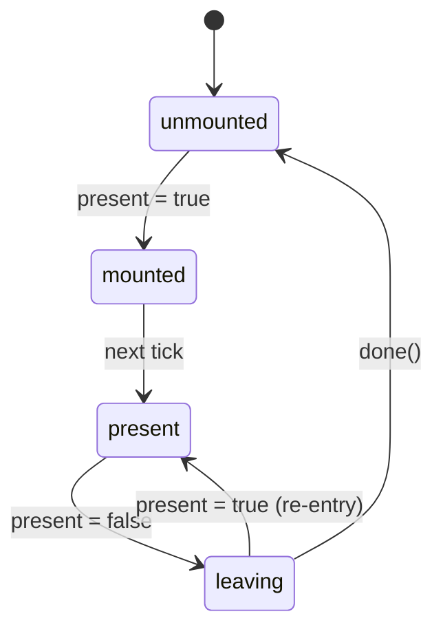

# usePresence

Animation-agnostic mount lifecycle management.

<DocsPageFeatures :frontmatter />

## Usage

The `usePresence` composable implements a state machine that controls when content should be in the DOM. It handles lazy mounting, enter/exit timing, and cleanup — without opinion on how animation happens.

```ts collapse no-filename usePresence
import { usePresence } from '@vuetify/v0'
import { shallowRef } from 'vue'

const isOpen = shallowRef(false)

const { isMounted, isPresent, isLeaving, state, done } = usePresence({
  present: isOpen,
  lazy: true,
  immediate: false,
})

// isMounted — controls v-if (true during mounted, present, and leaving)
// state — 'unmounted' | 'mounted' | 'present' | 'leaving'
// done() — call when exit animation finishes
```

## Architecture



## Reactivity

| Property | Type | Description |
|----------|------|-------------|
| `state` | `Ref<PresenceState>` | Current lifecycle state |
| `isMounted` | `Ref<boolean>` | Whether content should be in the DOM |
| `isPresent` | `Ref<boolean>` | Whether content is logically active |
| `isLeaving` | `Ref<boolean>` | Whether an exit is in progress |
| `done` | `() => void` | Signal that exit animation is complete |

## Questions

::: faq
??? How does usePresence relate to useLazy?

`usePresence` with `lazy: true` subsumes `useLazy`'s deferred rendering behavior. The `isMounted` ref is equivalent to `hasContent`, and the state machine replaces the manual `onAfterLeave` callback pattern.

??? What does immediate do?

When `immediate: true` (default), if `done()` isn't called within a microtask of entering the `leaving` state, Presence auto-resolves to `unmounted`. This is the fast path for content without exit animations. Set `immediate: false` for JS-driven animations where you need full control over timing.
:::

<DocsApi />
