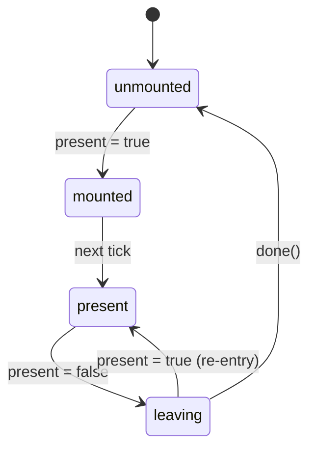

# usePresence

Animation-agnostic mount lifecycle management.

<DocsPageFeatures :frontmatter />

## Usage

The `usePresence` composable implements a state machine that controls when content should be in the DOM. It handles lazy mounting, enter/exit timing, and cleanup — without opinion on how animation happens.

```ts collapse no-filename usePresence
import { usePresence } from '@vuetify/v0'
import { shallowRef } from 'vue'

const isOpen = shallowRef(false)

const { isMounted, isPresent, isLeaving, state, done } = usePresence({
  present: isOpen,
  lazy: true,
  immediate: false,
})

// isMounted — controls v-if (true during mounted, present, and leaving)
// state — 'unmounted' | 'mounted' | 'present' | 'leaving'
// done() — call when exit animation finishes
```

## Options

| Option | Type | Default | Notes |
| - | - | - | - |
| `present` | `MaybeRefOrGetter<boolean>` | — | Required. Drives visibility — when truthy, content enters; when falsy, begins leaving |
| `lazy` | `boolean` | `false` | Delay first mount until `present` is `true` for the first time |
| `immediate` | `boolean` | `true` | Auto-resolve the `leaving` state on the next tick if `done()` is not called. Set to `false` for JS-driven animations that need full timing control |

## Architecture



## Reactivity

| Property | Type | Description |
|----------|------|-------------|
| `state` | `Ref<PresenceState>` | Current lifecycle state |
| `isMounted` | `Ref<boolean>` | Whether content should be in the DOM |
| `isPresent` | `Ref<boolean>` | Whether content is logically active |
| `isLeaving` | `Ref<boolean>` | Whether an exit is in progress |
| `done` | `() => void` | Signal that exit animation is complete |

## Examples

::: gn-example
/composables/use-presence/useAccordion.ts 1
/composables/use-presence/AccordionPanel.vue 2
/composables/use-presence/accordion.vue 3

### Animated Accordion

A single-open FAQ accordion where every panel drives its own `usePresence` instance, so each region is fully absent from the DOM when collapsed and animates in and out with CSS keyframes. The composable owns only the demo state — the panel list and which `id` is active — while the reusable panel component owns the mount lifecycle. Opening one panel collapses the previous one, which means two presence machines run at once: one entering, one leaving. This is the case a plain `v-show` cannot handle, because the leaving panel must stay mounted long enough to finish its exit animation before it is removed.

The pattern hinges on `immediate: false` together with `done()`. With the default `immediate: true`, `usePresence` auto-resolves the `leaving` state on the next microtask — fine for content with no exit animation, but it races a CSS animation. Setting `immediate: false` hands timing control to the panel: `isMounted` gates the `v-if`, `state` is reflected onto a `data-state` attribute that selects the enter or leave keyframe, and `done()` is called from `animationend` only while `isLeaving` is true (so the enter animation's own `animationend` is ignored). Until `done()` runs, the element stays mounted and the exit animation completes cleanly.

Reach for this when each item needs an independent enter/exit animation before it leaves the DOM. If you only need deferred first mount with no exit delay, pass `lazy: true` and leave `immediate` at its default. For the compound component that wraps this composable with slot-based transitions, see [Presence](/components/primitives/presence); for the simpler defer-until-first-open case, see [useLazy](/composables/system/use-lazy).

| File | Role |
|------|------|
| `useAccordion.ts` | Owns the panel data and the active-id state with a toggle |
| `AccordionPanel.vue` | Drives one `usePresence` instance and resolves the CSS exit via `done()` |
| `accordion.vue` | Wires the composable to the panels and renders the headers |
:::

## FAQ

::: faq
??? How does usePresence relate to useLazy?

`usePresence` with `lazy: true` subsumes `useLazy`'s deferred rendering behavior. The `isMounted` ref is equivalent to `hasContent`, and the state machine replaces the manual `onAfterLeave` callback pattern.

??? What does immediate do?

When `immediate: true` (default), if `done()` isn't called within a microtask of entering the `leaving` state, Presence auto-resolves to `unmounted`. This is the fast path for content without exit animations. Set `immediate: false` for JS-driven animations where you need full control over timing.
:::

<DocsApi />
