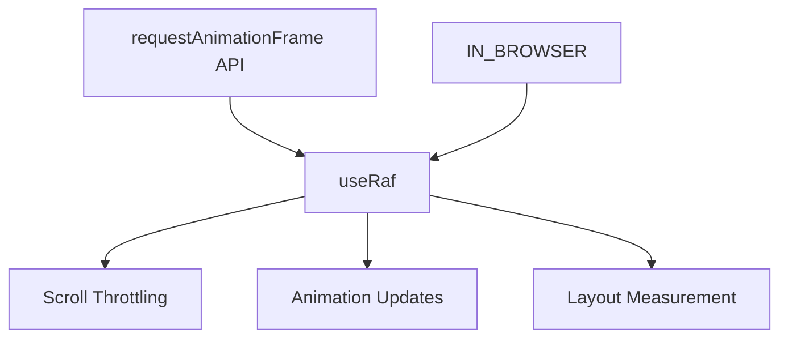

# useRaf

A composable for scope-disposed safe requestAnimationFrame with automatic cleanup.

<DocsPageFeatures :frontmatter />

## Usage

The `useRaf` composable wraps `requestAnimationFrame` with a cancel-then-request pattern that deduplicates rapid calls. It returns a callable function that requests an animation frame, automatically canceling any pending frame.

```vue useRaf
<script setup lang="ts">
  import { useRaf } from '@vuetify/v0'
  import { ref } from 'vue'

  const position = ref(0)

  const updatePosition = useRaf((timestamp) => {
    position.value = Math.sin(timestamp / 1000) * 100
  })

  // Call to request frame (cancels pending)
  updatePosition()

  // Manual cancel if needed
  updatePosition.cancel()

  // Check if frame is pending
  console.log(updatePosition.isActive.value)
</script>
```

## Examples

::: example
/composables/use-raf/scroll-throttle
:::

## Key Features

### Cancel-Then-Request Pattern

Each call cancels any pending frame before requesting a new one. This deduplicates rapid calls, ensuring only the latest request executes:

```ts
const update = useRaf(() => {
  // This callback only runs once per frame
})

// These rapid calls result in only ONE frame callback
update()
update()
update()
```

### Automatic Cleanup

The composable automatically cancels pending frames when the Vue scope is disposed (component unmount, effect scope stop):

```ts
// No manual cleanup needed - handled automatically
const update = useRaf(callback)
```

### SSR Safe

The composable is a no-op in non-browser environments. `isActive` always returns `false` during SSR.

## Architecture

`useRaf` provides a lightweight wrapper around `requestAnimationFrame`:



<DocsApi />
