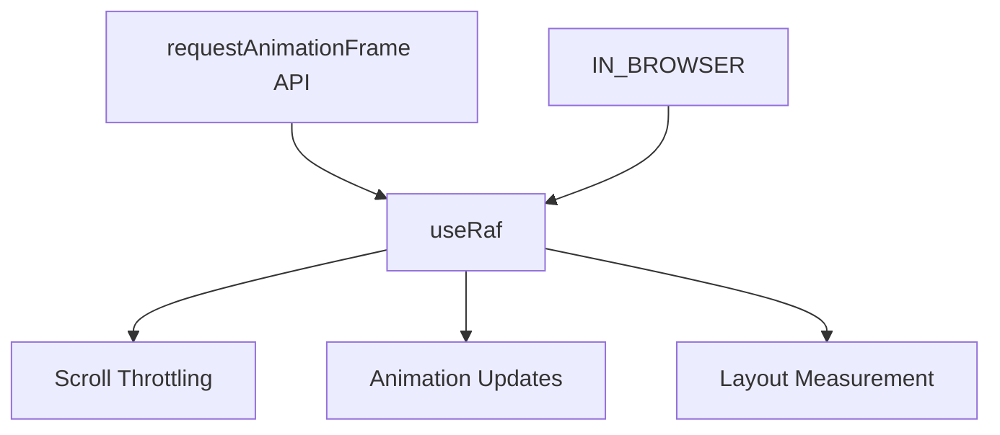

# useRaf

Throttles callbacks to the next animation frame with cancel-then-request deduplication. Cleans up automatically on scope disposal.

<DocsPageFeatures :frontmatter />

## Usage

The `useRaf` composable wraps `requestAnimationFrame` with a cancel-then-request pattern that deduplicates rapid calls. It returns a callable function that requests an animation frame, automatically canceling any pending frame.

```vue useRaf
<script setup lang="ts">
  import { useRaf } from '@vuetify/v0'
  import { ref } from 'vue'

  const position = ref(0)

  const updatePosition = useRaf((timestamp) => {
    position.value = Math.sin(timestamp / 1000) * 100
  })

  // Call to request frame (cancels pending)
  updatePosition()

  // Manual cancel if needed
  updatePosition.cancel()

  // Check if frame is pending
  console.log(updatePosition.isActive.value)
</script>
```

## Architecture

`useRaf` provides a lightweight wrapper around `requestAnimationFrame`:


```mermaid "useRaf Hierarchy"
flowchart TD
  RAF["requestAnimationFrame API"] --> useRaf
  IN_BROWSER --> useRaf
  useRaf --> ScrollThrottle["Scroll Throttling"]
  useRaf --> Animations["Animation Updates"]
  useRaf --> LayoutMeasure["Layout Measurement"]
```

## Examples

::: gn-example
/composables/use-raf/scroll-throttle

### Scroll Throttle

A tall scrollable container that tracks three metrics — `scrollTop` in pixels, scroll percentage, and a running update count — to make the RAF deduplication visible. Each `scroll` DOM event calls the `useRaf`-wrapped updater, which cancels any pending frame before scheduling a new one. Scrolling rapidly produces many events per frame, but the counter increments at most once per animation frame rather than once per event.

`useRaf` returns a function wrapping the callback; calling it repeatedly within the same frame costs only one `cancelAnimationFrame` + one `requestAnimationFrame`, so scroll handlers, resize reactions, and pointer-move listeners are all safe to call at native event rate. The `isActive` ref on the returned function reflects whether a frame is currently pending. No cleanup is needed — the composable cancels any outstanding frame on scope disposal. For element-size tracking that pairs naturally with this, see [useResizeObserver](/composables/system/use-resize-observer); for event listener registration with the same scope-safe cleanup, see [useEventListener](/composables/system/use-event-listener).

:::

## Key Features

### Cancel-Then-Request Pattern

Each call cancels any pending frame before requesting a new one. This deduplicates rapid calls, ensuring only the latest request executes:

```ts
const update = useRaf(() => {
  // This callback only runs once per frame
})

// These rapid calls result in only ONE frame callback
update()
update()
update()
```

### Automatic Cleanup

The composable automatically cancels pending frames when the Vue scope is disposed (component unmount, effect scope stop):

```ts
// No manual cleanup needed - handled automatically
const update = useRaf(callback)
```

### SSR Safe

The composable is a no-op in non-browser environments. `isActive` always returns `false` during SSR.

<DocsApi />
