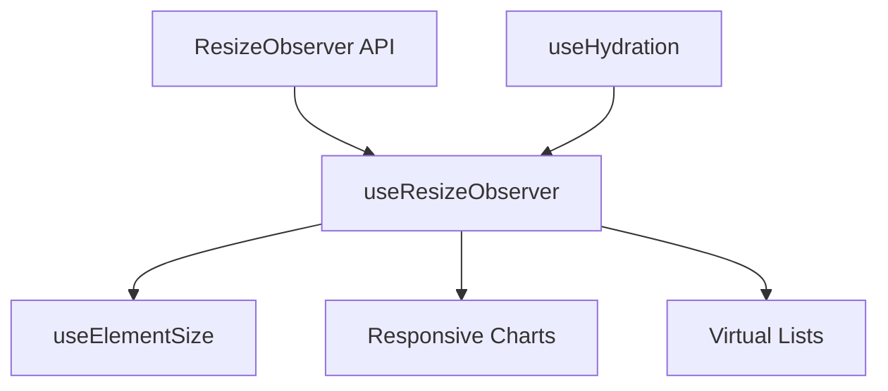

# useResizeObserver

A composable for detecting element size changes using the Resize Observer API with automatic cleanup.

<DocsPageFeatures :frontmatter />

## Usage

The `useResizeObserver` composable wraps the Resize Observer API to detect when an element's dimensions change. It's useful for responsive components, charts, virtualized lists, and aspect ratio maintenance.

```vue UseResizeObserver
<script setup lang="ts">
  import { useResizeObserver } from '@vuetify/v0'
  import { ref, useTemplateRef } from 'vue'

  const container = useTemplateRef('container')
  const width = ref(0)
  const height = ref(0)

  useResizeObserver(container, (entries) => {
    const entry = entries[0]
    width.value = entry.contentRect.width
    height.value = entry.contentRect.height
  })
</script>

<template>
  <div ref="container" class="resizable">
    <p>Width: {{ width }}px</p>
    <p>Height: {{ height }}px</p>
  </div>
</template>
```

## Examples

::: example
/composables/use-resize-observer/responsive-grid
:::

## Architecture

`useResizeObserver` wraps the native ResizeObserver API with Vue reactivity:



<DocsApi />
