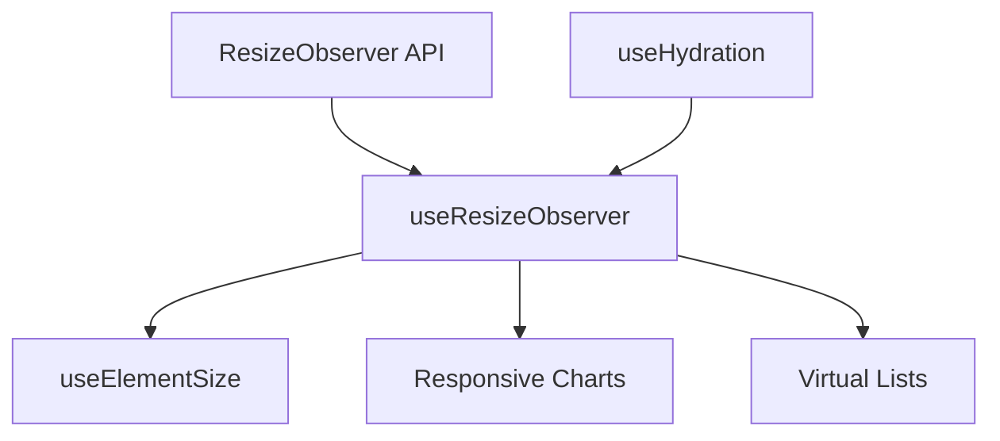

# useResizeObserver

A composable for detecting element size changes using the Resize Observer API with automatic cleanup.

<DocsPageFeatures :frontmatter />

## Usage

The `useResizeObserver` composable wraps the Resize Observer API to detect when an element's dimensions change. It's useful for responsive components, charts, virtualized lists, and aspect ratio maintenance.

> [!TIP] Why wrap ResizeObserver?
> The native `ResizeObserver` has no awareness of Vue's `effectScope` lifecycle. If you create one inside a composable, it won't automatically disconnect when the scope is disposed. `useResizeObserver` integrates `onScopeDispose` for automatic cleanup, defers creation until after hydration for SSR safety, and adds reactive target tracking — things the native API can't do on its own.

```vue collapse no-filename UseResizeObserver
<script setup lang="ts">
  import { useResizeObserver } from '@vuetify/v0'
  import { ref, useTemplateRef } from 'vue'

  const container = useTemplateRef('container')
  const width = ref(0)
  const height = ref(0)

  useResizeObserver(container, (entries) => {
    const entry = entries[0]
    width.value = entry.contentRect.width
    height.value = entry.contentRect.height
  })
</script>

<template>
  <div ref="container" class="resizable">
    <p>Width: {{ width }}px</p>
    <p>Height: {{ height }}px</p>
  </div>
</template>
```

## Architecture

`useResizeObserver` wraps the native ResizeObserver API with Vue reactivity:


```mermaid "Resize Observer Hierarchy"
flowchart TD
  ResizeObserver["ResizeObserver API"] --> useResizeObserver
  useHydration --> useResizeObserver
  useResizeObserver --> useElementSize
  useResizeObserver --> Charts["Responsive Charts"]
  useResizeObserver --> VirtualLists["Virtual Lists"]
```

## Options

| Option | Type | Default | Notes |
| - | - | - | - |
| `immediate` | `boolean` | `false` | Fire the callback immediately on mount before any resize |
| `once` | `boolean` | `false` | Stop observing after the first callback fires |
| `box` | `'content-box' \| 'border-box'` | `'content-box'` | Which box model to observe |

## Reactivity

| Property/Method | Reactive | Notes |
| - | :-: | - |
| `isActive` | <AppSuccessIcon /> | Computed from observer ref |
| `isPaused` | <AppSuccessIcon /> | ShallowRef, readonly |
| `target` | <AppSuccessIcon /> | Accepts MaybeRef, watched for changes |
| `pause()` | — | Temporarily stop observing without disconnecting |
| `resume()` | — | Resume after `pause()` |
| `stop()` | — | Disconnect the observer permanently |

### useElementSize

| Property/Method | Reactive | Notes |
| - | :-: | - |
| `width` | <AppSuccessIcon /> | ShallowRef |
| `height` | <AppSuccessIcon /> | ShallowRef |

## Examples

::: gn-example
/composables/use-resize-observer/responsive-grid

### Responsive Grid

A drag-resizable container with a card grid that recalculates its column count based on the container's own width, not the viewport. The `useResizeObserver` callback writes the `contentRect.width` into a `shallowRef`; a `computed` maps width ranges to column counts (1 below 400 px, 2 from 400–600 px, 3 above 600 px). The dimension badge in the top-right corner shows the live pixel values so you can see the breakpoints as you drag the right edge.

This component-query pattern is the key use case for `useResizeObserver` over CSS media queries: the container can be placed at any width in the page and still respond correctly to its own available space, independent of the viewport. It is also the recommended approach for charts, virtual lists, and any element whose internal layout depends on its measured size rather than a global breakpoint. For tracking element visibility rather than size, see [useIntersectionObserver](/composables/system/use-intersection-observer).

:::

<DocsApi />
