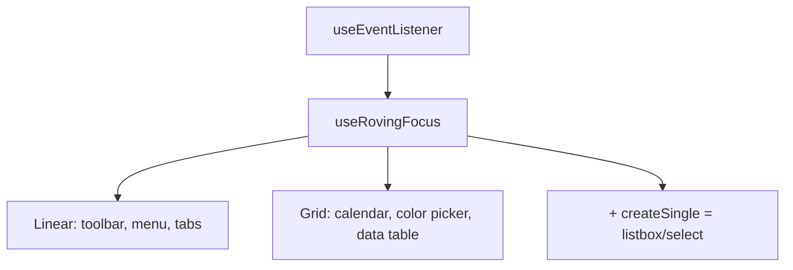

# useRovingFocus

Keyboard navigation for composite widgets where arrow keys move focus between items, skipping disabled ones.

<DocsPageFeatures :frontmatter />

## Usage

`useRovingFocus` manages focus across a group of items — only the active item has `tabindex="0"`, all others have `tabindex="-1"`. Arrow keys move focus between items, automatically skipping disabled ones. Supports linear (horizontal/vertical) and grid (2D) navigation modes.

```vue collapse no-filename useRovingFocus
<script setup lang="ts">
  import { useRovingFocus } from '@vuetify/v0'
  import { useTemplateRef } from 'vue'

  const toolbar = useTemplateRef('toolbar')

  const items = [
    { id: 'bold', label: 'Bold' },
    { id: 'italic', label: 'Italic' },
    { id: 'underline', label: 'Underline', disabled: true },
    { id: 'strike', label: 'Strikethrough' },
  ]

  const { focusedId, isTabbable } = useRovingFocus(
    () => items.map(item => ({
      id: item.id,
      el: () => toolbar.value?.querySelector(`[data-id="${item.id}"]`),
      disabled: item.disabled,
    })),
    { target: toolbar, orientation: 'horizontal' },
  )
</script>

<template>
  <div ref="toolbar" role="toolbar" aria-label="Formatting">
    <button
      v-for="item in items"
      :key="item.id"
      :data-id="item.id"
      :tabindex="isTabbable(item.id) ? 0 : -1"
      :disabled="item.disabled"
    >
      {{ item.label }}
    </button>
  </div>
</template>
```

## useRovingFocus vs useVirtualFocus

Both manage keyboard navigation, but they use different focus strategies:

| | `useRovingFocus` | `useVirtualFocus` |
|-|------------------|-------------------|
| **DOM focus** | Moves to each item | Stays on the control (e.g., `<input>`) |
| **tabindex** | Managed per item | Not used |
| **ARIA** | Items receive focus directly | `aria-activedescendant` on control |
| **Use for** | Toolbars, menus, grids, tabs | Comboboxes, autocompletes, searchable selects |
| **Keyboard pattern** | Items are real focusable elements | Items are virtual — only one DOM node has focus |

Choose `useRovingFocus` when items are real interactive elements (buttons, links). Choose `useVirtualFocus` when a single input drives a list of options that aren't individually focusable.

## Architecture

`useRovingFocus` builds on `useEventListener` for keydown handling. It is a standalone composable — not part of the registry/selection hierarchy — making it composable alongside `createSingle` or `createSelection` for widgets that separate focus from selection (e.g., listboxes, selects).



## Reactivity

| Property/Method | Reactive | Notes |
| - | :-: | - |
| `focusedId` | <AppSuccessIcon /> | ShallowRef, tracks currently focused item |
| `isTabbable(id)` | - | Returns `true` for the one item that should have `tabindex="0"` |
| `focus(id)` | - | Programmatically focus an item by ID |
| `next()` | - | Move focus to next enabled item |
| `prev()` | - | Move focus to previous enabled item |
| `first()` | - | Move focus to first enabled item |
| `last()` | - | Move focus to last enabled item |
| `onKeydown` | - | Keydown handler — auto-bound when `target` is provided |

## Examples

::: gn-example
/composables/use-roving-focus/Grid.vue 1
/composables/use-roving-focus/grid.vue 2

### Color Grid

A 24-swatch material color palette arranged in a 6-column grid, demonstrating `useRovingFocus` in 2D mode. Passing `columns: 6` enables full grid navigation: left/right arrow keys step one swatch, up/down step one row (±6), Home and End jump to the first and last swatch in the current row, and Ctrl+Home/Ctrl+End jump to the absolute first and last swatch. The `circular: true` option wraps navigation so the focus cycles back to the start when it reaches either end.

`Grid.vue` is a reusable component that accepts a `swatches` prop and exposes `v-model` for the selected swatch. It registers each swatch by element reference using a `querySelector` on the grid container, and passes the IDs back through `isTabbable` to set `tabindex="0"` on exactly one swatch at a time. The `onFocus` callback fires whenever keyboard navigation lands on a swatch and immediately updates the model — so selection and keyboard focus stay in sync without a separate event handler. `grid.vue` wires the 24 swatches and the `v-model` together in a minimal entry point.

Reach for grid mode any time your items form a logical 2D structure: color pickers, emoji grids, calendar date cells, data table cells. For strictly linear focus (toolbar buttons, menu items, tabs), use `orientation: 'horizontal'` or `'vertical'` without `columns`. To pair keyboard focus with selection state from a composable, see the [createSingle](/composables/selection/create-single) decision table.

| File | Role |
|------|------|
| `Grid.vue` | Reusable swatch grid with 2D keyboard navigation |
| `grid.vue` | Entry point rendering the material color palette |
:::

<DocsApi />
