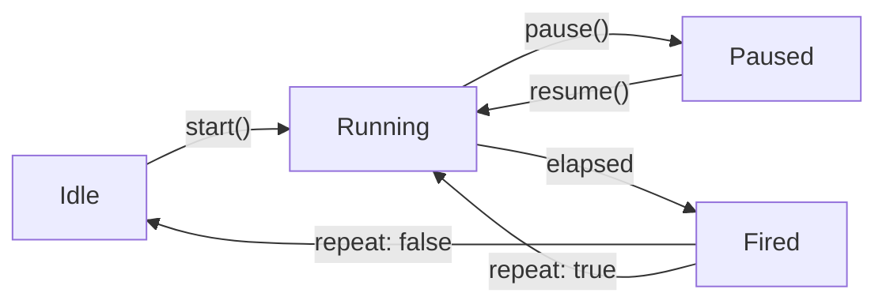

# useTimer

A reactive timer composable with pause/resume support and remaining time tracking.

<DocsPageFeatures :frontmatter />

## Usage

The `useTimer` composable creates a controllable timer that fires a handler after a specified duration. It supports pause/resume, repeating intervals, and reactive remaining time tracking.

```ts collapse
import { useTimer } from '@vuetify/v0'

const timer = useTimer(() => {
  console.log('Timer fired!')
}, { duration: 5000 })

// Control the timer
timer.start()
timer.pause()
timer.resume()
timer.stop()

// Reactive state
timer.remaining.value  // ms left until next fire
timer.isActive.value   // true when started (even if paused)
timer.isPaused.value   // true when paused
```

## Architecture



The timer tracks three internal values: `startedAt` (timestamp when the current run began), `budget` (remaining ms for the current run), and `duration` (the original interval). On pause, `budget` is reduced by elapsed time. On resume, a new `setTimeout` is created with the remaining `budget`.

## Reactivity

| Property | Type | Description |
|----------|------|-------------|
| `remaining` | `ShallowRef<number>` | Milliseconds until next fire, updated ~100ms |
| `isActive` | `ShallowRef<boolean>` | `true` after `start()`, `false` after `stop()` or one-shot fires |
| `isPaused` | `ShallowRef<boolean>` | `true` after `pause()`, `false` after `resume()` or `stop()` |

## Examples

::: example
/composables/use-timer/countdown

### Countdown

A 10-second countdown timer demonstrating all four controls — start, stop, pause, resume — with a progress bar driven by the reactive `remaining` value.

:::

::: example
/composables/use-timer/useToast.ts 2
/composables/use-timer/Toast.vue 3
/composables/use-timer/toasts.vue 1

### Toast Notifications

Auto-dismissing notifications where each toast owns its own `useTimer`. Hovering a toast pauses its countdown, and the progress bar reflects the remaining time.

| File | Role |
|------|------|
| `useToast.ts` | Toast state — reactive array with add/dismiss helpers |
| `Toast.vue` | Single toast — owns a useTimer, pauses on hover |
| `toasts.vue` | Entry point — trigger buttons and toast list |

:::

## Key Features

### One-Shot vs Repeating

By default, the timer fires once and stops. Set `repeat: true` for an interval that restarts after each fire:

```ts
// One-shot (default) — fires once, then isActive becomes false
const delay = useTimer(() => save(), { duration: 3000 })

// Repeating — fires every 5 seconds until stopped
const poll = useTimer(() => refresh(), { duration: 5000, repeat: true })
```

### Pause and Resume

Pause preserves the remaining time. Resume continues from where it left off:

```ts
const timer = useTimer(handler, { duration: 10_000 })
timer.start()

// After 3 seconds...
timer.pause()
// remaining.value ≈ 7000

// Later...
timer.resume()
// fires after ~7 more seconds
```

### Restart Behavior

Calling `start()` while already running restarts from full duration:

```ts
timer.start()  // starts 5s countdown
// 2 seconds later...
timer.start()  // restarts — fires in 5s, not 3s
```

### Automatic Cleanup

The timer clears on scope disposal — no manual cleanup needed:

```ts
// Timer automatically stops when component unmounts
const timer = useTimer(handler, { duration: 1000 })
```

<DocsApi />
