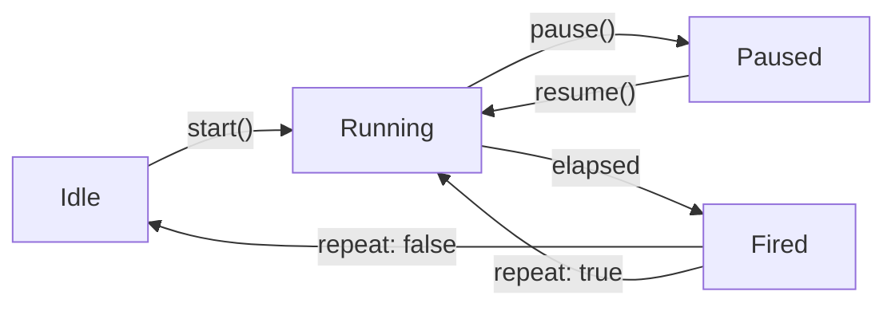

# useTimer

A reactive timer composable with pause/resume support and remaining time tracking.

<DocsPageFeatures :frontmatter />

## Usage

The `useTimer` composable creates a controllable timer that fires a handler after a specified duration. It supports pause/resume, repeating intervals, and reactive remaining time tracking.

```ts collapse
import { useTimer } from '@vuetify/v0'

const timer = useTimer(() => {
  console.log('Timer fired!')
}, { duration: 5000 })

// Control the timer
timer.start()
timer.pause()
timer.resume()
timer.stop()

// Reactive state
timer.remaining.value  // ms left until next fire
timer.isActive.value   // true when started (even if paused)
timer.isPaused.value   // true when paused
```

> [!TIP] Replaces debounce
> `useTimer` replaces the deprecated `debounce` utility. It provides the same delay behavior with pause/resume, repeat support, and automatic cleanup on scope disposal.

## Architecture



The timer tracks three internal values: `startedAt` (timestamp when the current run began), `budget` (remaining ms for the current run), and `duration` (the original interval). On pause, `budget` is reduced by elapsed time. On resume, a new `setTimeout` is created with the remaining `budget`.

## Reactivity

| Property | Type | Description |
|----------|------|-------------|
| `remaining` | `ShallowRef<number>` | Milliseconds until next fire, updated ~100ms |
| `isActive` | `ShallowRef<boolean>` | `true` after `start()`, `false` after `stop()` or one-shot fires |
| `isPaused` | `ShallowRef<boolean>` | `true` after `pause()`, `false` after `resume()` or `stop()` |

## Examples

::: gn-example
/composables/use-timer/countdown

### Countdown

A 10-second countdown timer that exercises all four controls — start, stop, pause, resume — and displays the reactive `remaining` value as both a seconds readout and a progress bar. `toRef(() => Math.ceil(remaining.value / 1000))` converts the millisecond ref to a human-readable ceiling count; `toRef(() => (remaining.value / duration) * 100)` drives the bar width. Three state badges at the bottom reflect `isActive`, `isPaused`, and the raw `remaining` ms so you can watch all three change as you operate the controls.

The pause/resume behavior is the main teaching point: pausing captures the remaining budget so resume continues from exactly where it left off. Stopping resets the timer so start begins a fresh 10-second run. Reach for this pattern for user-facing delays (auto-dismiss dialogs, OTP expiry, resend-code cooldowns) where the user may need to pause and resume. For auto-dismissing queued notifications, see the Toast Notifications example below; for interval-based work (polling, animation ticks), use `repeat: true`.

:::

::: gn-example
/composables/use-timer/useToast.ts 2
/composables/use-timer/Toast.vue 3
/composables/use-timer/toasts.vue 1

### Toast Notifications

Auto-dismissing toast notifications where each `Toast.vue` instance owns its own `useTimer`. The timer fires the `onDismiss` callback when the duration elapses, removing the toast from the list. Hovering pauses the countdown via `@pointerenter="pause"` and resumes it via `@pointerleave="resume"`, giving users time to read without losing the notification. A shrinking progress bar driven by `remaining` makes the remaining time visible without any polling or watchers.

The key design point is one timer per toast, not a single shared timer. Each toast tracks its own independent countdown so toasts added at different times dismiss independently. `useToast.ts` stores the toast array and provides `add` and `dismiss` helpers; `toasts.vue` wires the trigger buttons to `add()` and passes `onDismiss` as a prop to each `Toast.vue`. This composition pattern generalizes to any queue of items that each need their own timed lifecycle — drag-to-dismiss sheets, loading overlays with a timeout, or step-through tutorials. For the underlying queue primitive, see [createQueue](/composables/registration/create-queue).

| File | Role |
|------|------|
| `useToast.ts` | Toast state — reactive array with add/dismiss helpers |
| `Toast.vue` | Single toast — owns a useTimer, pauses on hover |
| `toasts.vue` | Entry point — trigger buttons and toast list |

:::

## Recipes

### Key Features

#### One-Shot vs Repeating

By default, the timer fires once and stops. Set `repeat: true` for an interval that restarts after each fire:

```ts
// One-shot (default) — fires once, then isActive becomes false
const delay = useTimer(() => save(), { duration: 3000 })

// Repeating — fires every 5 seconds until stopped
const poll = useTimer(() => refresh(), { duration: 5000, repeat: true })
```

#### Pause and Resume

Pause preserves the remaining time. Resume continues from where it left off:

```ts
const timer = useTimer(handler, { duration: 10_000 })
timer.start()

// After 3 seconds...
timer.pause()
// remaining.value ≈ 7000

// Later...
timer.resume()
// fires after ~7 more seconds
```

#### Restart Behavior

Calling `start()` while already running restarts from full duration:

```ts
timer.start()  // starts 5s countdown
// 2 seconds later...
timer.start()  // restarts — fires in 5s, not 3s
```

#### Automatic Cleanup

The timer clears on scope disposal — no manual cleanup needed:

```ts
// Timer automatically stops when component unmounts
const timer = useTimer(handler, { duration: 1000 })
```

## FAQ

::: faq

??? What's the difference between useTimer and useRaf?

`useTimer` is a `setTimeout`-based delay or interval with pause/resume and remaining-time tracking — reach for it for user-facing delays like auto-dismiss or cooldowns. [useRaf](/composables/system/use-raf) throttles a callback to animation frames, for per-frame work like scroll or animation updates.

??? Does pausing lose the remaining time?

No. `pause()` captures the remaining budget and `resume()` continues from exactly where it left off, not from the full duration.

??? What happens if I call start() while the timer is already running?

It restarts from the full duration. A timer started for 5s that you `start()` again after 2s will fire 5s later, not 3s.

??? How do I make the timer repeat instead of firing once?

Pass `repeat: true`. By default the timer is one-shot — it fires once and `isActive` becomes `false`; with `repeat` it restarts after each fire until you call `stop()`.

??? What replaced the old debounce utility?

`useTimer` did. It provides the same delay behavior plus pause/resume, repeat support, and automatic cleanup on scope disposal.

:::

<DocsApi />
