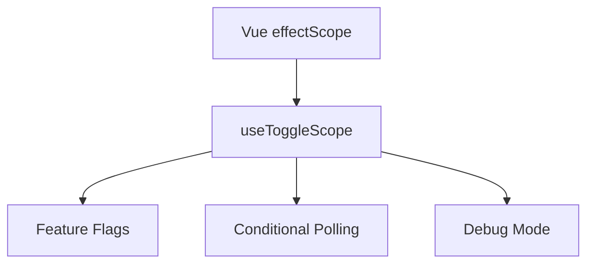

# useToggleScope

A composable for conditionally managing Vue effect scopes based on reactive boolean conditions with automatic cleanup.

<DocsPageFeatures :frontmatter />

## Usage

The `useToggleScope` composable wraps Vue's `effectScope` API to create and destroy reactive effect scopes based on a boolean condition. When the condition becomes true, a new scope is created and your callback runs. When false, the scope is stopped and all effects are cleaned up automatically.

```vue UseToggleScope
<script setup lang="ts">
  import { useToggleScope } from '@vuetify/v0'
  import { shallowRef, watch } from 'vue'

  const isEnabled = shallowRef(false)
  const data = shallowRef(0)

  const { isActive } = useToggleScope(isEnabled, () => {
    // This watch is only active when isEnabled is true
    watch(data, (value) => {
      console.log('Data changed:', value)
    })
  })
</script>

<template>
  <div>
    <button @click="isEnabled = !isEnabled">
      {{ isEnabled ? 'Disable' : 'Enable' }} Watcher
    </button>
    <p>Scope active: {{ isActive }}</p>
    <input v-model.number="data" type="number">
  </div>
</template>
```

## Architecture

`useToggleScope` wraps Vue's effectScope for conditional reactive effect management:



<DocsApi />
