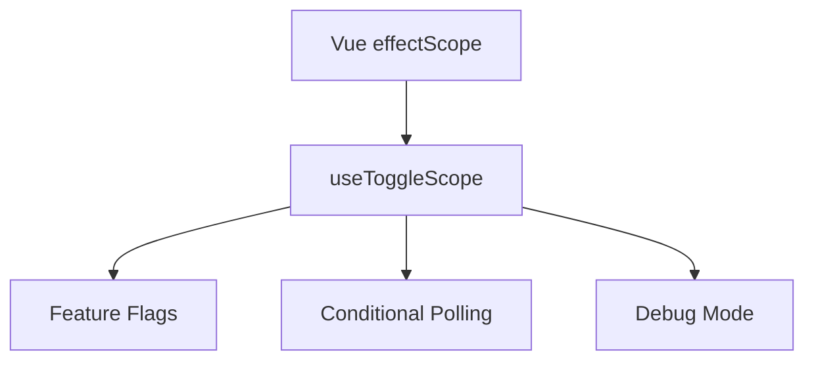

# useToggleScope

A composable for conditionally managing Vue effect scopes based on reactive boolean conditions with automatic cleanup.

<DocsPageFeatures :frontmatter />

## Usage

The `useToggleScope` composable wraps Vue's `effectScope` API to create and destroy reactive effect scopes based on a boolean condition. When the condition becomes true, a new scope is created and your callback runs. When false, the scope is stopped and all effects are cleaned up automatically.

```vue collapse no-filename UseToggleScope
<script setup lang="ts">
  import { useToggleScope } from '@vuetify/v0'
  import { shallowRef, watch } from 'vue'

  const isEnabled = shallowRef(false)
  const data = shallowRef(0)

  const { isActive } = useToggleScope(isEnabled, () => {
    // This watch is only active when isEnabled is true
    watch(data, (value) => {
      console.log('Data changed:', value)
    })
  })
</script>

<template>
  <div>
    <button @click="isEnabled = !isEnabled">
      {{ isEnabled ? 'Disable' : 'Enable' }} Watcher
    </button>
    <p>Scope active: {{ isActive }}</p>
    <input v-model.number="data" type="number">
  </div>
</template>
```

## Architecture

`useToggleScope` wraps Vue's effectScope for conditional reactive effect management:


```mermaid "Toggle Scope Hierarchy"
flowchart TD
  effectScope["Vue effectScope"] --> useToggleScope
  useToggleScope --> FeatureFlags["Feature Flags"]
  useToggleScope --> ConditionalPolling["Conditional Polling"]
  useToggleScope --> DebugMode["Debug Mode"]
```

## Reactivity

| Property/Method | Reactive | Notes |
| - | :-: | - |
| `isActive` | <AppSuccessIcon /> | Computed from scope ref |
| `source` | <AppSuccessIcon /> | WatchSource, triggers scope on/off |
| `start()` | <AppErrorIcon /> | Create and run the effect scope |
| `stop()` | <AppErrorIcon /> | Stop and clean up all effects in the scope |
| `reset()` | <AppErrorIcon /> | Stop then immediately restart the scope |

## Examples

::: gn-example
/composables/use-toggle-scope/conditional-effects

### Conditional Effects

A mouse-position tracker where the `mousemove` listener exists only while the toggle is active. When the scope starts, `useEventListener(window, 'mousemove', ...)` registers the listener inside the new `effectScope`; when the scope stops, Vue disposes the scope and `useEventListener`'s `onScopeDispose` cleanup fires automatically — no manual `removeEventListener` required. The move counter, X, and Y values freeze as soon as tracking is disabled.

The example demonstrates the core use case: wrapping `useEventListener` (or any composable that registers effects) inside `useToggleScope` so the effect lifecycle follows a reactive boolean rather than the component lifecycle. This is the recommended pattern for feature-flag-controlled behaviors, debug overlays, admin-only polling, and any functionality that should only run under a specific condition. The `isActive` ref returned by `useToggleScope` is a computed view of the internal scope state — useful for rendering status indicators. Note the [feedback on toggle scope](/composables/system/use-toggle-scope): do not use this to guard watchers that must run synchronously on value changes, as the scope creation introduces an async tick.

:::

<DocsApi />
