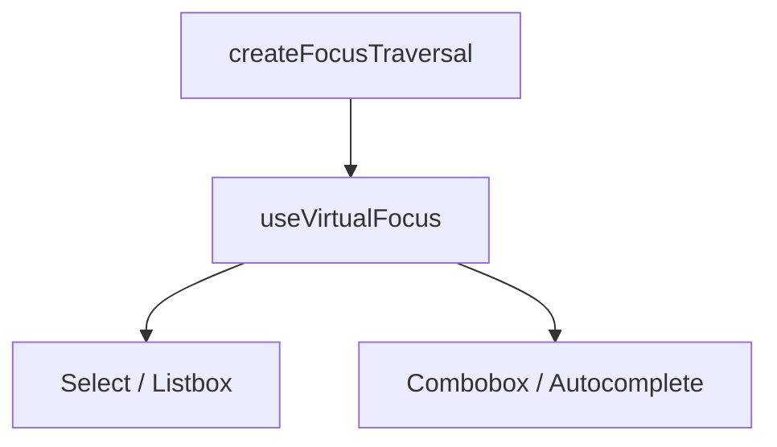

# useVirtualFocus

A composable for keyboard navigation where DOM focus stays on a single control element while a visual highlight moves across items.

<DocsPageFeatures :frontmatter />

## Usage

`useVirtualFocus` manages a virtual highlight across a list of items — DOM focus never leaves the control element (typically an `<input>`). Arrow keys move the highlight, `aria-activedescendant` on the control references the active item, and `data-highlighted` is set on the highlighted element. This is the standard pattern for comboboxes, autocompletes, and searchable selects.

```vue collapse no-filename useVirtualFocus
<script setup lang="ts">
  import { useVirtualFocus } from '@vuetify/v0'
  import { useTemplateRef } from 'vue'

  const input = useTemplateRef('input')
  const list = useTemplateRef('list')

  const options = [
    { id: 'opt-1', label: 'Option 1' },
    { id: 'opt-2', label: 'Option 2' },
    { id: 'opt-3', label: 'Option 3', disabled: true },
    { id: 'opt-4', label: 'Option 4' },
  ]

  const { highlightedId } = useVirtualFocus(
    () => options.map(item => ({
      id: item.id,
      el: () => list.value?.querySelector(`[data-id="${item.id}"]`),
      disabled: item.disabled,
    })),
    { control: input, orientation: 'vertical' },
  )
</script>

<template>
  <div>
    <input
      ref="input"
      aria-controls="listbox"
      aria-expanded="true"
      role="combobox"
    />

    <ul id="listbox" ref="list" role="listbox">
      <li
        v-for="item in options"
        :id="item.id"
        :key="item.id"
        :data-id="item.id"
        role="option"
      >
        {{ item.label }}
      </li>
    </ul>
  </div>
</template>
```

## Architecture

`useVirtualFocus` shares its traversal kernel with `useRovingFocus` — both build on `createFocusTraversal`. The difference: roving focus moves real DOM focus between items, while virtual focus keeps DOM focus on a control and moves a data attribute highlight.



## Options

| Option | Type | Default | Notes |
| - | - | - | - |
| `control` | `MaybeRefOrGetter<HTMLElement \| null>` | — | Required. Element that holds DOM focus and receives `aria-activedescendant` |
| `target` | `MaybeRefOrGetter<HTMLElement \| null>` | `control` | Element to attach keydown listener to (defaults to `control`) |
| `orientation` | `'horizontal' \| 'vertical' \| 'both'` | `'vertical'` | Arrow key axis. Ignored when `columns` is set — grid navigation uses all 4 arrows |
| `circular` | `boolean` | `false` | Wrap around when navigating past first/last item |
| `columns` | `MaybeRefOrGetter<number>` | — | Column count for 2D grid navigation. Left/Right step ±1, Up/Down step ±columns, Home/End jump to row edges, Ctrl+Home/End go to first/last item |
| `onHighlight` | `(id: ID) => void` | — | Called when the highlighted item changes |

## Reactivity

| Property/Method | Reactive | Notes |
| - | :-: | - |
| `highlightedId` | <AppSuccessIcon /> | ShallowRef, tracks the currently highlighted item |
| `highlight(id)` | - | Programmatically highlight an item by ID |
| `clear()` | - | Remove the highlight |
| `next()` | - | Move highlight to next enabled item |
| `prev()` | - | Move highlight to previous enabled item |
| `first()` | - | Move highlight to first enabled item |
| `last()` | - | Move highlight to last enabled item |
| `onKeydown` | - | Keydown handler — auto-bound to `target` or `control` |

## Examples

::: gn-example
/composables/use-virtual-focus/Listbox.vue 1
/composables/use-virtual-focus/listbox.vue 2

### Searchable Fruit Picker

A combobox-style fruit picker where the input retains DOM focus while arrow keys move a visual highlight across the filtered option list. Typing in the input filters the list via a `computed`; `watch(filtered, () => clear())` resets the highlight when the list changes so the highlighted item is never pointing at a stale position. Pressing Enter confirms the currently highlighted item; clicking a non-disabled option focuses the input again to keep DOM focus on the control.

`Listbox.vue` passes each option's element reference as a `querySelector` callback so `useVirtualFocus` can call `el.setAttribute('data-highlighted', '')` on the active option and `el.removeAttribute('data-highlighted')` on departure — without moving real focus. The CSS in `Listbox.vue` styles `[data-highlighted]` and `[data-selected]` with CSS custom properties from the v0 theme so the example works under both light and dark modes. Disabled options carry `aria-disabled` and `data-disabled` attributes, and `useVirtualFocus` skips them automatically when navigating with arrow keys.

`listbox.vue` provides the fruit data and a `selected` ref, wiring the `Listbox` component through `v-model` and a `@select` emit. Reach for `useVirtualFocus` whenever a single `<input>` controls a list that cannot individually receive browser focus — comboboxes, autocompletes, token fields, and searchable selects. For lists of real focusable buttons or links, use [useRovingFocus](/composables/system/use-roving-focus) instead.

| File | Role |
|------|------|
| `Listbox.vue` | Reusable listbox with filtering, virtual focus, and ARIA markup |
| `listbox.vue` | Entry point with a fruit list |
:::

<DocsApi />
