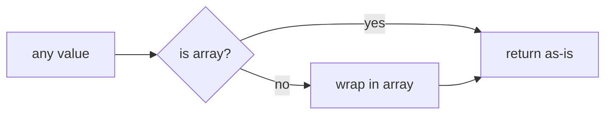

# toArray

The `toArray` utility function provides a consistent way to convert any value into an array format. It handles edge cases like `null` and `undefined` values, and ensures that the output is always an array.

<DocsPageFeatures :frontmatter />

## Usage

```ts
import { toArray } from '@vuetify/v0'

const value = 'Example Value'
const valueAsArray = toArray(value)

console.log(valueAsArray) // ['Example Value']
```

## Architecture

`toArray` is a pure transformation utility:



<DocsApi />
