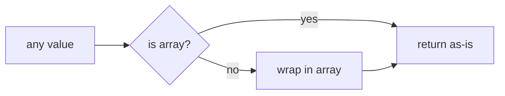

# toArray

Coerces any value — including `null` and `undefined` — to an array.

<DocsPageFeatures :frontmatter />

## Usage

```ts collapse no-filename
import { toArray } from '@vuetify/v0'

const value = 'Example Value'
const valueAsArray = toArray(value)

console.log(valueAsArray) // ['Example Value']
```

## Architecture

`toArray` is a pure transformation utility:


```mermaid "Array Transformation"
flowchart LR
  input[any value] --> check{is array?}
  check -- yes --> output[return as-is]
  check -- no --> wrap[wrap in array]
  wrap --> output
```

## Reactivity

`toArray` is a **pure transformer function**. It does not track reactivity or return reactive values.

> [!TIP] Use inside computed for reactivity
> Wrap in `computed()` if you need reactive array normalization:
```ts
const items = computed(() => toArray(props.items))
```

## Examples

::: gn-example
/composables/to-array/normalize

### Normalize Inputs

An interactive input explorer that runs `toArray` against five different input shapes — string, number, array, `null`, and `undefined` — and displays the raw input, its JavaScript type, the output array, and the resulting length. Selecting String or Number reveals an editable field so you can verify the wrapping behavior with any value; selecting Array lets you add and remove items to confirm that an existing array passes through unchanged; selecting null or undefined demonstrates that both produce an empty array rather than `[null]` or `[undefined]`.

The primary use case for `toArray` is normalizing props or options that accept either a single value or an array — the canonical `MaybeArray<T>` pattern. Rather than branching on `Array.isArray(input)` at every call site, call `toArray(input)` once and iterate the result. Because it is a pure synchronous function, wrap it in `toRef(() => toArray(prop))` for reactive derivation or in `computed()` when the result feeds expensive downstream work. For the inverse operation — converting arrays to reactive proxies with automatic ref unwrapping — see [toReactive](/composables/transformers/to-reactive).

:::

<DocsApi />
