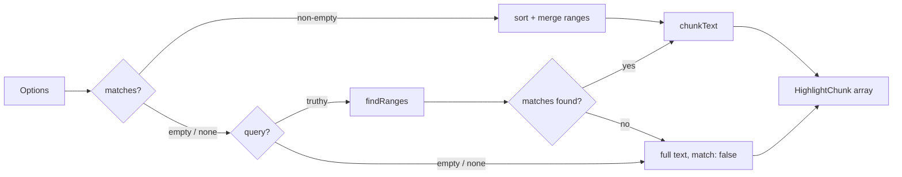

# toHighlight

Pure transformer that splits text into matched and unmatched chunks. Returns a plain `HighlightChunk[]` — wrap the call in `computed()` for reactive recomputation.

<DocsPageFeatures :frontmatter />

## Usage

```ts collapse
import { computed } from 'vue'
import { toHighlight } from '@vuetify/v0'

const chunks = computed(() =>
  toHighlight(() => props.text, () => props.query, { ignoreCase: true })
)
// chunks.value → [{ text: 'Hello ', match: false }, { text: 'World', match: true }]
```

## Architecture

`toHighlight` resolves its input through a fixed priority order:



## Reactivity

`toHighlight` is a pure transformer — it reads each input through `toValue` once and
returns a plain `HighlightChunk[]`. To make the result track upstream changes, wrap the
call in `computed()` (or any reactive scope). The function itself creates no reactivity.

| Behavior | Reactive | Notes |
| - | :-: | - |
| Calling `toHighlight(text, query)` | <AppErrorIcon /> | One-shot snapshot at call time |
| Wrapping in `computed(() => toHighlight(...))` | <AppSuccessIcon /> | Re-runs when tracked refs change |
| Passing refs or getters as arguments | <AppSuccessIcon /> | `toValue` unwraps them on every call |
| Mutating returned chunks | <AppErrorIcon /> | Treat the array as derived; do not mutate |

> [!TIP] Reach for plain values, refs, or getters
> Every input accepts `MaybeRefOrGetter<T>`. Pass a literal for static input, a `Ref` for
> v-model integration, or a getter (`() => props.text`) for prop-driven reactivity. Wrap
> the call in `computed()` when you want the result to update automatically.

## Examples

::: example
/composables/to-highlight/basic

### Search input

Live query against a paragraph. The example wraps `toHighlight` in `computed()` so the
chunks update instantly when the `query` ref changes — swap the search term and the
markup re-renders without any manual wiring. Each `HighlightChunk` carries
`{ text, match }`, so you control the full rendering: use a native `<mark>` for semantics
and screen-reader compatibility, a `<strong>` for bold-only, or whatever your design
calls for.

Matching is case-sensitive by default. Set `ignoreCase: true` to
match regardless of casing in the source text.

:::

::: example
/composables/to-highlight/multiple-queries

### Multiple queries

Pass an array to `query` to highlight several terms at once. Overlapping or adjacent
spans are merged into a single highlight — `['foo', 'oba']` against `'foobar'` produces
one chunk `{ text: 'fooba', match: true }` rather than two. This matches how most
search engines report matches and avoids nested or duplicated highlights.

The example splits a comma-separated input into an array via `computed`. You can also
derive the array from a tag list, token stream, or search-engine suggestion list — anything
that produces `string[]`.

When `matchAll` is `false`, only the first occurrence of each term is highlighted. Useful
for "jump to first match" UI patterns where highlighting every hit would be distracting.

:::

::: example
/composables/to-highlight/match-ranges

### Pre-computed ranges

Skip the query entirely and supply exact `[start, end]` index pairs via `matches`.
When `matches` is a non-empty array it takes priority over `query`, and `matchAll`
is ignored — the caller is asserting full control over which spans to highlight.

Pre-computed ranges are useful when:

- A full-text search engine returns character offsets directly alongside results.
- You're combining `createFilter` from `@vuetify/v0` with its forthcoming `matches` output
  — a single filter pass yields both the filtered items *and* their highlight spans, so you
  don't run the query algorithm twice.
- You need to highlight structurally identified tokens (syntax spans, named entities,
  diff hunks) rather than substring matches.

The `MatchRange` type is `[number, number]` — a `[start, end]` pair where `end` is
exclusive (matching JavaScript's `String.prototype.slice` convention).

| Priority | Source | Condition |
|----------|--------|-----------|
| 1 | `matches` | non-empty array |
| 2 | `query` | string or string[] |
| 3 | No-match fallback | neither provided |

:::

## Accessibility

Wrap matched chunks in the native `<mark>` element. It carries the implicit ARIA role
`mark` and is announced by screen readers as highlighted or marked text. No additional
ARIA attributes are needed on the wrapper element.

> [!TIP]
> WCAG 1.4.3 (Contrast — Minimum) applies to highlighted text. Ensure sufficient contrast
> between the mark background color and the surrounding text.

## Questions

::: faq
??? Does toHighlight preserve the original casing?

Yes. The source `text` string is sliced at match boundaries, so the original characters
(including casing, punctuation, and whitespace) are always preserved in the output chunks.
`ignoreCase` affects only the matching logic, not the returned text.

??? Can I use it with createFilter results?

Yes. The `matches` option accepts `MatchRange[]` — `[start, end]` pairs. Once
`createFilter` exposes positional data, pass the result directly and skip the query path.

??? How does it handle overlapping multi-term matches?

Overlapping or adjacent spans are merged before the chunks array is produced.
`['foo', 'oba']` against `'foobar'` yields `[{ text: 'fooba', match: true }, { text: 'r', match: false }]`
rather than two separate matches.

??? Are caller-supplied match ranges normalized?

Yes. Ranges passed via the `matches` option are sorted by start index and merged on
overlap or adjacency before chunking. Pass `[[4, 6], [0, 2]]` or `[[0, 4], [2, 6]]` and
the output is the same as if you had supplied the canonical sorted, non-overlapping form.

??? What happens when neither query nor matches is provided?

The function returns a single `[{ text: sourceText, match: false }]` chunk — the full
string with no highlights. Safe to iterate without any guard.

??? Is it SSR-safe?

Yes. `toHighlight` is a pure function with no DOM access and no reactive state. It is
safe to call during SSR.
:::

<DocsApi />
