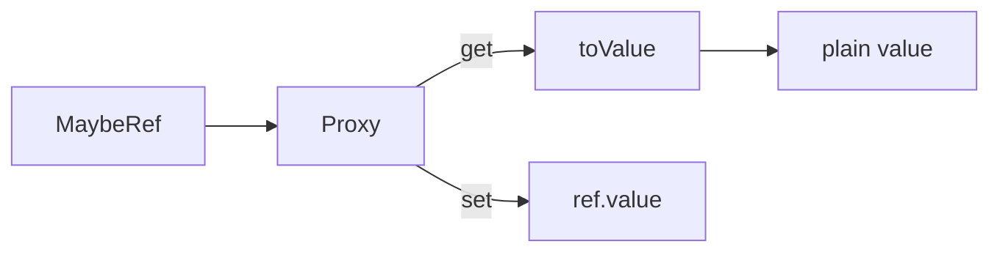

# toReactive

The `toReactive` utility function converts a `MaybeRef` object to a reactive proxy, automatically unwrapping ref values. It provides special handling for `Map`, `Set`, and regular objects.

<DocsPageFeatures :frontmatter />

## Usage

```ts
import { ref } from 'vue'
import { toReactive } from '@vuetify/v0'

const state = ref({ name: 'John', age: 30 })
const rstate = toReactive(state)

console.log(rstate.name) // 'John' (no .value needed)
```

## Architecture

`toReactive` creates a Proxy that unwraps ref values:



<DocsApi />
