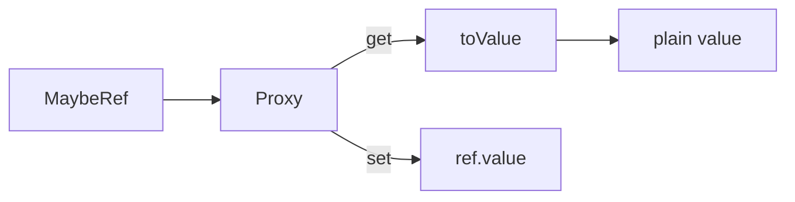

# toReactive

Converts a `MaybeRef` object to a reactive proxy with automatic ref unwrapping and `Map`/`Set` support.

<DocsPageFeatures :frontmatter />

## Usage

```ts collapse no-filename
import { ref } from 'vue'
import { toReactive } from '@vuetify/v0'

const state = ref({ name: 'John', age: 30 })
const rstate = toReactive(state)

console.log(rstate.name) // 'John' (no .value needed)
```

## Architecture

`toReactive` creates a Proxy that unwraps ref values:


```mermaid "Reactive Proxy Flow"
flowchart LR
  MaybeRef --> Proxy
  Proxy -- get --> toValue
  Proxy -- set --> ref.value
  toValue --> unwrapped[plain value]
```

## Reactivity

`toReactive` converts a `MaybeRef` into a **fully reactive proxy** with automatic ref unwrapping. This is the primary way to eliminate `.value` syntax.

| Behavior | Reactive | Notes |
| - | :-: | - |
| Object access | <AppSuccessIcon /> | Properties are reactive, refs auto-unwrapped |
| Map operations | <AppSuccessIcon /> | `get`/`set`/`entries` unwrap ref values |
| Set operations | <AppSuccessIcon /> | Iteration unwraps ref values |
| Array access | <AppSuccessIcon /> | Index access unwraps nested refs |

> [!TIP] When to use
> Use `toReactive` when you want to:
- Eliminate `.value` in templates
- Pass reactive state to non-Vue code expecting plain objects
- Create reactive proxies over ref-wrapped collections

## Examples

::: gn-example
/composables/to-reactive/settings

### Reactive Settings Object

A settings panel that wraps a `ref`-based config object with `toReactive` so the template can read and write `settings.theme`, `settings.fontSize`, `settings.language`, and the two boolean toggles without `.value`. The theme selector, font size stepper, notification toggle, and sidebar toggle all mutate the proxy directly (`settings.theme = t`, `settings.fontSize++`), and the debug panel below shows the underlying `config.value` updating in real time — confirming that proxy writes flow back to the source ref. A change history log records each snapshot, making it easy to see that `watch(config, ...)` still fires correctly even though the writes come through the proxy.

Reach for `toReactive` when you have a `ref`-wrapped object and want to eliminate `.value` in templates or in non-Vue code that expects a plain object interface. It is especially useful for composable return values: instead of returning `{ name: ref(''), age: ref(0) }` and having callers write `state.name.value`, return `toReactive(ref({ name: '', age: 0 }))`. The proxy also handles `Map` and `Set` — `get`, `set`, and iteration all unwrap ref values stored as map entries. For the inverse direction — normalizing a single value or array into a consistent array shape — see [toArray](/composables/transformers/to-array).

:::

<DocsApi />
