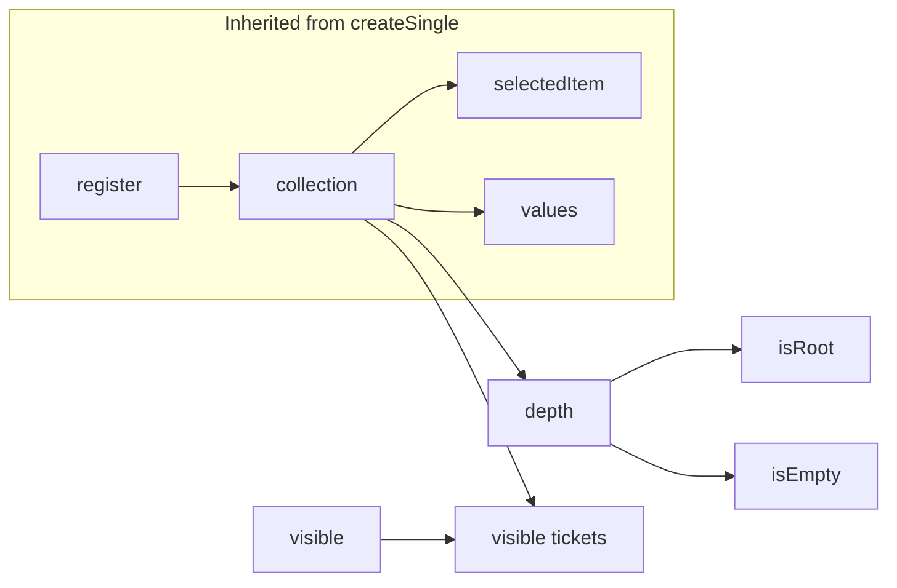

# createBreadcrumbs

A breadcrumb navigation composable built on `createSingle`, providing registry-based item management with automatic path truncation and ellipsis collapse for long trails.

<DocsPageFeatures :frontmatter />

## Usage

The `createBreadcrumbs` composable extends `createSingle` with navigation methods that truncate the path when selecting earlier items.

```ts collapse
import { createBreadcrumbs } from '@vuetify/v0'

const breadcrumbs = createBreadcrumbs({ visible: 4 })

breadcrumbs.register({ text: 'Home' })
breadcrumbs.register({ text: 'Products' })
breadcrumbs.register({ text: 'Electronics' })
breadcrumbs.register({ text: 'Phones' })
breadcrumbs.register({ text: 'iPhone' })

console.log(breadcrumbs.tickets.value)
// [
//   { type: 'crumb', value: { text: 'Home', ... }, index: 0 },
//   { type: 'ellipsis', value: '…', collapsed: [...] },
//   { type: 'crumb', value: { text: 'Phones', ... }, index: 3 },
//   { type: 'crumb', value: { text: 'iPhone', ... }, index: 4 }
// ]

// Navigate back (truncates path)
breadcrumbs.prev()  // removes iPhone, selects Phones
breadcrumbs.first() // truncates to Home

// Inherited from createSingle
breadcrumbs.selectedItem.value  // current item
breadcrumbs.values()            // all items
breadcrumbs.get('home')         // by id
```

## Architecture

`createBreadcrumbs` extends `createSingle` with truncation behavior:



## Inheritance

```
createRegistry → createSelection → createSingle → createBreadcrumbs
```

**From createSingle:**
- `register()`, `unregister()`, `onboard()`, `offboard()`, `clear()`
- `get()`, `has()`, `values()`, `keys()`, `lookup()`, `seek()`
- `selectedId`, `selectedIndex`, `selectedItem`, `selectedValue`

**Added by createBreadcrumbs:**
- `select(id)` — truncates path after selected item
- `first()` — navigate to root (truncates)
- `prev()` — navigate up one level (truncates)
- `tickets` — computed render output with ellipsis collapse
- `depth`, `isRoot`, `isEmpty` — derived state

<DocsApi />
