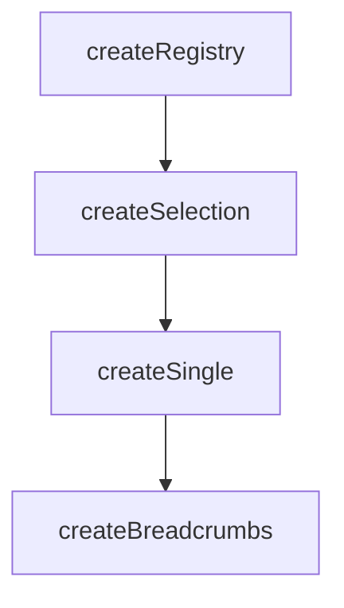

# createBreadcrumbs

A composable that extends `createSingle` for breadcrumb navigation with automatic path truncation and ellipsis collapse.

<DocsPageFeatures :frontmatter />

## Usage

The `createBreadcrumbs` composable manages an ordered path of items. When you select an earlier item, everything after it is removed. The `tickets` computed property provides a render-ready array with ellipsis support for long trails.

```ts collapse
import { createBreadcrumbs } from '@vuetify/v0'

const breadcrumbs = createBreadcrumbs({ visible: 4 })

breadcrumbs.register({ text: 'Home' })
breadcrumbs.register({ text: 'Products' })
breadcrumbs.register({ text: 'Electronics' })
breadcrumbs.register({ text: 'Phones' })
breadcrumbs.register({ text: 'iPhone' })

// Derived state
breadcrumbs.depth.value      // 5
breadcrumbs.isRoot.value     // false
breadcrumbs.tickets.value    // [Home, ..., Phones, iPhone]

// Navigate back (truncates path)
breadcrumbs.prev()           // removes iPhone, selects Phones
breadcrumbs.first()          // truncates to Home only

// Select with truncation
breadcrumbs.select(home.id)  // removes everything after Home
```

## Architecture

`createBreadcrumbs` extends `createSingle` with path truncation and render ticket computation:



The [Breadcrumbs component](/components/semantic/breadcrumbs) consumes `createBreadcrumbs` as its backing model, similar to how `Tabs.Root` uses `createStep`.

## Reactivity

Breadcrumb state is **always reactive**. All derived properties update automatically when items are registered, unregistered, or navigated.

| Property/Method | Reactive | Notes |
| - | :-: | - |
| `depth` | <AppSuccessIcon /> | Ref — count of registered items |
| `isRoot` | <AppSuccessIcon /> | Ref — `depth <= 1` |
| `isEmpty` | <AppSuccessIcon /> | Ref — `depth === 0` |
| `tickets` | <AppSuccessIcon /> | Computed — render array with ellipsis |
| `selectedId` | <AppSuccessIcon /> | Computed — current (last) item ID |
| `selectedItem` | <AppSuccessIcon /> | Computed — current item ticket |
| `selectedValue` | <AppSuccessIcon /> | Computed — current item value |
| `selectedIndex` | <AppSuccessIcon /> | Computed — current item position |

> [!TIP] Depth tracking
> Use `depth`, `isRoot`, and `isEmpty` to conditionally render navigation controls like a "Back" button or hide the breadcrumb trail when at the root level.

## Examples

::: example
/composables/create-breadcrumbs/navigation

### Navigation

Interactive navigation using `prev()`, `first()`, and `select()`. Add crumbs dynamically and watch the trail update with ellipsis collapse when exceeding the visible limit.

:::

<DocsApi />
