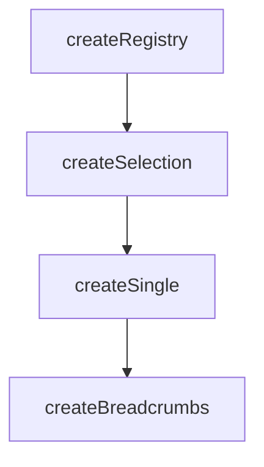

# createBreadcrumbs

A composable that extends `createSingle` for breadcrumb navigation with automatic path truncation and ellipsis collapse.

<DocsPageFeatures :frontmatter />

## Usage

The `createBreadcrumbs` composable manages an ordered path of items. When you select an earlier item, everything after it is removed. The `tickets` computed property provides a render-ready array with ellipsis support for long trails.

::: example
/composables/create-breadcrumbs/basic
:::

## Architecture

`createBreadcrumbs` extends `createSingle` with path truncation and render ticket computation:

The [Breadcrumbs component](/components/semantic/breadcrumbs) consumes `createBreadcrumbs` as its backing model, similar to how `Tabs.Root` uses `createStep`.

## Reactivity

Breadcrumb state is **always reactive**. All derived properties update automatically when items are registered, unregistered, or navigated.

| Property/Method | Reactive | Notes |
| - | :-: | - |
| `depth` | <AppSuccessIcon /> | Ref — count of registered items |
| `isRoot` | <AppSuccessIcon /> | Ref — `depth <= 1` |
| `isEmpty` | <AppSuccessIcon /> | Ref — `depth === 0` |
| `tickets` | <AppSuccessIcon /> | Computed — render array with ellipsis |
| `selectedId` | <AppSuccessIcon /> | Computed — current (last) item ID |
| `selectedItem` | <AppSuccessIcon /> | Computed — current item ticket |
| `selectedValue` | <AppSuccessIcon /> | Computed — current item value |
| `selectedIndex` | <AppSuccessIcon /> | Computed — current item position |

> [!TIP] Depth tracking
> Use `depth`, `isRoot`, and `isEmpty` to conditionally render navigation controls like a "Back" button or hide the breadcrumb trail when at the root level.

## Examples

::: example
/composables/create-breadcrumbs/file-explorer/FileExplorer.vue
/composables/create-breadcrumbs/file-explorer/tree.ts

### File Explorer

A file explorer that uses `createBreadcrumbs` to track the user's position in a folder tree. Clicking a folder calls `register()` to push it onto the trail, while clicking a breadcrumb calls `select()` to navigate back — automatically truncating everything after the selected crumb. Hidden crumbs are accessible through a Popover on the ellipsis.

**File breakdown:**

| File | Role |
|------|------|
| `file-explorer.vue` | Interactive file browser with breadcrumb navigation, ellipsis popover, and anchor toggle |
| `tree.ts` | Typed folder tree data and `FolderNode` interface |

**Key patterns:**

- `FileBreadcrumbTicketInput` extends `BreadcrumbTicketInput<FolderNode>` so `selectedValue` is properly typed — no casting needed
- Each folder node is stored as the ticket's `value`, keeping the breadcrumb trail and folder listing in sync through the registry itself
- The `anchor` option controls truncation direction — `'end'` (default) keeps the last crumbs visible, `'start'` keeps the first crumbs visible
- The `Popover` component renders inside the ellipsis, letting users click hidden crumbs to jump directly to any collapsed level
- `isRoot` controls whether the back button is visible

Drill into **Home > Documents > Projects > v0-app > src** to see the ellipsis appear, then toggle **Anchor start** to flip the truncation direction.

:::

<DocsApi />
