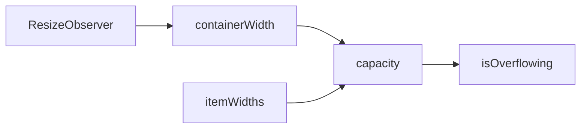

# createOverflow

A composable for computing how many items fit in a container based on available width, enabling responsive truncation for pagination, breadcrumbs, and similar components.

<DocsPageFeatures :frontmatter />

## Usage

The `createOverflow` composable provides reactive container width tracking and capacity calculation. It supports two modes: variable-width (for items with different widths like breadcrumbs) and uniform-width (for same-width items like pagination buttons).

```ts
import { useTemplateRef } from 'vue'
import { createOverflow } from '@vuetify/v0'

const containerRef = useTemplateRef('container')

// Pass container as a ref or getter for proper reactive tracking
const overflow = createOverflow({
  container: containerRef,
  gap: 8,
  reserved: 40,
})

// Check capacity
console.log(overflow.capacity.value) // Number of items that fit
console.log(overflow.isOverflowing.value) // true if items exceed container
```

## Architecture

`createOverflow` uses ResizeObserver to compute container capacity:



## API Pattern

| Function | Purpose |
|----------|---------|
| `createOverflow(options)` | Factory - returns an overflow context |
| `createOverflowContext(options)` | Factory with DI - returns `[useOverflow, provideOverflow, overflow]` trinity |
| `useOverflow(namespace?)` | Injection getter - retrieves provided overflow context |

### Basic Usage

```ts
const overflow = createOverflow({
  container: containerRef,
  gap: 8,
  reserved: 40,
})
```

### With Dependency Injection

```ts
// Create context with DI support
const [useOverflow, provideOverflow, overflow] = createOverflowContext({
  namespace: 'app:overflow',
  gap: 8,
})

// In parent component
provideOverflow()

// In child component
const overflow = useOverflow()
```

<DocsApi />
