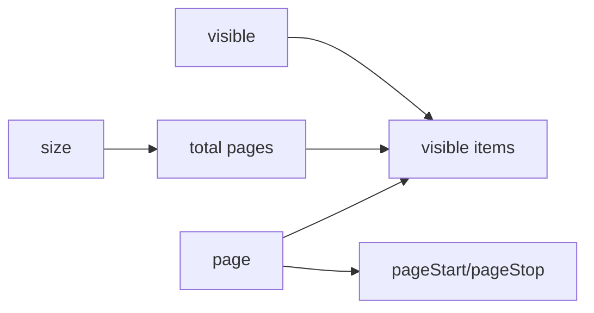

# createPagination

A lightweight composable for managing pagination state with navigation methods and computed visible page items.

<DocsPageFeatures :frontmatter />

## Usage

The `createPagination` composable provides reactive pagination state management with navigation methods and automatic computation of visible page items with ellipsis support.

```ts
import { ref } from 'vue'
import { createPagination } from '@vuetify/v0'

const pagination = createPagination({
  size: 200, // Total items
  itemsPerPage: 10,
  visible: 5,
})

console.log(pagination.pages) // 20 (200 items / 10 per page)
console.log(pagination.items.value)
// [
//   { type: 'page', value: 1 },
//   { type: 'page', value: 2 },
//   { type: 'page', value: 3 },
//   { type: 'ellipsis', value: '…' },
//   { type: 'page', value: 20 }
// ]
```

## Architecture

`createPagination` computes page state and navigation:



## API Pattern

| Function | Purpose |
|----------|---------|
| `createPagination(options)` | Factory - returns a pagination context |
| `createPaginationContext(options)` | Factory with DI - returns `[usePagination, providePagination, pagination]` trinity |
| `usePagination(namespace?)` | Injection getter - retrieves provided pagination context |

### Basic Usage

```ts
const pagination = createPagination({
  size: 100,
  itemsPerPage: 10,
})

pagination.next() // Go to next page
pagination.goto(5) // Go to page 5
```

### With Dependency Injection

```ts
// Create context with DI support
const [usePagination, providePagination, pagination] = createPaginationContext({
  namespace: 'app:pagination',
  itemsPerPage: 20,
})

// In parent component
providePagination()

// In child component
const pagination = usePagination()
```

<DocsApi />
