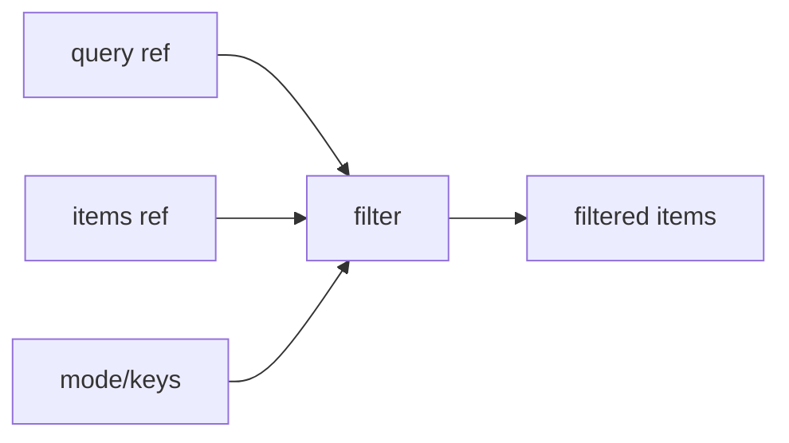

# useFilter

A composable for filtering arrays of items based on search queries, supporting both primitive values and complex objects with customizable filtering logic.

<DocsPageFeatures :frontmatter />

## Usage

The `useFilter` composable provides reactive array filtering with multiple modes for different search behaviors. It works with both primitive values and complex objects, and supports filtering by specific keys.

```ts
import { ref } from 'vue'
import { useFilter } from '@vuetify/v0'

const items = ref([
  { name: 'John Doe', age: 30, city: 'New York' },
  { name: 'Jane Doe', age: 25, city: 'Los Angeles' },
  { name: 'Peter Jones', age: 40, city: 'Chicago' },
])

const query = ref('doe')
const { items: filtered } = useFilter(query, items, { keys: ['name'] })

console.log(filtered.value)
// [
//   { name: 'John Doe', age: 30, city: 'New York' },
//   { name: 'Jane Doe', age: 25, city: 'Los Angeles' }
// ]
```

## Architecture

`useFilter` provides pure filtering logic with context support:



<DocsApi />
